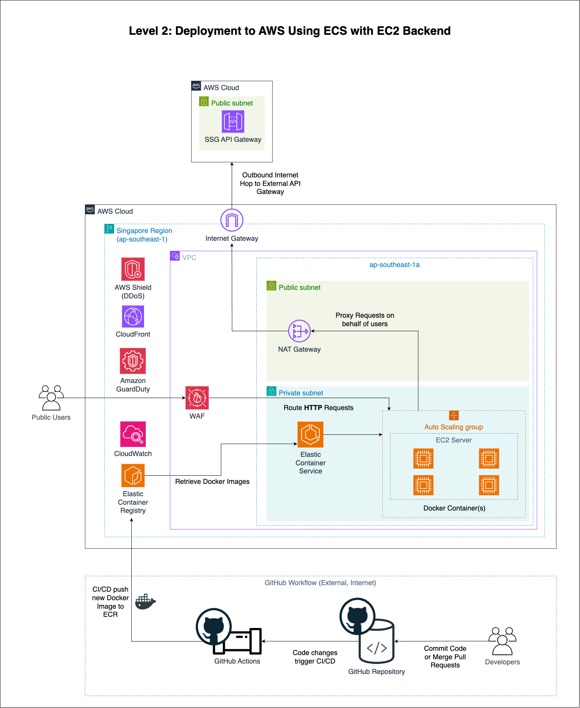

# Deployment Guide

Welcome to the SSG-WSG Sample Application Deployment Guide!

## Table of Contents

1. [Usage of the Guide](#usage-of-the-guide)
2. [Docker](#docker)
    1. [Images and Dockerfiles](#images-and-dockerfiles)
3. [Cloud Architecture](#cloud-architecture)
   1. [Services](#services)
      1. [EC2](#ec2)
      2. [ECS](#ecs)
      3. [Fargate](#fargate)
      4. [ECR](#ecr)
      5. [Task Definition](#task-definition)
   2. [Production Architecture](#production-architecture)
   3. [CI/CD Pipelines](#ci/cd-pipelines)
4. 

## Usage of the Guide

To aid you in understanding how to deploy the Sample Application, notes, warnings and hints are added to this user guide
to help you better understand the different aspects of the Sample Application.

Text in **green** callout boxes are some tips and tricks that you should be aware of while using the Sample Application:

> [!TIP]
> This is a tip!

Text in **blue** callout boxes are informational messages that you should take note of:

> [!NOTE]
> This is a note!

Text in **yellow** callout boxes are warnings that you should take note of to ensure that you do not encounter an error:

> [!WARNING]
> This is a warning!

Text in **red** callout boxes are potential errors which you may encounter while performing an action in the 
Sample Application:

> [!CAUTION]
> This is a potential error!

## Docker

Docker is a containerisation tool and framework to help you ship applications in a consistent and reliable manner.

Docker is the main tool used for deployment as it helps to ensure that the sample application can be quickly deployed
and torn down in a predictable and consistent manner.

### Images and Dockerfiles

Docker **Images** are the building blocks of Docker containers. A Docker image is a lightweight, standalone, 
executable package of software that includes everything needed to run a piece of software, including the code, 
runtime and dependencies.

A **Dockerfile** is a text file that contain a set of instructions that are used to create a Docker image.

For the Sample Application, the Dockerfile used to create a container containing the Sample Application is found
at the top level application directory [here](../app/Dockerfile).

Most crucially, a Dockerfile should contain the following clauses:

```dockerfile
FROM ...
WORKDIR ...
EXPOSE ...
COPY ...
RUN ...
```

* `FROM`: The base image that the Docker image is built on.
* `WORKDIR`: The working directory of the Docker container. This should mirror the name of the folder that the
   application code is stored in.
* `EXPOSE`: The port that is exposed (accessible) from outside the container. This depends on the port that you set in 
   your [Streamlit configuration file](../app/.streamlit/config.toml). By default, the port is `8502`.
* `COPY`: Copies the application code from your device into the Docker container.
* `RUN`: This clause is used to specify a command that is executed when the container is started.

A completed Dockerfile with minimal configurations required to run the application should look like this:

```dockerfilesp
FROM python:3.12
WORKDIR /app
EXPOSE 8502

COPY .. .

RUN pip install --no-cache-dir -r requirements.txt
```

This is the Dockerfile that is used to build the Docker image for the Sample Application.

## Cloud Architecture

Now that you understand the main tool that we will be using in the deployment to of the Sample Application to AWS,
let's next take a look at the AWS architecture that is used to serve the application.

### Services

Let's take a look at the services that we will be using in the application.

1. **Amazon Elastic Compute Cloud (EC2)**: EC2 is a web service that provides secure, resizable compute capacity in the
   cloud. It is designed to make web-scale cloud computing easier for developers.
2. **Amazon Elastic Container Service (ECS)**: ECS is a fully managed container orchestration service that allows you to
   easily run, stop, and manage Docker containers on a cluster.
3. **Amazon Elastic Container Registry (ECR)**: ECR is a fully managed Docker container registry that makes it easy for
   developers to store, manage, and deploy Docker container images.
4. **Amazon Fargate**: Fargate is a serverless compute engine for containers that works with both ECS and EKS. Fargate
   removes the need to provision and manage servers, lets you specify and pay for resources per application, and improves
   security through application isolation by design.
5. **Amazon Application Load Balancer (ALB)**: ALB is a load balancer that operates at the application layer and allows
   you to define routing rules based on content across multiple services or containers running on one or more EC2
   instances.
6. **Amazon Virtual Private Cloud (VPC)**: VPC is a service that lets you launch AWS resources in a virtual network that
   you define. You have complete control over your virtual networking environment, including selection of your own IP
   address range, creation of subnets, and configuration of route tables and network gateways.
7. **Amazon Route 53**: Route 53 is a scalable Domain Name System (DNS) web service designed to route end users to
   Internet applications by translating human-readable names into numeric IP addresses.
8. **Amazon CloudWatch**: CloudWatch is a monitoring and observability service built for DevOps engineers, developers,
   site reliability engineers (SREs), and IT managers. CloudWatch provides you with data and actionable insights to
   monitor your applications, respond to system-wide performance changes, optimize resource utilization, and get a
   unified view of operational health.
9. **ECS Task Definition**: A JSON file containing instructions for the task that the ECS Cluster is to perform.

Let's zoom into the few services that we will actively be using and managing in the application.

#### EC2

EC2 is used to provide the application a platform and compute capabilities to run on.

In the initial stages of deployment, this was used as it allows you to get the application up and running quickly, by
provisioning an EC2 instance on-demand and manually deploying the application on it without much configurations required
by the developer.

However, as we move towards a more cloud-native solution, we will be using ECS in conjunction with Fargate to manage the
orchestration and deployment of the application through Docker containers instead, rather than using bare EC2 instances
to host the application.

#### ECS

ECS is used to orchestrate and manage the deployment of the application through Docker containers.

ECS allows you to define a task definition that specifies the Docker container image to use, the CPU and memory
requirements, the networking configuration, and other configurations that are required to run the application.

ECS also allows you to define a service that manages the task definition and ensures that the application is running
according to the configurations specified in the task definition.

You will be using this service mostly throughout the deployment process.

#### Fargate

Fargate is a serverless compute engine for containers that allows you to run containers without having to manage the
underlying infrastructure.

Fargate allows you to specify the CPU and memory requirements of the application, and AWS will automatically provision
the necessary resources to run the application.

This allows you to focus on the application itself, rather than the underlying infrastructure that the application is
running on.

This is especially useful for the Sample Application, since the infrastructural security of the application can be
managed by AWS instead, offloading the responsibility of keeping our system updated and patched to AWS.

#### ECR

ECR is a scalable private container registry (something like GitHub for Docker images!) that allows you to store,
manage, and deploy Docker container images.

ECR has integrations with ECS that allows you to easily push and pull Docker images from the registry to the ECS, and
trigger upstream changes to ECS services when a new image is pushed to the registry.

This allows you to create complex Continuous Deployment pipelines that automatically deploy new versions of the
application to production when a new image is ready.

#### Task Definition

The Task Definition is a JSON file that contains the configurations for the task that is to be run on ECS.

The Task Definition file we are using for deployment can be found [here](../deploy/task-definition.json).

Within this file, we define the following:

* `family`: The version of the task definition.
* `networkMode`: The networking mode to use for the containers in the task.
* `containerDefinitions`: An array of container definitions that are used in the task.
  * `name`: The name of the container.
  * `image`: The Docker image to use for the container.
  * `portMappings`: The port mappings to use for the container.
    * `containerPort`: The port to expose on the container.
    * `hostPort`: The port to map the exposed port to.
    * `protocol`: The protocol to use for the port mapping.
    * `appProtocol`: The application protocol to use for the port mapping.
  * `essential`: Specify if health of the stack is dependent on this container.
  * `entryPoint`: The entry point command to use for the container.
  * `dependsOn`: The dependencies of the container.
    * `containerName`: The name of the container to depend on.
    * `condition`: The condition to use for the dependency.
  * `disableNetworking`: Whether networking is disabled for the container.
  * `priviledged`: Whether the container has privilege to execute privileged tasks.
  * `readonlyRootFilesystem`: Whether the container has a read-only root filesystem.
  * `interactive`: `-i` flag for Docker
  * `psudoTerminal`: `-t` flag for Docker
* `requiresCompatabilities`: The compute compatibilities that the task requires.
* `cpu`: The CPU requirements of the task.
* `memory`: The memory requirements of the task.
* `runtimePlatform`: The runtime platform to use for the task.
  * `cpuArchitecture`: The CPU architecture to use for the task.
  * `operatingSystemFamily`: The operating system family to use for the task.

Your file should look something like:

```json
{
    "family": "SSG-WSG ECS Deployment Pipeline v1",
    "networkMode": "bridge",
    "containerDefinitions": [
        {
            "name": "app",
            "image": "",
            "portMappings": [
                {
                    "containerPort": 8502,
                    "hostPort": 80,
                    "protocol": "tcp",
                    "appProtocol": "http"
                }
            ],
            "essential": true,
            "dependsOn": [
                {
                    "containerName": "",
                    "condition": "START"
                }
            ],
            "disableNetworking": false,
            "privileged": true,
            "readonlyRootFilesystem": false,
            "interactive": true,
            "pseudoTerminal": true
        }
    ],
    "requiresCompatibilities": [
        "EC2"
    ],
    "cpu": "1024",
    "memory": "1024",
    "runtimePlatform": {
        "cpuArchitecture": "X86_64",
        "operatingSystemFamily": "LINUX"
    }
}
```

This file will be used by GitHub CI/CD to trigger a Task Definition action on AWS to deploy the application to either
EC2 Cluster or Fargate.


### Production Architecture

The second level of deployment is slightly more complicated - deploying the application on an ECS cluster within one
Availability Zone.



The workflow for this level is as follows:

1. Developer commits/pushes code to the Sample-Codes repository
2. GitHub Actions CI/CD pipeline is triggered
3. CI/CD creates an ECS cluster within an Availability Zone
4. CI/CD creates a Docker image of the application
5. CI/CD pushes the Docker image to ECR
6. CI/CD creates an ECS task definition and service
7. ECS executes the task as provided by the task definition and launches the application
8. The application is now live and can be accessed by users

This deployment requires you to have access to an AWS account, as well as permissions to create and manage ECS clusters.

> [!WARNING]
> The Docker container images that you define should expose port `8502` to allow connections to the application!

## CI/CD Pipelines


