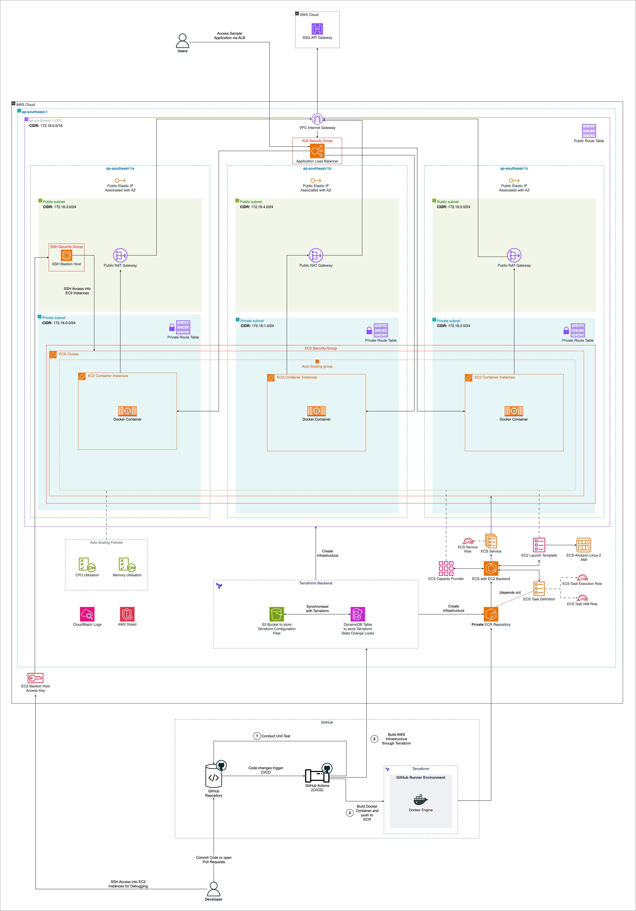

# Deployment Guide

Welcome to the SSG-WSG Sample Application Deployment Guide!

## Table of Contents

* [Table of Contents](#table-of-contents)
* [Usage of the Guide](#usage-of-the-guide)
* [AWS](#aws)
    * [Preparation](#preparation)
* [Codecov](#codecov)
* [GitHub](#github)
    * [GitHub Actions](#github-actions)
        * [Workflows](#workflows)
    * [Preparation](#preparation-1)
    * [GitHub Environments](#github-environments)
* [Docker](#docker)
    * [Images and Dockerfiles](#images-and-dockerfiles)
    * [Docker Commands](#docker-commands)
        * [`docker build`](#docker-build)
        * [`docker run`](#docker-run)
* [Terraform](#terraform)
    * [Install Terraform](#install-terraform)
    * [Organisation of Terraform Code](#organisation-of-terraform-code)
        * [`dev`](#dev)
        * [`prod`](#prod)
        * [`create-backend`](#create-backend)
        * [`create-ecr`](#create-ecr)
        * [`main-infrastructure`](#main-infrastructure)
    * [Terraform Configuration](#terraform-configuration)
    * [Terraform Modules](#terraform-modules)
    * [Terraform Plan](#terraform-plan)
    * [Terraform Apply](#terraform-apply)
    * [Terraform Destroy](#terraform-destroy)
* [Cloud Architecture](#cloud-architecture)
    * [`prod` and `dev` Environments](#prod-and-dev-environments)
    * [VPC and Region](#vpc-and-region)
    * [Availability Zones](#availability-zones)
    * [Networking](#networking)
        * [Subnets](#subnets)
    * [Load Balancer](#load-balancer)
    * [Security Groups](#security-groups)
    * [Logging](#logging)
    * [IAM](#iam)
        * [SSH Keys](#ssh-keys)
    * [Compute](#compute)
        * [EC2](#ec2)
        * [ECR and ECS](#ecr-and-ecs)
        * [Docker](#docker-1)
        * [AutoScaling Group](#autoscaling-group)
    * [Architecture Diagram](#architecture-diagram)
* [Conclusion](#conclusion)

## Usage of the Guide

To aid you in understanding how to deploy the Sample Application, notes, warnings and hints are added to this user guide
to help you better understand the different aspects of the Sample Application.

Text in **green** callout boxes are some tips and tricks that you should be aware of while using the Sample Application:

> [!TIP]
> This is a tip!

Text in **blue** callout boxes are informational messages that you should take note of:

> [!NOTE]
> This is a note!

Text in **yellow** callout boxes are warnings that you should take note of to ensure that you do not encounter an error:

> [!WARNING]
> This is a warning!

Text in **red** callout boxes are potential errors which you may encounter while performing an action in the
Sample Application:

> [!CAUTION]
> This is a potential error!

The following section details some of the tools we use to deploy the application to AWS.

## AWS

Amazon Web Services (AWS) is a cloud computing platform that provides a wide range of cloud services, including
computing power, storage, databases, machine learning, and more.

For the Sample Application, we will be deploying it on AWS to take advantage of the scalability, reliability, and
security that AWS provides.

### Preparation

Before you can deploy the Sample Application to AWS, follow the steps below to prepare your AWS account:

1. Create an AWS account if you do not already have one. Follow the instructions provided in
   this [forum post](https://repost.aws/knowledge-center/create-and-activate-aws-account)
   for more information on how you can create an AWS account.
2. Create an IAM user with the necessary permissions to deploy the Sample Application. Follow the instructions provided
   in this [guide](https://medium.com/@sam.xzo.developing/create-aws-iam-user-02ee9c65c877) to create an IAM user. Make
   sure to attach
   the [AdministratorAccess](https://docs.aws.amazon.com/aws-managed-policy/latest/reference/AdministratorAccess.html)
   policy to the IAM user to ensure the user has the necessary permissions to deploy the Sample Application.
    1. This is important as you are highly advised against using the root account to change your AWS resources.

> [!WARNING]
> Even though you are also recommended to keep permissions as minimal as possible, for this guide, you
> are advised to attach the `AdministratorAccess` policy to the IAM user to ensure that you have the necessary
> permissions to deploy the Sample Application.

3. Create an Access Key and Secret Key for the IAM user. Follow the instructions in
   the [AWS documentation](https://docs.aws.amazon.com/IAM/latest/UserGuide/id_credentials_access-keys.html)
   to create an Access Key and Secret Key for the IAM user.

> [!CAUTION]
> Make sure NOT to check the key files or any other files containing your keys into version control or share them
> with anyone! This is to prevent unauthorised access to your AWS resources.

After obtaining your secret key and access key, you are ready to move on to the next step of the preparation
process on GitHub. Refer to the [GitHub section](#GitHub) for more information on what you need to do for the next step.

## Codecov

Codecov is a code coverage tool that helps you measure the effectiveness of your tests by showing you which parts of
your code is being tested and which parts are not.

For the Sample Application, we will be using Codecov to measure the code coverage of the tests that are run on the
application.

To use Codecov, you must create an account on Codecov and link your GitHub repository to Codecov. Follow
[this guide](https://docs.codecov.com/docs/quick-start) to get started with Codecov.

Make sure to save the Repository Upload Token, as it will be used in the next section to configure the GitHub Actions
workflows.

## GitHub

GitHub is a code hosting platform for version control and collaboration. It lets you and others work together on
projects from anywhere.

For the Sample Application, we will be using GitHub to host the codebase and to automate the deployment process using
GitHub Actions.

In addition to GitHub, we will also be using GitHub Actions to automate the testing and deployment processes to AWS.

GitHub Actions is a Continuous Integration/Continuous Deployment tool that allows you to automate your software
development workflows. You can use GitHub Actions to build, test, and deploy your code right from GitHub.

### GitHub Actions

GitHub Actions allow you to specify workflows that are triggered by events in your GitHub repository by using YML files
that declare the resources, actions and triggers that are used to trigger a workflow.

GitHub Actions workflows are stored in the `.github/workflows` directory at the root of the repository.

> [!NOTE]
> Workflows can be automatically triggered by events such as a push (commit) to the repository, a pull request, or
> a new release. Workflows can also be **manually triggered** by using the `workflow_dispatch` event.
>
> For `workflow_dispatch` events, you can trigger a workflow by going to the Actions tab in your repository, selecting
> the workflow that you want to run, and click the `Run workflow` button.
>
> Note that `workflow_dispatch` workflows can be triggered manually only if the workflow YML file exists in the
> `main`/`master` branch of the repository!

#### Workflows

Workflows are declared within a YML file. Sections within the YML file determine the actions, as well as the sequence,
to take when the workflow is triggered.

Most importantly, there are a few declarations that you should be aware of when creating a workflow:

* `on`: This declaration specifies the event that triggers the workflow. For example, a push to the repository, a pull
  request, or a new release.
* `if`: This declaration specifies a condition that must be fulfilled if a job within a workflow is to execute
* `env`: This declaration specifies the environment variables that are used in the workflow. Environment variables can
  either be
  secrets (which should never be exposed to the workflow in plaintext) or global variables that we want to keep
  consistent across
  the workflow.
* `jobs`: This declaration specifies the jobs that are run in the workflow. Jobs are a high-level collection of steps to
  take to complete a task.
    * Jobs are run in parallel by default, but you can specify dependencies between jobs to run them in sequence.
      under the [GitHub Actions Marketplace](https://github.com/marketplace?type=actions).
* `steps`: This declaration specifies the steps that are run in the job. Steps are a collection of tasks that are run in
  sequence to complete the job.
* `strategy`, `matrix`: These declarations specify the matrix of configurations that are used to run the workflow. This
  is useful when you want to run the same workflow with different configurations in parallel.
* `runs-on`: This declaration specifies the runner that the job runs on. The runner is the environment that the job runs
  on, such as `ubuntu-latest`, `windows-latest`, or `macos-latest`, each corresponding to an environment with the
  respective OS installed.
* `uses`: This declaration specifies external extensions that are used in the workflow. External extensions can be
  actions, or other workflows that are stored in a different repository. A catalogue of external extensions can be found
* `needs`: This declaration specifies the dependencies between jobs. If a job depends on another job, the dependent job
  will only run if the job it depends on is successful.
* `working-directory`: This declaration specifies the working directory of the job. This is useful when you want to run
  the job in a different directory from the default working directory.
* `run`: This declaration specifies the shell commands that are run in the step. The shell commands are run in the
  environment specified by the `runs-on` declaration.

Refer to
the [documentation by GitHub](https://docs.github.com/en/actions/using-workflows/workflow-syntax-for-github-actions)
for more information on the different GitHub Actions workflow syntaxes that are available.

To better understand the workflows that are used in the Sample Application, refer to the YML files under the
[`.github/workflows`](../../.github/workflows) directory and the CI/CD documentation under the
[Developer Guide](Developer%20Guide.md#cicd).

### Preparation

> [!WARNING]
> Make sure to complete the preparation steps under the AWS and Codecov section before proceeding with the steps below!

Before you can deploy the application to AWS, you need to set up GitHub Actions.

Follow [this guide](https://docs.github.com/en/actions/security-guides/using-secrets-in-github-actions) to add the
following GitHub Actions Secrets to the repository:

1. `AWS_ACCESS_KEY_ID`: The Access Key ID of the IAM user that you created in the AWS preparation step.
2. `AWS_SECRET_ACCESS_KEY`: The Secret Access Key of the IAM user that you created in the AWS preparation step.
3. `AWS_REGION`: The AWS region that you want to deploy the application to. This should correspond to the region that
   is used under the [`deploy` directory](../deploy).
4. `CODECOV_TOKEN`: The Repository Upload Token that you obtained from Codecov.

### GitHub Environments

To prevent unwanted deployments to AWS, you can set up GitHub Environments to restrict deployments to specific branches.

Refer
to [this guide](https://docs.github.com/en/actions/deployment/targeting-different-environments/using-environments-for-deployment)
to learn more about the use of environments to enforce approvals before deployment.

For the application, you will need to create the `production` environment.

> [!NOTE]
> If you are a developer, make sure to create a `dev` environment instead. Simply replace `production` with
> `dev` below.

To create the `production` environment, follow the steps below:

1. Go to the `Settings` tab of the repository.
2. Click on the `Environments` tab on the sidebar.
3. Click on the `New environment` button.
4. Enter `production` as the environment name.
5. Click on the `Configure environment` button.
6. Click on the `Required reviewers` checkbox. Feel free to add reviewers to the environment to enforce approvals
   before deployment.
    1. If needed, select the `Prevent self-review` option to prevent self-approval of the deployment
7. Add the following secrets to the environment by clicking on the `Add environment secret` button:
    * `AWS_ACCESS_KEY_ID`: The Access Key ID of the IAM user that you created in the AWS preparation step
    * `AWS_SECRET_ACCESS_KEY`: The Secret Access Key of the IAM user that you created in the AWS preparation step
    * `AWS_REGION`: The AWS region that you want to deploy the application to. This should correspond to the region that
      is used under the [`deploy` directory](../deploy)

> [!WARNING]
> Secrets need to be re-declared in the environment to ensure that the secrets created in the previous step
> are available to the environment.

> [!WARNING]
> Currently, this approval behaviour is only enforced for the final step of the build process whereby the necessary
> main infrastructure is provisioned. If you require approvals for other steps in the build process, you will need to
> modify the GitHub Actions workflows with different environments. You may repeat the step above to create environments
> for other build steps.

## Docker

Docker is a containerisation tool and framework to help you ship applications consistently and reliably.

Docker is the main tool used for deployment as it helps to ensure that the sample application can be quickly deployed
and torn down predictably and consistently.

### Images and Dockerfiles

Docker **Images** are the building blocks of Docker. A Docker image is a lightweight, standalone,
executable package of software that includes everything needed to run a piece of software, including the code,
runtime and dependencies.

A **Dockerfile** is a text file that contains a set of instructions that are used to create a Docker image.

For the Sample Application, the Dockerfile used to create a container containing the Sample Application is found
at the top level application directory [here](../app/Dockerfile).

Most crucially, a Dockerfile should contain the following clauses:

```dockerfile
FROM ...
WORKDIR ...
EXPOSE ...
COPY ...
RUN ...
```

* `FROM`: The base image that the Docker image is built on.
* `WORKDIR`: The working directory of the Docker container. This should mirror the name of the folder that the
  application code is stored in.
* `EXPOSE`: The port that is exposed (accessible) from outside the container. This depends on the port that you set in
  your [Streamlit configuration file](../app/.streamlit/config.toml). By default, the port is `80`.
* `COPY`: Copies the application code from your device into the Docker container.
* `RUN`: This clause is used to specify a command that is executed during the creation of the container.

A completed Dockerfile with minimal configurations required to run the application should look like this:

```dockerfilesp
FROM python:3.12
WORKDIR /app
EXPOSE 80

COPY .. .

RUN pip install --no-cache-dir -r requirements.txt
```

This is the Dockerfile that is used to build the Docker image for the Sample Application.

### Docker Commands

There are only 2 main commands which you need to be aware of when using Docker:

1. `docker build`: This command is used to build a Docker image from a Dockerfile.
2. `docker run`: This command is used to run a Docker container from a Docker image.

#### `docker build`

To build a Docker image from a Dockerfile, you can run the following command:

```shell
docker build -t [IMAGE_NAME] .
```

This command builds a Docker image from the Dockerfile in the current directory and tags the image with the specified
image name.

> [!NOTE]
> Images are usually tagged with a version number to indicate the version of the image. For example, `my-image:1.0.0` or
> `my-image:latest`, where `my-image` is the name of the image and `1.0.0` and `latest` are the version numbers.

> [!WARNING]
> Replace `[IMAGE_NAME]` in whole with the name of the Docker image that you want to build.

> [!CAUTION]
> Make sure that the Docker daemon is active and running before running the `docker build` command. Failure to do so may
> result in errors!

#### `docker run`

To run a Docker container from a Docker image, you can run the following command:

```shell
docker run -p [HOST_PORT]:[CONTAINER_PORT] [IMAGE_NAME]
```

This command runs a Docker container from the specified Docker image and maps the host port to the container port.

> [!NOTE]
> The host port is the port that is exposed on the host machine, while the container port is the port that is exposed
> in the Docker container.

> [!WARNING]
> Replace `[HOST_PORT]`, `[CONTAINER_PORT]` and `[IMAGE_NAME]` in whole with the host port, container port and image
> name as specified above in `docker build` respectively.

> [!CAUTION]
> Make sure that the Docker daemon is active and running before running the `docker run` command. Failure to do so may
> result in errors!

## Terraform

Terraform is an open-source infrastructure as code tool that allows you to define and provision infrastructure using a
high-level configuration language.

Terraform allows you to define the infrastructure that you want to create in configuration files, and then use the
Terraform CLI to create, update, and destroy the infrastructure.

Terraform is used in the deployment of the Sample Application to create the necessary infrastructure in AWS to host the
application. In particular, Terraform is used in conjunction with GitHub Actions to automatically provision the
necessary resources and configure the provisioned resources.

> [!NOTE]
> Refer to the GitHub Actions [workflow file](../../.github/workflows/integration.yml) to see how Terraform is used in
> conjunction with GitHub Actions to deploy the Sample Application.

### Install Terraform

To install the Terraform CLI on your machine, follow the instructions provided in
the [official Terraform documentation](https://developer.hashicorp.com/terraform/install).

> [!NOTE]
> This step is not necessary as GitHub Actions can be used to run Terraform commands in an environment that is already
> configured for you.

### Organisation of Terraform Code

The Terraform code for the Sample Application is organised into 2 main directories: `dev` and `prod`.

The `dev` directory contains the Terraform code that is used to provision the development environment of the Sample
Application, while the `prod` directory contains the Terraform code that is used to provision the production environment
of the Sample Application.

Within both directories, the Terraform code is further organised into subdirectories that represent the different
components of the Sample Application: `create-backend`, `create-ecr`, and `main-infrastructure`.

The `create-backend` subdirectory contains the Terraform code that is used to provision the S3 bucket and DynamoDB table
that is used to store the Terraform state and lock the state respectively.

The `create-ecr` subdirectory contains the Terraform code that is used to provision the Elastic Container Registry
repository that is used to store the images used for Elastic Container Service.

The `main-infrastructure` subdirectory contains the Terraform code that is used to provision the main infrastructure of
the
Sample Application, such as the VPC, subnets, security groups, and other resources that are required to host the
application.

#### `dev`

The Terraform code used to provision the development environment of the Sample Application can be found in the `dev`
directory.

Within this directory, the Terraform code is organised into 3 main directories: `create-backend`, `create-ecr`, and
`main-infrastructure`.

The environment provisioned by the Terraform code in the `dev` directory is used for testing and development purposes.

Developers must test their code changes on the `dev` environment before deploying them to the `prod` environment.

#### `prod`

The Terraform code used to provision the production environment of the Sample Application can be found in the `prod`
directory.

Within this directory, the Terraform code is organised into 3 main directories: `create-backend`, `create-ecr`, and
`main-infrastructure`.

The environment provisioned by the Terraform code in the `prod` directory is used for production purposes only.

Changes to the production environment should be tested on the `dev` environment before being deployed to the `prod`
environment.

#### `create-backend`

Terraform allows you to save the state of your infrastructure in a remote backend, such as an Amazon S3 bucket, and use
NoSQL databases like Amazon DynamoDB to lock the state to prevent concurrent modifications.

For the Sample Application, we will deploy the S3 bucket and DynamoDB table to store the Terraform state and lock the
state respectively.

The Terraform code used to provision these resources can be found in the
[`dev` `create-backend`](../deploy/dev/create-backend) and
[`prod` `create-backend`](../deploy/prod/create-backend) directory.

> [!CAUTION]
> If you are deploying the application locally rather than via GitHub Actions, make sure to initialise the Terraform
> code within this folder before attempting to initialise the main infrastructure.
>
> Failure to do so may result in the deployment of the main infrastructure to fail!

> [!CAUTION]
> If you are a developer, make sure to change the name of the S3 bucket used in the `dev` Terraform code to another
> unique name! You may get an error if the bucket already exists.

#### `create-ecr`

> [!CAUTION]
> Make sure to initialise the necessary AWS resources under `create-backend` first, before initialising the main
> infrastructure contained in this directory!

This directory contains the Terraform code that is used to deploy the Elastic Container Registry (ECR) repository that
is used to store the Docker images used for the Elastic Container Service (ECS).

The Terraform code used to provision the ECR repository can be found in the
[`dev` `create-ecr`](../deploy/dev/create-ecr) and
[`prod` `create-ecr`](../deploy/prod/create-ecr) directory.

> [!CAUTION]
> If you are a developer, make sure to change the name of the S3 bucket used in the `dev` Terraform code to the name
> used above under [`create-ecr`](#create-ecr)! If not, you will get an error as the bucket already exists.

#### `main-infrastructure`

> [!CAUTION]
> Make sure to initialise the necessary AWS resources under `create-backend` first, before initialising the main
> infrastructure contained in this directory!

This directory contains the Terraform code that is used to deploy the main infrastructure of the Sample Application to
AWS.

Based on where the Terraform code is located, the infrastructure will be deployed to the respective environment
(`dev` or `prod`).

You may freely change and edit the Terraform code to suit your needs, but make sure to test the changes in `dev` before
deploying them to `prod`!

More information on the overall architecture of the Sample Application can be found below under
[Cloud Architecture](#cloud-architecture).

> [!TIP]
> Terraform does not care about how you structure your code within the same directory. You can split your code into
> multiple files and Terraform will treat them as a single configuration!
>
> For the Sample Application, we have split the Terraform code into multiple files to make it easier to manage and
> maintain the different components of the Sample Application!

> [!CAUTION]
> If you are a developer, make sure to change the name of the S3 bucket used in the `dev` Terraform code to the name
> used above under [`create-ecr`](#create-ecr)! If not, you will get an error as the bucket already exists.

### Terraform Configuration

Before you can use Terraform to deploy the Sample Application, you will need to initialise Terraform and retrieve the
required backend configurations.

To do so, you need to run the following command in the subdirectories within the `deploy/` directory:

```shell
terraform init
```

Each directory contains the necessary Terraform code needed to deploy component(s) of the Sample Application to AWS.

> [!TIP]
> If you have already done this step previously and are repeating it, you can run the Terraform command with
> the `-reconfigure` flag to force Terraform to reconfigure the backend configurations!
>
> e.g. `terraform init -reconfigure`

### Terraform Modules

Terraform modules are reusable, composable units of Terraform configuration that are used to define a set of resources.

Terraform modules are used in the deployment process to store global configuration variables used throughout the
process.

The constants can be found under the `deploy/modules/constants/` directory in
the [`constants.tf`](../deploy/modules/constants/constants.tf) file.

### Terraform Plan

After initialising Terraform, you can run the following command to generate a Terraform plan:

```shell
terraform plan
```

This command will generate a plan that shows you what Terraform will do when you apply the configuration.

> [!NOTE]
> This step is not necessary if you are sure that your infrastructure is correctly configured or if you are
> redeploying/verifying the infrastructure (due to a change in the code which triggers a GitHub Actions workflow
> or otherwise).

### Terraform Apply

After generating the Terraform plan, you can run the following command to apply the configuration:

```shell
terraform apply
```

This command will apply the configuration and create the necessary infrastructure in AWS.

### Terraform Destroy

If you want to destroy the infrastructure that you have created, you can run the following command:

```shell
terraform destroy
```

## Cloud Architecture

Now that you understand the main tools that we will be using in the deployment of the Sample Application to AWS,
let's delve deeper into how the Sample Application is architected.

### `prod` and `dev` Environments

To better manage the deployment of the Sample Application, the application is deployed in 2 environments: `prod` and
`dev`.

The `prod` environment is used to host the production version of the Sample Application,
while the `dev` environment is used for testing and development of the Sample Application.

Architecturally, the `prod` and `dev` environments are identical, with the only difference being where are resources
are deployed.

> [!NOTE]
> In the following sections, the description of each component of the cloud architecture applies to both the
> `dev` and `prod` environments.

### VPC and Region

[[Prod Terraform File]](../deploy/prod/main-infrastructure/vpc.tf)
[[Dev Terraform File]](../deploy/dev/main-infrastructure/vpc.tf)

For purposes of compliance and proximity to our customers (who are mainly based in Singapore), the Sample Application
is deployed in the `ap-southeast-1` (Singapore) region.

A Virtual Private Cloud (VPC) is hence created in the `ap-southeast-1` region to host the Sample Application.

Virtual Private Clouds (VPCs) are isolated networks within the AWS cloud that allow you to launch AWS resources in a
virtual network that you define.

You may change the region that the Sample Application is deployed to by changing the `aws_region` variable in the
Terraform and within the Terraform scripts that reference the region.

> [!CAUTION]
> If you decide to change the default region where the Sample Application will be hosted, make sure that any
> reference to the AWS region of interest is updated in the Terraform code. Failure to update the Region within
> the Terraform scripts may result in a failed deployment!

> [!CAUTION]
> Your deployment may fail if there are any policies in place to restrict creation of resources to certain regions.
> Make sure to check with your administrator if there are such policies in place before deploying your application.

### Availability Zones

[[Prod Terraform File]](../deploy/prod/main-infrastructure/vpc.tf)
[[Dev Terraform File]](../deploy/dev/main-infrastructure/vpc.tf)

Availability Zones are distinct locations within a region that are engineered to be geographically isolated from
failures in other Availability Zones.

For the Sample Application, all 3 Availability Zones in the `ap-southeast-1` region (`ap-southeast-1a`,
`ap-southeast-1b` and `ap-southeast-1c`) are used to ensure high availability and fault tolerance.

You may change the number of Availability Zones that the VPC is created in by changing the `az_count` variable
in the Terraform file [`constants.tf`](../deploy/modules/constants/constants.tf).

> [!WARNING]
> You are highly recommended to deploy the VPC in at least 2 Availability Zones to ensure high availability and fault
> tolerance. Deploying the VPC in a single Availability Zone may result in a single point of failure!

### Networking

[[Prod Terraform File]](../deploy/prod/main-infrastructure/vpc.tf)
[[Dev Terraform File]](../deploy/dev/main-infrastructure/vpc.tf)

By default, the VPC is created with a Class B CIDR IPv4 IP address of `172.16.0.0/16`.
This configuration allows for `2^16` ~ `65536` IP addresses within your VPC.

You may change the default CIDR IP of the VPC by changing the `cidr` variable in the Terraform file
[`constants.tf`](../deploy/modules/constants/constants.tf).

> [!NOTE]
> Refer
> to [this guide on IP addressing](https://aws.amazon.com/what-is/cidr/#:~:text=A%20CIDR%20IP%20address%20appends,2%2C%20is%20the%20network%20address.)
> for more information on how the CIDR IP addressing system works.

#### Subnets

Subnets are created within the VPC to segment the IP address space of the VPC into smaller, more manageable blocks.

For the Sample Application, 2 types of subnets are created: **public** and **private** subnets.

---

**Public Subnets**

[[Prod Terraform File]](../deploy/prod/main-infrastructure/public-subnet.tf)
[[Dev Terraform File]](../deploy/dev/main-infrastructure/public-subnet.tf)

Public subnets are Internet-facing and have a route to an Internet Gateway. Internet Gateways are gateways that allow
Internet traffic out of the VPC.

NAT Gateways are created and associated with a Public Subnet as they facilitate outbound traffic from the Private Subnet
to the Internet.

For the public subnets, the IP addresses assigned to them are:

* `172.16.3.0/24`
* `172.16.4.0/24`
* `172.16.5.0/24`

> [!NOTE]
> Developer Note: You may wish to replace the Internet Gateway with a VPC peering connection or VPC endpoint to the
> SSG API Gateway VPC to reduce the complexity of your network and improve security.

---

**Private Subnets**

[[Prod Terraform File]](../deploy/prod/main-infrastructure/private-subnet.tf)
[[Dev Terraform File]](../deploy/dev/main-infrastructure/private-subnet.tf)

Private subnets are not Internet-facing, and have a route to a NAT Gateway. Instances in a private subnet can
initiate outbound connections to the Internet, but cannot receive direct inbound connections from the Internet
due to NAT translation at the gateway.

For the private subnets, the IP addresses assigned to them are:

* `172.16.0.0/24`
* `172.16.1.0/24`
* `172.16.2.0/24`

### Load Balancer

[[Prod Terraform File]](../deploy/prod/main-infrastructure/alb.tf)
[[Dev Terraform File]](../deploy/dev/main-infrastructure/alb.tf)

An Application Load Balancer (ALB) is created to route traffic to the ECS Service that hosts the Sample Application.

An ALB Listener and Target Group is also created to ensure that traffic is listened to on port `80` and routed to the
ECS Service on port `80`.

The configurations for the ALB are:

* Load Balancer Name: `ssg-alb`
* Security Group: [Application Load Balancer Security Group](#Security-Groups)
* Subnets: Attach all Public Subnets to the ALB

The configurations for the ALB Listener are:

* Associated Load Balancer: `ssg-alb`
* Protocol: `HTTP`
* Port: `80`
* Default Action: Forward to the Target Group

The configurations for the ALB Target Group are:

* Target Group Name: `ssg-target-group`
* Protocol: `HTTP`
* Port: `80`
* VPC: VPC created above
* Deregistration Delay: `120` seconds
* Health Check Configuration:
    * Healthy Threshold: 2
    * Unhealthy Threshold: 2
    * Interval of Health Check: 60 seconds
    * HTTP codes permitted: `200` (Success Code)
    * Port: Traffic Port
    * Protocol: `HTTP`
    * Timeout: 10 seconds
* Session Stickiness
    * Cookie Duration: `1` day = `86400` seconds
    * Cookie Name: `SSGWSGSAMPLEAPPCOOKIE`
    * Enabled: `true`
    * Type: `app_cookie`

**This ALB Target Group depends on the ALB (ALB must be created before the Target Group can be created).**

### Security Groups

[[Prod Terraform File]](../deploy/prod/main-infrastructure/security-groups.tf)
[[Dev Terraform File]](../deploy/dev/main-infrastructure/security-groups.tf)

Security Groups are virtual firewalls that control the inbound and outbound traffic to your AWS resources.

There are 3 main Security Groups that are created for the Sample Application:

1. **EC2 Security Group**: This Security Group is associated with the EC2 instances that are created to host the
   Sample Application.
    1. Inbound Rules:
        * `TCP` on port `80` originating from the `Application Load Balancer` Security Group
        * `TCP` on port `22` originating from the `Bastion Host` Security Group
    2. Outbound Rules:
        * `TCP` on any port to any destination (`0.0.0.0/0`)
2. **Application Load Balancer Security Group**: This Security Group is associated with the Application Load Balancer
   that routes traffic to the ECS Service.
    1. Inbound Rules:
        * `TCP` on port `80` from any source (`0.0.0.0/0`)
    2. Outbound Rules:
        * `TCP` on any port to any destination (`0.0.0.0/0`)
3. **Bastion Host Security Group**: This Security Group is associated with the Bastion Host that is used to SSH into
   the EC2 instances.
    1. Inbound Rules:
        * `TCP` on port `22` from any source (`0.0.0.0/0`)
    2. Outbound Rules:
        * `TCP` on any port to any destination (`0.0.0.0/0`)

> [!NOTE]
> `0.0.0.0/0` represents a broadcast address that allows traffic from any source to the specified destination.

### Logging

[[Prod Terraform File]](../deploy/prod/main-infrastructure/cloudwatch.tf)
[[Dev Terraform File]](../deploy/dev/main-infrastructure/cloudwatch.tf)

An AWS CloudWatch Log Group is created to store the logs of the ECS Tasks that are run by the ECS Service.

The configurations for the CloudWatch Log Group are:

* Name: `ssg/ecs/sample-application`
* Retention Period: `7` days'

> [!WARNING]
> Logs will be delivered to the CloudWatch Log Group from your application in ECS only if the application prints its
> logs to `STDOUT` or `STDERR`, otherwise, no logs will be captured by CloudWatch!

### IAM

[[Prod Terraform File]](../deploy/prod/main-infrastructure/iam.tf)
[[Dev Terraform File]](../deploy/dev/main-infrastructure/iam.tf)

Identity and Access Management (IAM) is a service that helps you securely control access to AWS resources.

The following roles and policies are created for the Sample Application:

* EC2 Instance Role
    * Statements
        * Action: `sts:AssumeRole`
        * Effect: `Allow`
        * Principals
            * Type: Service
            * Identifiers:
                * `ec2.amazonaws.com`
                * `ecs.amazonaws.com`
    * Attached IAM Role Policy: `arn:aws:iam::aws:policy/service-role/AmazonEC2ContainerServiceforEC2Role`
* Associated EC2 Instance Role Profile
* ECS Service Role
    * Statements
        * Action: `sts:AssumeRole`
        * Effect: `Allow`
        * Principals
            * Type: Service
            * Identifiers: `ecs.amazonaws.com`
    * Attached **Service Role Policy**
        * Statements
            * Effect: `Allow`
            * Actions:
                * `ec2:AuthorizeSecurityGroupIngress`
                * `ec2:Describe*`
                * `elasticloadbalancing:DeregisterInstancesFromLoadBalancer`
                * `elasticloadbalancing:DeregisterTargets`
                * `elasticloadbalancing:Describe*`
                * `elasticloadbalancing:RegisterInstancesWithLoadBalancer`
                * `elasticloadbalancing:RegisterTargets`
                * `ec2:DescribeTags`
                * `logs:CreateLogGroup`
                * `logs:CreateLogStream`
                * `logs:DescribeLogStreams`
                * `logs:PutSubscriptionFilter`
                * `logs:PutLogEvents`
            * Resources: `*` (all AWS resources)
* ECS Task Execution Role
    * Statements
        * Action: `sts:AssumeRole`
        * Effect: `Allow`
        * Principals
            * Type: Service
            * Identifiers: `ecs-tasks.amazonaws.com`
    * Attached IAM Role Policy: `arn:aws:iam::aws:policy/service-role/AmazonECSTaskExecutionRolePolicy`

#### SSH Keys

[[Prod Terraform File]](../deploy/prod/main-infrastructure/main.tf)
[[Dev Terraform File]](../deploy/dev/main-infrastructure/main.tf)

SSH Keys are used to allow secure access to the EC2 instances that are created to host the Sample Application.

For this application, we will be using RSA-4096 as the encryption algorithm for the SSH Key Pair.

The configuration of the SSH Key is:

* Key Pair Name: `ssg-key-pair`
* Public Key:

```text
ssh-rsa AAAAB3NzaC1yc2EAAAADAQABAAACAQDVLkiG61Z6tcziVlMDL3TWcFJbDGFJRv8e98lbGNZKMtOzTf++wIzJYuSvS+RK/sM/Gqql4nxagRhSKh
6cx+KAYzd4zbMjrqvlRYXEWoQwD+/xm160A+R7ecGSEhbwxVigkJqAx9HGzMvO0o07oLtUz3NZxNEMLiIw8ZE0VjkCTa2gzaD3Rs3SFuPcsruc8wr0S+4y
bazlx+Y1if7qWEGtixVtsBS3U89XK29amNr3HliPUPrvjcuh5Y4feI3f3mmGVvRCbmqkahfC2i6h9BKOI2c8Z4ZNRD/YAsMwe3GbZw8mk4rIztHHKIsuby
jOGrqbWyO24/hKB2ooQVGE+9jM/YUD5dq8TyC9JniKgGVSlZSudfBTYsi/3fH76gO7i0vmNTL10Yf2zxYoVsWbeYvsId83RFbNZ3L6wlZngg6DFFAEtB5O
UeMFKts+B/fq1ykJPD8DNyDfZtuI5C54oddxs+8oEDCGJWyl/1SkrHNGhKXcpPdLoKex3iVNw0whOBZS8t7Jru4/vy2CYNlRt3lnPjt+4Up+6H70F9jsJC
xRTN5kFZQxJv+vWSAZwVqxNxx7IcY7N/bWTeajnoyXoglmERDhGToRsGPXf0V0gMsdzNcmKO6HuSyHYjw/U5ZOJQOil1vk4GDuDUspIxjlz4bmf78ppuDz
xkjvwIxZu+VtaQ== george@Georges-MacBook-Pro.local

```

The private key will be provided to you in another package containing all the credentials you need to access and
maintain the application.

> [!WARNING]
> Even though an existing key pair is created for you, you should still change the SSH key pair to your SSH
> key pair to avoid reusing keys.
>
> To create a new key pair, run the command (you need the `ssh-keygen` command to be installed on your machine):
> ```shell
> ssh-keygen -t rsa -b 4096
> ```
>
> Replace the existing public key with the public key generated by the command above, by replacing both the key file
> stored in the [constants](../deploy/modules/constants) directory and the public key string in
> [constants.tf](../deploy/modules/constants/constants.tf).

> [!CAUTION]
> You should not share your SSH keys with anyone who is not permitted to access the EC2 instances.

### Compute

The following section details some of the compute resources that are created to host the Sample Application.

#### EC2

[[Prod Terraform File]](../deploy/prod/main-infrastructure/ssh.tf)
[[Dev Terraform File]](../deploy/dev/main-infrastructure/ssh.tf)

One Elastic Compute Cloud (EC2) instance is created to act as a Bastion Host to allow SSH access to the EC2 instances
that are created to host the Sample Application.

The Bastion Host is created in the public subnet and is associated with the Bastion Host Security Group.

The configurations for the Bastion Host are:

* AMI: `Amazon Linux 2`
* Instance Type: `t2.micro`
* Associated Subnet: First Public Subnet (`172.16.3.0/24`)
* Public IPv4 Address: Enabled
* Security Group: [`Bastion Host` Security Group](#Security-Groups)

> [!WARNING]
> Bastion Hosts on production systems are a hotly debated topic. You may wish to remove the Bastion Host completely
> or replace it with a more secure form of connection to the EC2 instances.

#### ECR and ECS

[[Prod Terraform File (ECS)]](../deploy/prod/main-infrastructure/ecs.tf)
[[Dev Terraform File (ECS)]](../deploy/dev/main-infrastructure/ecs.tf)

[[Prod Terraform File (EC2)]](../deploy/prod/main-infrastructure/launch-templates.tf)
[[Dev Terraform File (EC2)]](../deploy/dev/main-infrastructure/launch-templates.tf)

A Private Elastic Container Registry (ECR) is used to store Docker images of the Sample Application.

The configurations for the ECR are:

* Repository Name: `ssg/sample-application`
* Force Delete Repository: False
* Image Tag Mutability: `MUTABLE`
* Image Scanning: Enabled

An Elastic Container Service (ECS) is used to run the Docker images of the Sample Application. The ECS Service is
dependent on the ECR Repository to pull the Docker images.

ECS also creates other services that it uses to host the Sample Application, such as the ECS Cluster, Capacity Provider,
Task Definition, and EC2 Launch Template.

The services created and their associated configurations are:

* **ECS Cluster**: Provides the compute resources for the ECS service
    * Cluster Name: `ssg-ecs-cluster`
    * Lifecycle: Create Before Destroy
* **ECS Service**
    * Service Name: `ssg-ecs-service`
    * IAM Role: ECS Service Role
    * Cluster: ECS Cluster
    * Task Definition: ECS Task Definition
    * Desired Count: 1 (Number of ECS Tasks to run, this should be more than 1 for high availability)
    * Deployment Maximum Percent: 100
    * Deployment Minimum Healthy Percent: 50
    * Associated Load Balancer
        * Target Group ARN: ALB Target Group ARN
        * Container Name: `sample-application`
        * Container Port: `80`
    * Placement Strategy
        * Strategy: `spread` (Distribute tasks evenly across Availability Zones)
        * Strategy: `binpack` (Pack tasks based on memory usage)
            * Field: `memory`
    * Lifecycle: Ignore changes made to the desired count to allow autoscaling to manage the desired count
* **Capacity Provider**: Specifies the Auto Scaling Group that the ECS Service uses to run the ECS Tasks. This is
  attached to an ECS Cluster Capacity Provider, which itself is attached to the ECS Cluster.
    * Name: `ssg-sample-application-capacity-provider`
    * Auto Scaling Group Provider
        * Auto Scaling Group ARN: EC2 Auto Scaling Group ARN
        * Managed Scaling
            * Maximum Scaling Step Size: 1
            * Minimum Scaling Step Size: 1
            * Target Capacity: 1
        * Managed Termination Protection: Enabled
* **ECS Task Definition**: Specifies the Docker image that the ECS Service uses to run the Sample Application
    * Family: `ssg-ecs-task-definition`
    * Task Execution Role: ECS Task Execution Role
    * Task Role: ECS Task Role
    * Depends on: Docker Image of Sample Application
    * Container Definition
        * Name: `sample-application`
        * Image: `[ECR Repository URI]:[Hash of files used in the Docker Container]`
        * CPU: `512`
        * Memory: `512`
        * Essential: `true`
        * Port Mappings
            * Container Port: `80`
            * Host Port: `0` (Any port)
            * Protocol: `tcp`
        * Log Configuration
            * Log Driver: `awslogs`
            * Options
                * awslogs-group: `ssg/ecs/sample-application`
                * awslogs-region: `ap-southeast-1`
                * awslogs-stream-prefix: `ssg`
* **EC2 Launch Template**: Specifies the configurations of the EC2 instances that the ECS Service runs on
    * Name: `ssg-ec2-launch-template`
    * Image ID: ID of the ECS-compatible Amazon Linux 2 AMI
    * Instance Type: `t2.micro`
    * Key Pair: `ssg-key-pair`
    * VPC Security Group: EC2 Security Group
    * User Data:
        * ```
        #!/bin/bash
        echo ECS_CLUSTER=ssg-ecs-cluster >> /etc/ecs/ecs.config
        ```
    * IAM Instance Profile: EC2 Instance Role Profix
    * Monitoring
        * Enabled: `true`

> [!WARNING]
> You need to make sure to echo the name of the cluster into the ECS config file.

#### Docker

[[Prod Terraform File]](../deploy/prod/main-infrastructure/docker.tf)
[[Dev Terraform File]](../deploy/dev/main-infrastructure/docker.tf)

Docker is used to create a Docker image of the Sample Application that is stored in the ECR Repository.

To create the Docker Image, Terraform utilises the native execution environment to run the Docker commands to build the
Docker image.

The configurations for the Docker Image are:

* Hash: Hash of the files used in the Docker Container
* Docker Image Name: `[ECR Repository URL]:[Hash of files used in the Docker Container]`

> [!CAUTION]
> This step must be done after the ECR Repository is created or else the Docker Image will not be able to be pushed
> to the ECR Repository!

#### AutoScaling Group

An Auto Scaling Group is created to manage the EC2 instances that are created to host the Sample Application.

The configurations for the Auto Scaling Group are:

* Auto Scaling Group
    * Name: `ssg-asg`
    * Min Size: `1`
    * Max Size: `1`  (**this should ideally be more than 1 for high availability**, but this is kept low for reducing
      cost)
    * VPC Zone Identifier: All Private Subnets (since EC2 instances except the Bastion Host are hosted on private
      subnets)
    * Health Check Type: `EC2`
    * Protect From Scale In: `true` (Prevent the Auto Scaling Group from terminating instances, but you may disable this
      if you want the ASG to terminate instances)
    * Enabled Metrics (list of metrics that will trigger a scaling event):
        * `GroupMinSize`
        * `GroupMaxSize`
        * `GroupDesiredCapacity`
        * `GroupInServiceInstances`
        * `GroupPendingInstances`
        * `GroupStandbyInstances`
        * `GroupTerminatingInstances`
        * `GroupTotalInstances`
    * Launch Template: `ssg_ec2_launchTemplate`
    * Instance Refresh Strategy: `Rolling`
    * Lifecycle: Create Before Destroy

We also enabled Target Tracking on the ECS Cluster to allow autoscaling to manage the desired number of EC2 instances
to launch.

The following services and policies are created for this:

* App Autoscaling Target
    * Minimum Capacity: `1` (minimum task count)
    * Maximum Capacity: `1` (maximum task count)
    * Resource ID: `service/ssg_ecs_cluster/ssg_ecs_service`
    * Scalable Dimension: `ecs:service:DesiredCount` (The desired count as established above under ECS)
    * Service Namespace: `ecs`
* App Autoscaling Policy: CPU Usage
    * Policy Name: `ssg-ecs-cpu-policy`
    * Policy Type: `TargetTrackingScaling`
    * Resource ID: Resource ID of the App Autoscaling Target formed above
    * Scalable Dimension: Scalable Dimension of the App Autoscaling Target formed above
    * Service Namespace: Service Namespace of the App Autoscaling Target formed above
    * Target Tracking Scaling Policy Configuration
        * Target Value: `50`
        * Predefined Metrics Specification
            * Predefined Metric Type: `ECSServiceAverageCPUUtilization`
* App Autoscaling Policy: Memory Usage
    * Policy Name: `ssg-ecs-memory-policy`
    * Policy Type: `TargetTrackingScaling`
    * Resource ID: Resource ID of the App Autoscaling Target formed above
    * Scalable Dimension: Scalable Dimension of the App Autoscaling Target formed above
    * Service Namespace: Service Namespace of the App Autoscaling Target formed above
    * Target Tracking Scaling Policy Configuration
        * Target Value: `50`
        * Predefined Metrics Specification
            * Predefined Metric Type: `ECSServiceAverageMemoryUtilization`

### Architecture Diagram

The following architectural diagram shows the AWS, GitHub and Terraform services that are used in the deployment of the
Sample Application, as well as the `dev` and `prod` environments.



The diagram also shows the workflows between the different services, and how they interact with each other to deploy the
Sample Application to AWS.

This architecture is implemented within the Terraform code.

Notice that the `dev` and `prod` environments are identical, with the only difference being where the resources are
deployed.

You can also notice that there is a distinct split in the processes needed to deploy the application, with the
`create-backend` directory handling the creation of the S3 bucket and DynamoDB table, and the `main-infrastructure`
directory handling the creation of the main infrastructure of the Sample Application. GitHub and Terraform are also
involved in the deployment process, with GitHub Actions being used to test and deploy the application, and Terraform
being used as an infrastructure as a code tool to automatically check the status of AWS resources and deploy the
application.

The following is a rough process of what happens when you deploy the application to AWS:

1. On a push to the repository, GitHub Actions is triggered.
2. GitHub Actions trigger unit tests, linting and code coverage checks.
3. GitHub Actions then uses Terraform to check the status of the Terraform remote backend, provisioning the resources
   as needed if it is missing in the target AWS environment. GitHub Actions will also trigger the correct CI pipeline
   based on the repository where the CI pipeline is started (i.e. `dev` pipelines will trigger only on forked
   repositories while `prod` pipelines will trigger only on the main repository).
4. GitHub Actions finally uses Terraform to check the status of the main infrastructure and provision resources if it
   is missing in the AWS environment or if Terraform files have changed
5. For networking,
    1. A VPC, its associated public and private Subnets, public and private Route Tables, Internet Gateway, NAT Gateway,
       Elastic IP and Security Groups are created.
    2. An Application Load Balancer is created to route traffic to the ECS Service
6. For ECS,
    1. A private ECR Repository is created to store Docker images of the Sample Application
    2. An ECS Service, ECS Cluster, Capacity Provider, Task Definition and EC2 Launch Templates are then created, along
       with the associated ECS and EC2 Roles and Policies
7. For compute (EC2),
    1. An Auto Scaling Group and EC2 Container Instances are created
    2. The ECS Service is then linked to the Auto Scaling Group to ensure that the ECS Service is running on the EC2
       Container Instances through the Capacity Provider

## Conclusion

Congratulations! You have successfully completed the deployment guide for the Sample Application.

You have learned how to deploy the Sample Application to AWS using GitHub Actions and Terraform, and how to configure
the necessary infrastructure to host the Sample Application.

If you wish to learn more on how to set up your AWS account and AWS Organization, refer to the
[AWS Account Setup Guide](AWS%20Account%20Setup%20Guide.md).

If you wish to learn more about how to use the application from a user's perspective, refer to the
[User Guide](User%20Guide.md).

If you wish to learn more about how to set up the application locally and develop it, refer to the
[Developer Guide](Developer%20Guide.md).

If you wish to just install the application locally on your machine and use it without any further development, refer
to the [Installation Guide](Installation%20Guide.md).
