# Developer Guide

Welcome to the SSG-WSG Sample Application Developer Guide!

## Table of Contents

* [Table of Contents](#table-of-contents)
* [Acknowledgements](#acknowledgements)
* [Introduction](#introduction)
   * [Notation](#notation)
* [Getting Started](#getting-started)
   * [Minimum Requirements](#minimum-requirements)
   * [Next Steps](#next-steps)
* [Design](#design)
   * [Architecture](#architecture)
      * [Entrypoint](#entrypoint)
      * [User Flow](#user-flow)
      * [Pages](#pages)
         * [`Encryption-Decryption`](#encryption-decryption)
         * [`Courses`](#courses)
         * [`Enrolment`](#enrolment)
         * [`Attendance`](#attendance)
         * [`Assessments`](#assessments)
         * [`SkillsFuture Credit Pay`](#skillsfuture-credit-pay)
      * [Core](#core)
      * [Utils](#utils)
      * [Tests](#tests)
   * [AWS Architecture](#aws-architecture)
* [Implementation](#implementation)
   * [Encryption and Decryption](#encryption-and-decryption)
   * [Courses](#courses-1)
      * [Course Run by Run Id](#course-run-by-run-id)
      * [Add Course Runs](#add-course-runs)
      * [Edit or Delete Course Runs](#edit-or-delete-course-runs)
      * [View Course Sessions](#view-course-sessions)
   * [Enrolment](#enrolment-1)
      * [Create Enrolment](#create-enrolment)
      * [Update Enrolment](#update-enrolment)
      * [Cancel Enrolment](#cancel-enrolment)
      * [Search Enrolment](#search-enrolment)
      * [View Enrolment](#view-enrolment)
      * [Update Enrolment Fee Collection](#update-enrolment-fee-collection)
   * [Attendance](#attendance-1)
      * [Course Session Attendance](#course-session-attendance)
      * [Upload Course Session Attendance](#upload-course-session-attendance)
   * [Assessment](#assessment)
      * [Create Assessment](#create-assessment)
      * [Update or Void Assessment](#update-or-void-assessment)
      * [Find Assessment](#find-assessment)
      * [View Assessment](#view-assessment)
   * [SkillsFuture Credit Pay](#skillsfuture-credit-pay-1)
      * [SF Credit Claims Payment Request Encryption](#sf-credit-claims-payment-request-encryption)
      * [SF Credit Claims Payment Request Decryption](#sf-credit-claims-payment-request-decryption)
      * [Upload Supporting Documents](#upload-supporting-documents)
      * [View Claim Details](#view-claim-details)
      * [Cancel Claim](#cancel-claim)
* [DevOps](#devops)
   * [AWS Setup](#aws-setup)
   * [GitHub Setup](#github-setup)
      * [GitHub Actions Secrets](#github-actions-secrets)
      * [GitHub Environments](#github-environments)
      * [GitHub Code Scanning and Dependency Analysis](#github-code-scanning-and-dependency-analysis)
   * [General Workflow](#general-workflow)
   * [AWS Workflow](#aws-workflow)
      * [Production](#production)
      * [Dev](#dev)
   * [CI/CD](#cicd)
      * [Failed Deployment](#failed-deployment)
* [Logging and Housekeeping](#logging-and-housekeeping)
   * [Logging](#logging)
   * [Housekeeping](#housekeeping)
      * [`start_scheduler()`](#start_scheduler)
      * [`_clean_temp()`](#_clean_temp)
      * [Extending tasks to perform](#extending-tasks-to-perform)
* [Planned Enhancements](#planned-enhancements)
   * [In-memory Key Files](#in-memory-key-files)
   * [Alternative: Change processes to save key files to temporary files](#alternative-change-processes-to-save-key-files-to-temporary-files)
   * [Go Serverless: Fargate](#go-serverless-fargate)
* [Conclusion](#conclusion)

## Acknowledgements

Code from the application is reused from multiple sources:

* ChatGPT
    * https://chatgpt.com/share/27060ade-b2e2-4b83-9a5b-238d23e0656a
* GitHub
    * https://github.com/aws-actions/amazon-ecr-login
* Medium
    * https://medium.com/@octavio/ecs-deployments-with-github-actions-dd34beed6528
* nexgeneerz
    * https://nexgeneerz.io/aws-computing-with-ecs-ec2-terraform/
* nric.biz
    * https://nric.biz/
* Protecto.ai
    * https://www.protecto.ai/blog/personal-dataset-sample-singapore-national-registration-identity-card-number-download-pii-data-examples
* Python Docs
    * https://docs.python.org/3/library/logging.html#module-logging
    * https://docs.python.org/3/howto/logging-cookbook.html
* [samliew.com](https://samliew.com)
    * https://samliew.com/nric-generator
* StackOverflow
    * https://stackoverflow.com/questions/25389095/python-get-path-of-root-project-structure
    * https://stackoverflow.com/questions/16981921/relative-imports-in-python-3
    * https://stackoverflow.com/questions/1732438/how-do-i-run-all-python-unit-tests-in-a-directory
    * https://stackoverflow.com/questions/53249304/how-to-list-all-existing-loggers-using-python-logging-module
    * https://stackoverflow.com/questions/15435652/python-does-not-release-filehandles-to-logfile
    * https://stackoverflow.com/questions/45984018/python-unit-test-to-check-if-objects-are-same-at-different-location
    * https://stackoverflow.com/questions/25389095/python-get-path-of-root-project-structure
    * https://stackoverflow.com/questions/4330812/how-do-i-clear-a-stringio-object
    * https://stackoverflow.com/questions/6793575/estimating-the-size-of-binary-data-encoded-as-a-b64-string-in-python
    * https://stackoverflow.com/questions/19922790/how-to-check-for-python-the-key-associated-with-the-certificate-or-not
    * https://stackoverflow.com/questions/59166099/github-action-aws-cli
    * https://stackoverflow.com/questions/51028677/create-aws-ecr-repository-if-it-doesnt-exist
    * https://stackoverflow.com/questions/75546117/github-action-how-to-edit-a-json-objects-with-github-repository-secrets
* SingStat
    * https://www.singstat.gov.sg/-/media/files/standards_and_classifications/educational_classification/classification-of-lea-eqa-and-fos-ssec-2020.ashx
* Squash.io
    * https://www.squash.io/how-to-delete-a-file-or-folder-in-python/
* Streamlit
    * https://discuss.streamlit.io/t/st-code-on-multiple-lines/50511/8
* SAP
    * https://userapps.support.sap.com/sap/support/knowledge/en/2572734
* uen.gov.sg
    * https://www.uen.gov.sg/ueninternet/faces/pages/admin/aboutUEN.jspx

This guide's structure is also heavily inspired
by https://github.com/AY2324S1-CS2103T-T17-1/tp/blob/master/docs/DeveloperGuide.md.

This list of acknowledgements is not exhaustive, the relevant sources are credited in the codebase where the code is
reused.

## Introduction

In this guide, you will learn more about the underlying design and architecture of the application, the features of the
application, and how you can maintain or develop them.

### Notation

Some special notation will be used throughout the Developer Guide. Do make sure to familiarise yourself with the
notation below to avoid misunderstandings and confusion regarding the content of the guide!

Text in **green** callout boxes are some tips and tricks that you should be aware of:

> [!TIP]
> This is a tip!

Text in **blue** callout boxes are informational messages that you should take note of:

> [!NOTE]
> This is a note!

Text in **yellow** callout boxes are warnings that you should take note of to ensure that you do not encounter an error:

> [!WARNING]
> This is a warning!

## Getting Started

Before you start, make sure that you use a device that supports the minimum requirements needed to run the Sample
Application on your device.

### Minimum Requirements

The Sample Application is developed using Python `3.12` and uses Docker for containerisation.

If you are not sure how to Python `3.12` or Docker, head over to the
[Installation Guide](Installation%20Guide.md) for more information about the installation process.

### Next Steps

Now that you have installed the requirements for the Sample Application, you can begin developing new features or
fixing bugs within the application!

Refer to the [Design](#Design) section for more information about the overall architecture of the application.

Refer to the [Implementation](#Implementation) section for more information about the features of the application,
and how they are implemented in code.

Refer to [CI/CD](#cicd) for more information about the Continuous Integration and Continuous Deployment processes
is implemented in GitHub Actions.

Refer to [Logging and Housekeeping](#Logging-And-Housekeeping) for more information about the logging and
housekeeping processes of the application, so that you are better able to maintain the application.

## Design

The Sample Application is designed to be a simple monolithic Python application that allows for rapid prototyping
and UI/UX development, by using a UI/UX framework called Streamlit.

Unlike traditional UI/UX frameworks and languages like React or Flutter, Streamlit blurs the line between the backend
and frontend, by allowing developers to write Python code that generates UI/UX elements and handles the logic behind the
UI/UX elements are all in the same file, and often without much abstraction of logic between them.

### Architecture

The below diagram features the overall architecture of the application:

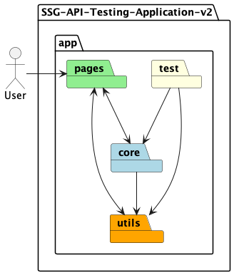

The application has 4 main components:

* `pages`: This component contains the Streamlit pages that are rendered when the application is run. Each page is
  responsible for rendering a set of UI/UX elements and handling the process behind calling a specific set of
  APIs. Pages also contain some logic to handle the rendering of UI/UX elements and the processing
  of data for the backend. This can be considered the "frontend" part of the application.
* `core`: This component contains the core logic of the application. This can be considered the "backend" part of the
  application.
* `utils`: This component contains utility functions that are used across the application.
* `tests`: This component contains the unit tests for the application.

We will explore in greater detail each of the components in the following sections.

#### Entrypoint

The entrypoint to the application is the `Home.py` file located in the `app` directory.

This file is a special page that is initially rendered when the application is first run. It provides users with the
opportunity to enter their credentials to authenticate themselves with the APIs and to access the other non-Home
pages, that will be described below under [Pages](#Pages).

To start the application, run the following command within the [`app`](../app) directory:

```shell
streamlit run Home.py
```

The process taken to start the Streamlit server is detailed below in the sequence diagram:

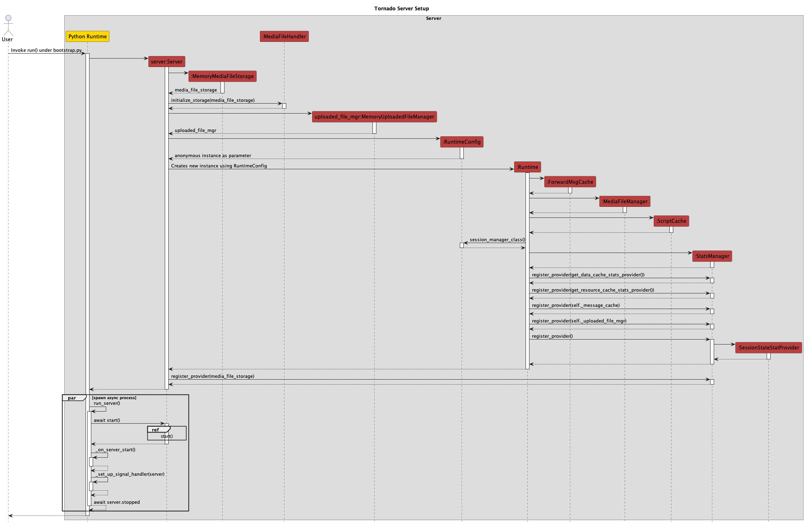

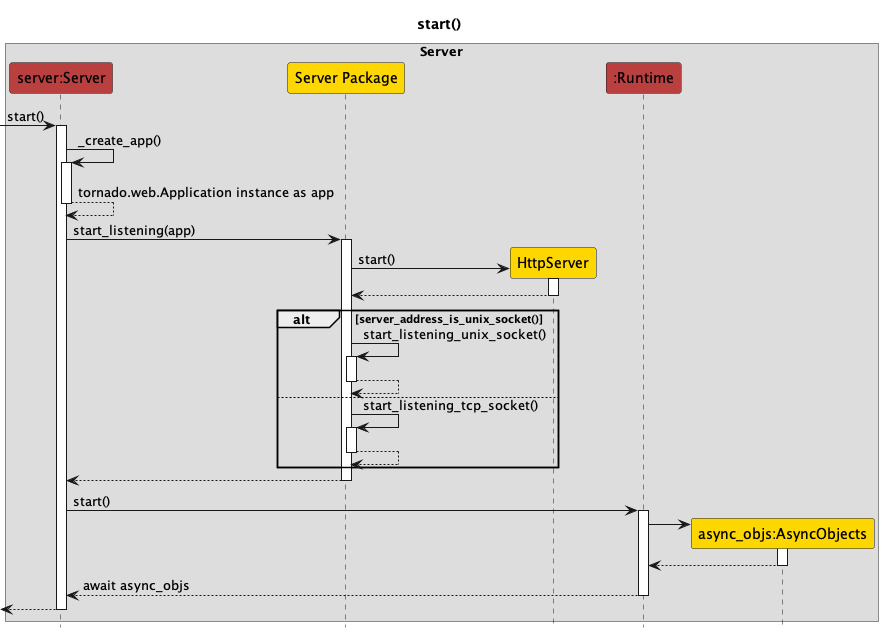

1. `run` from `bootstrap.py` is invoked
2. This creates an instance of `Server`, which forms the abstraction of the Streamlit Server where the application is
   served
3. In the constructor for `Server`,
    1. `MemoryMediaFileStorage`, `MediaFileHandler`, `MemoryUploadedFileManager` are initialised
    2. `Runtime` is initialised, and in the process, `RuntimeConfig` is also initialised and passed to `Runtime`
4. In the constructor for `Runtime`,
    1. `ForwardMsgCache`,  `MediaFileManager` and `ScriptCache` are initialised
    2. When creating an instance of `StatsManager`, `Runtime` invokes `StatsManager::register_provider()` to register
       the data, resources and message caches and the uploaded file manager. It also registers
       a `SessionStateStatProvider`
       object initialised by `StatsManager`.
5. `Server` then registers the `MemoryMediaFileStorage` object as a provider by
   invoking `StatsManager::register_provider()`
6. In a spawned asynchronous thread,
    1. `run_server()` is invoked, which invokes and awaits for the `Server::start()` method to return
        1. `Server::_create_app()` is invoked, which returns an instance of `tornado.web.Application`
        2. `start_listening(app)` from the server package is then invoked
        3. `HttpServer::start()` is invoked
        4. If the server address is a UNIX socket, `start_listening_unix_socket()` is invoked, else
           invoke `start_listening_tcp_socket()`
    2. `Runtime::start()` is finally invoked and awaited, which creates `AsyncObjects` and returns them to `Server`
7. The server is up and running

For most intents and purposes, it is highly unlikely you will need to modify any of these processes, as they are
provided
by the Streamlit library.

This section is to aid you in understanding how the Streamlit server is started and how the application is served.

#### User Flow

Once the server is started, you can access it via:

```text
http://localhost:[YOUR PORT HERE]
```

> [!NOTE]
> Replace `[YOUR_PORT_HERE]` entirely with the port number that is used in
> the [Streamlit configuration file](../app/.streamlit/config.toml).
>
> By default, the port number is set to `80`.

The following diagram showcases how a user might interact with the application:

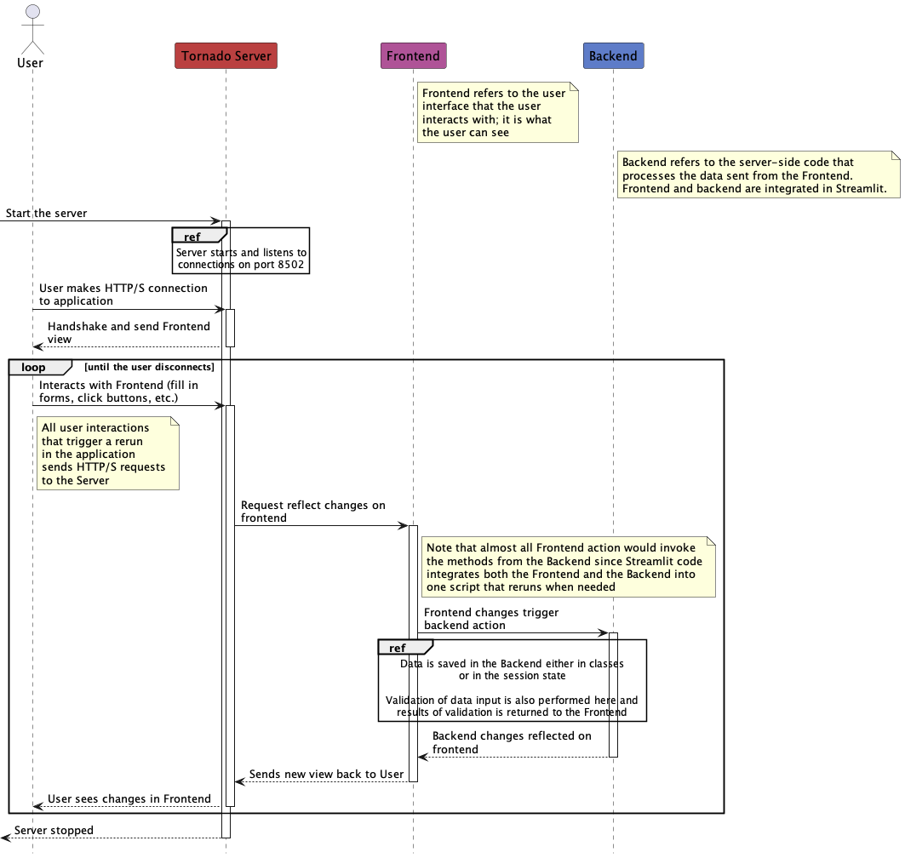

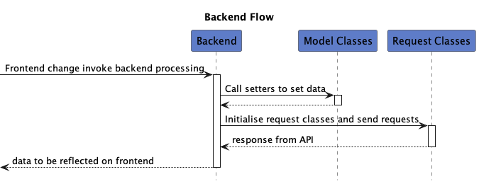

1. The server is started
2. User makes an HTTP/HTTPS connection to the server
3. While the server is active,
    1. When the user interacts with the frontend UI elements, HTTP requests are sent to the server
    2. The request triggers a change on the frontend
    3. This frontend change (usually) triggers a backend action
        1. For data entry changes, setters for backend model classes are called
        2. For event triggers (such as clicking buttons), depending on the event in question, either UI changes are made
           or backend logic is executed that calls external APIs
    4. Backend changes are then pushed to the frontend
    5. The user's view is then updated with the changes made

This flow is also something that you will highly unlikely need to modify, as it is provided by the Streamlit library.

However, the frontend to backend and then backend to frontend loop is something that you can modify if you wish.

#### Pages

The [`pages`](../app/pages) component contains the Streamlit pages that are rendered when the application is run.

The 6 non-Home pages in the application are contained in this component:

* [`Encryption-Decryption`](#Encryption-Decryption)
* [`Courses`](#Courses)
* [`Enrolment`](#Enrolment)
* [`Attendance`](#Attendance)
* [`Assessments`](#Assessments)
* [`SkillsFuture Credit Pay`](#SkillsFuture-Credit-Pay)

Each page of the application either showcases a certain functionality required for the application or utilises a
particular set of SSG APIs.

More information about the APIs is provided on
the [SSG Developer Portal](https://developer.ssg-wsg.gov.sg/webapp/api-discovery).

> [!TIP]
> Each page is designed to be modular and independent of each other. This means that you can modify each page
> without affecting the other pages.
>
> To develop new pages, follow the process as described in this [README.md](../app/pages/README.md) file.

##### `Encryption-Decryption`

This page allows users to encrypt and decrypt text using their encryption key.

The class diagram of classes involved in the creation of this page is as follows:

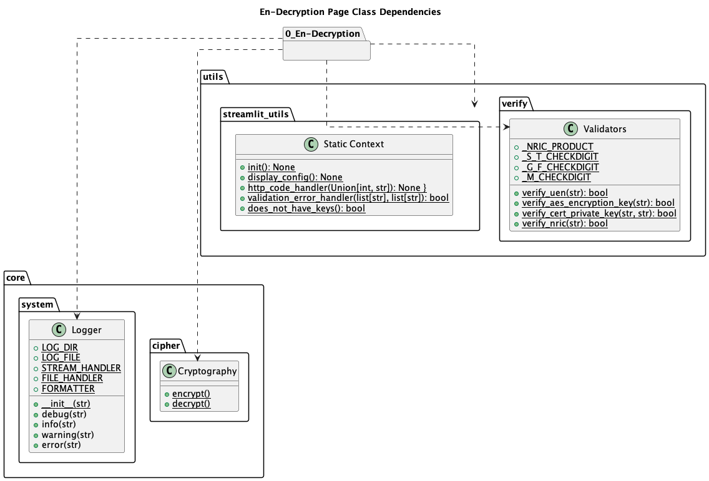

##### `Courses`

This page allows users to call the Courses API. More specifically, users can call the following APIs:

* Add Course Run
* Edit Course Run
* Course Run by Run Id
* Course Sessions

Users can navigate to the screen supporting the above APIs by clicking on the respective tabs.


The class diagram of classes involved in the creation of this page is as follows:

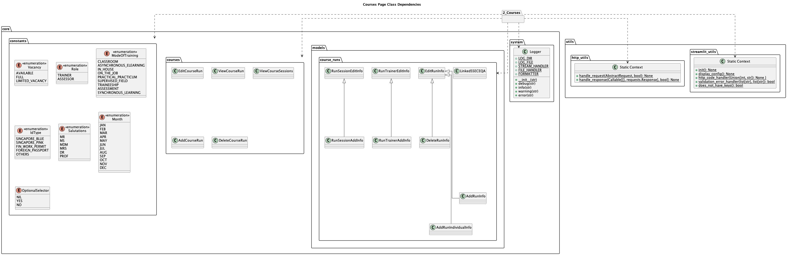

##### `Enrolment`

This page allows users to call the Enrolment API. More specifically, users can call the following APIs:

* Create Enrolment
* Update Enrolment
* Cancel Enrolment
* Search Enrolment
* View Enrolment
* Update Enrolment Fee Collection

Users can navigate to the screen supporting the above APIs by clicking on the respective tabs.


The class diagram of classes involved in the creation of this page is as follows:

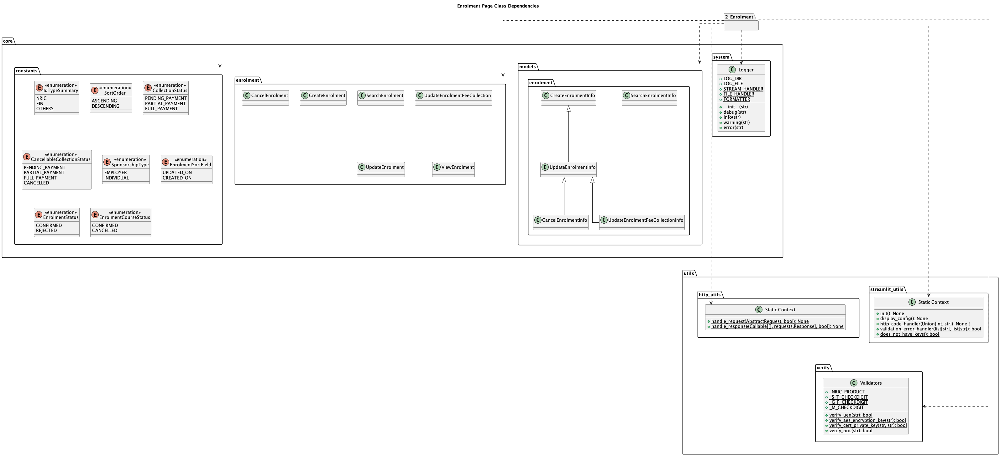

##### `Attendance`

This page allows users to call the Attendance API. More specifically, users can call the following APIs:

* Course Session Attendance
* Upload Course Session Attendance

Users can navigate to the screen supporting the above APIs by clicking on the respective tabs.


The class diagram of classes involved in the creation of this page is as follows:

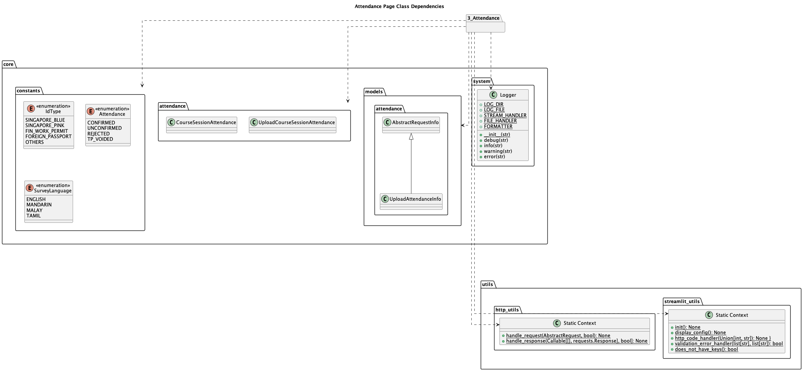

##### `Assessments`

This page allows users to call the Assessments API. More specifically, users can call the following APIs:

* Create Assessment
* Update/Void Assessment
* Search Assessment
* View Assessment

Users can navigate to the screen supporting the above APIs by clicking on the respective tabs.


The class diagram of classes involved in the creation of this page is as follows:

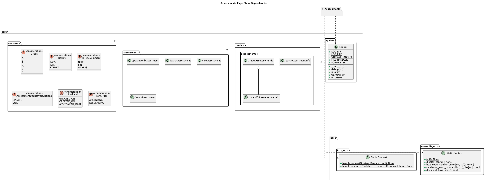

##### `SkillsFuture Credit Pay`

This page allows users to call the SkillsFuture Credit Pay API. More specifically, users can call the following APIs:

* Payment Request Encryption
* Payment Response Decryption
* Upload Supporting Documents
* View Claim Details
* Cancel Claim

Users can navigate to the screen supporting the above APIs by clicking on the respective tabs.


The class diagram of classes involved in the creation of this page is as follows:

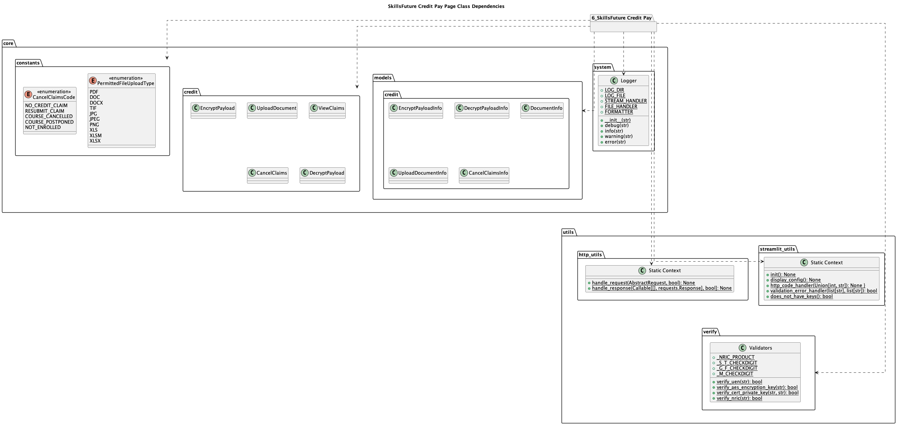

#### Core

The [`core`](../app/core) component contains the core logic of the application.

The structure of the component is as such:

* [`abc`](../app/core/abc): Contains abstract classes that are used to define the structure of the classes in the
  component
* [`assessments`](../app/core/assessments): Contains classes that are used to interact with the Assessments API
* [`attendance`](../app/core/attendance): Contains classes that are used to interact with the Attendance API
* [`cipher`](../app/core/cipher): Contains classes that are used to encrypt and decrypt payloads for the API
* [`courses`](../app/core/courses): Contains classes that are used to interact with the Courses API
* [`credit`](../app/core/credit): Contains classes that are used to interact with the SkillsFuture Credit Pay API
* [`enrolment`](../app/core/enrolment): Contains classes that are used to interact with the Enrolment API
* [`models`](../app/core/models): Contains classes that are used to create objects to hold data used in the different
  APIs
* [`system`](../app/core/system): Contains classes that are used to handle system-level operations and logging

The following class diagram showcases the classes involved in the core component, as well as the connections between the
classes:

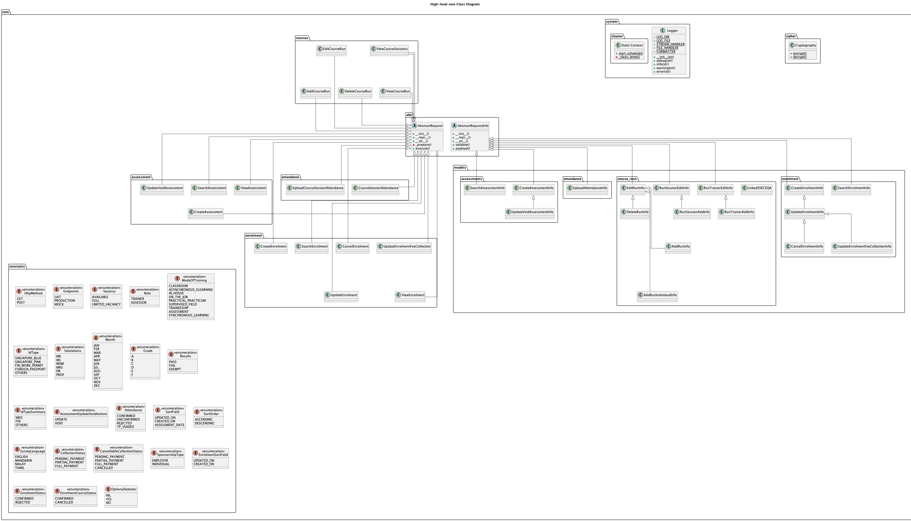

> [!WARNING]
> You should not modify the classes in this component unless you are sure of what you are doing. The classes in this
> component are used to interact with the SSG APIs and are critical to the functioning of the application!

#### Utils

The [`utils`](../app/utils) component contains utility functions that are used across the application.

The structure of the component is as such:

* [`http_utils`](../app/utils/http_utils.py): Contains classes that are used to make HTTP requests to the SSG APIs
* [`json_utils`](../app/utils/json_utils.py): Contains classes that are used to handle JSON payloads
* [`streamlit_utils`](../app/utils/streamlit_utils.py): Contains classes that are used to handle Streamlit-specific
  operations
* [`string_utils`](../app/utils/string_utils.py): Contains classes that are used to handle string operations
* [`verify`](../app/utils/verify.py): Contains classes that are used to verify data inputs by users

The following class diagram showcases the classes involved in the utils component, as well as the connections between
the classes:

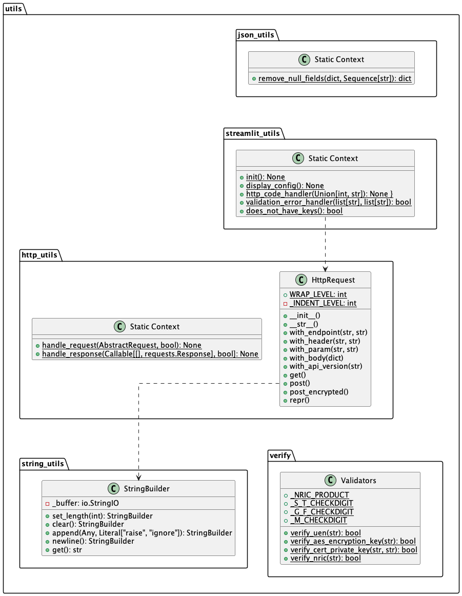

> [!WARNING]
> You should not modify the classes in this component unless you are sure of what you are doing. The classes in this
> component are used to provide utility functions that are used across the application!
>
> You may, however, add new utility functions to this component if you wish to extend the functionality of the
> application.

#### Tests

The [`tests`](../app/test) component contains the unit tests for the application.

The structure of the component is as such:

* [`checkstyle`](../app/test/checkstyle): Contains classes that are used to check the style of the code
* [`core`](../app/test/core): Contains classes that are used to test the core component
* [`resources`](../app/test/resources): Contains resources that are used in the unit tests
* [`utils`](../app/test/utils): Contains classes that are used to test the utils component

> [!NOTE]
> Feel free to modify the test cases in this component to add new test cases or to modify existing test cases to
> ensure that the application is functioning as expected!

### AWS Architecture

This application is also hosted on AWS. More information about the AWS cloud architecture is provided in the
[Deployment Guide](Deployment%20Guide.md).

For this Sample Application, we will be using the following Services provided by AWS:

* Amazon Elastic Container Registry (ECR)
* Amazon Elastic Container Service (ECS)
* Amazon Elastic Compute Cloud (EC2)
* Amazon DocumentDB
* Amazon Simple Storage Service (S3)
* Amazon CloudWatch
* VPC, Subnets, Route Tables, Internet Gateway, NAT Gateway, Elastic IPs (not services, but core components of AWS)

## Implementation

Since Streamlit uses a rather declarative approach to UI/UX development, the following section will focus on how the
encryption/decryption processes, 15 mandated APIs, and SkillsFuture Credit Pay APIs are implemented in the application.

In general, the collection of APIs is arranged as such:

- Each API is associated with a Streamlit Tab
- Within each Tab, all the UI and UI logic are placed within it
- The different data entry fields are usually at the top of the Tab. When data is entered, the data model class
  associated with an API is updated.
- A Streamlit Button is usually placed near the bottom of the Tab, after the data entry fields. When the button
  is clicked, the associated API request is called.

A diagram of the overall UI structure is seen below:

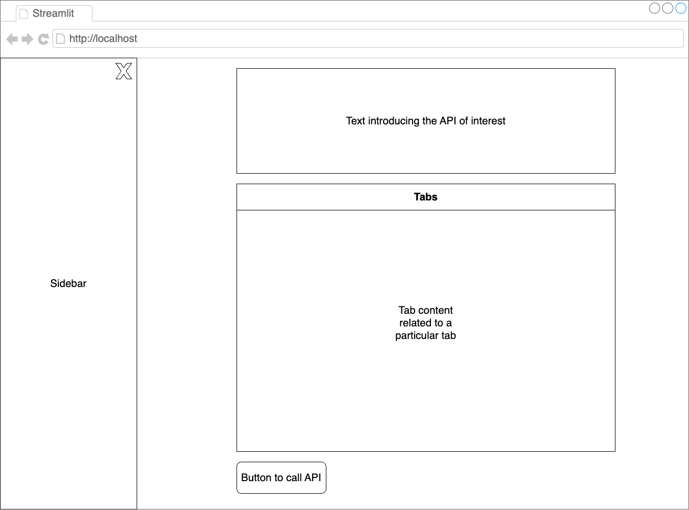

An actual screenshot of the UI can be seen in the [User Guide](User%20Guide.md).

We will not cover how the UI and UI logic are implemented as it is extensively documented by Streamlit in their
[documentation](https://docs.streamlit.io/).

We will, however, cover some of the design decisions regarding some of the APIs in greater detail below.

> [!NOTE]
> More details about the SSG APIs can be found at
> the [SSG Developer Portal](https://developer.ssg-wsg.gov.sg/webapp/api-discovery).

> [!NOTE]
> In the documentation below, if a data type is annotated with a value enclosed by a pair of square brackets 
> (e.g. `[1]`), that means that the type is constrained to a certain length.
> 
> For string types, the value enclosed by the square brackets represents the maximum length of the string.
> 
> For numerical types, the value enclosed by the square brackets represents the maximum value of the number.

> [!TIP]
> When an API is declared as "Request Encrypted", it means that you need to **encrypt the payload** with your AES-256
> key before sending it to the API.
>
> When an API is declared as "Response Encrypted", it means that the **payload returned by the API is encrypted** with
> your AES-256 key, and you need to decrypt it before using the data. You can use the same key for both encryption and
> decryption as AES-256 is a symmetric encryption algorithm.


### Encryption and Decryption

The En-Decryption page uses the following classes/methods from the `core` and `utils` components to encrypt and decrypt
text:

* `core.cipher.encrypt_decrypt.Cryptography`
    * Provides encryption and decryption capabilities
* `core.system.logger.Logger`
    * Provides logging capabilities
* `utils.streamlit_utils.init`, `utils.streamlit_utils.display_config`
    * Provides Streamlit-specific capabilities
* `utils.verify.Validators`
    * Provides validation capabilities for AES-256 keys

Together, they provide users with the ability to use their AES-256 keys to encrypt and decrypt text.

To find out more about the algorithms and processes used for encryption and decryption, head over to the
[Encryption and Decryption README](../app/core/cipher/README.md) for a more in-depth explanation.

### Courses

[[API Reference]](https://developer.ssg-wsg.gov.sg/webapp/docs/product/6kYpfJEWVb7NyYVVHvUmHi/group/374zmR5D0tQeS87eA1hrLV)

The Courses page uses the following classes/methods from the `core` and `utils` components to interact with the Courses
API:

* `core.courses.delete_course_run`, `core.courses.view_course_run`, `core.courses.edit_course_run`,
  `core.courses.add_course_run`, `core.courses.view_course_sessions`
    * Provides the ability to interact with the Courses API
* `core.models.course_runs.*`
    * Provides the data models for the Courses API
* `core.system.logger.Logger`
    * Provides logging capabilities
* `utils.streamlit_utils.init`, `utils.streamlit_utils.display_config`, `utils.streamlit_utils.validation_error_handler`
  `utils.streamlit_utils.does_not_have_keys`
    * Provides Streamlit-specific capabilities
* `utils.http_utils.handle_request`, `utils.http_utils.handle_request`
    * Handles the HTTP requests sent and responses received
* `utils.verify.Validators`
    * Provides validation capabilities for AES-256 keys

#### Course Run by Run Id

|   **Data Field**   |                 **Value**                 |
|:------------------:|:-----------------------------------------:|
|   API Reference    | Training Providers > Course Run by Run Id |
|    Request Type    |                    GET                    |
| Request Encrypted  |                    No                     |
| Response Encrypted |                    No                     |

This API is implemented under the "View Course Run" tab.

The user must input a valid Course Run ID to view the details of the course run.

Since neither the request nor response is encrypted, both the request payload and the response payloads are
read and displayed as is to the user via the UI. No preprocessing needs to be done on the request and response.

The parameters needed for this API are as follows:

| **Field** |                            **Description**                             |      **Type**       | **Example** | **Counterexample** |
|:---------:|:----------------------------------------------------------------------:|:-------------------:|:-----------:|:------------------:|
|   runId   | The Course Run ID. This can be obtained from the "Add Course Run" API. | Integer-like String |  `"1234"`   |   `"abc"`, `123`   |

> [!NOTE]
> Integer-like string represents Strings that contain only numerical digits, or can be directly converted into 
> an integer using the `int()` function in Python.

#### Add Course Runs

|   **Data Field**   |                 **Value**                 |
|:------------------:|:-----------------------------------------:|
|   API Reference    | Training Providers > Add Course Run (New) |
|    Request Type    |                   POST                    |
| Request Encrypted  |                    Yes                    |
| Response Encrypted |                    No                     |

This API is implemented under the "Add Course Run" tab.

Users must use this API to get a new Course Run ID for testing with the other APIs.

Since the request is encrypted but the response is not, the request payload, along with the encrypted request payload
is displayed to the user.

The parameters needed for this API are as follows:

|                            **Field**                             |                                               **Description**                                               |                                                               **Type**                                                               |                       **Example**                        |               **Counterexample**                |
|:----------------------------------------------------------------:|:-----------------------------------------------------------------------------------------------------------:|:------------------------------------------------------------------------------------------------------------------------------------:|:--------------------------------------------------------:|:-----------------------------------------------:|
|                   course.courseReferenceNumber                   |              The Course Reference Number. This can be obtained from the Conformance Test data.              |                                                                String                                                                |               `"XX-1000----K-01-TEST 166"`               |                      `123`                      |
|                   course.trainingProvider.uen                    |                                                 UEN Number                                                  |                                                                String                                                                |                      `"T08GB0001A"`                      |                      `123`                      |
|         runs.sequenceNumber (automatically incrementing)         |                          The sequence number of the course runs to add in a batch.                          |                                                               Integer                                                                |                           `1`                            |                  `1.0`, `abc`                   |
|                  runs.registrationDates.opening                  |                                The opening date of the registration period.                                 |                                                               Integer                                                                |                        `20221231`                        |             `"2022-12-31 00:00:00"`             |
|                  runs.registrationDates.closing                  |                                The closing date of the registration period.                                 |                                                               Integer                                                                |                        `20221231`                        |             `"2022-12-31 00:00:00"`             |
|                      runs.courseDates.start                      |                                        The start date of the course.                                        |                                                               Integer                                                                |                        `20221231`                        |             `"2022-12-31 00:00:00"`             |
|                       runs.courseDates.end                       |                                         The end date of the course.                                         |                                                               Integer                                                                |                        `20221231`                        |             `"2022-12-31 00:00:00"`             |
|                    runs.scheduleInfoType.code                    |                                 The code for the schedule information type.                                 |                                                              String[2]                                                               |                          `"01"`                          |                     `"abc"`                     |
|                runs.scheduleInfoType.description                 |                             The description for the schedule information type.                              |                                                              String[32]                                                              |                     `"Description"`                      | `123`, `"abcabcabcabcabcabcabcabcabcabcabcabc"` |
|                        runs.scheduleInfo                         |      The schedule information for the course run. This can be obtained from the Conformance Test data.      |                                                             String[300]                                                              |                 `"Schedule Information"`                 |                      `123`                      |
|                   runs.venue.block (optional)                    |                              The block of the venue where the course is held.                               |                                                              String[10]                                                              |                       `"Block 1"`                        |                      `123`                      |
|                   runs.venue.street (optional)                   |                              The street of the venue where the course is held.                              |                                                              String[32]                                                              |                       `"Street 1"`                       |                      `123`                      |
|                         runs.venue.floor                         |                              The floor of the venue where the course is held.                               |                                                              String[3]                                                               |                       `"Floor 1"`                        |                      `123`                      |
|                         runs.venue.unit                          |                               The unit of the venue where the course is held.                               |                                                              String[5]                                                               |                        `"Unit 1"`                        |                      `123`                      |
|                  runs.venue.building (optional)                  |                          The building name of the venue where the course is held.                           |                                                              String[66]                                                              |                      `"Building 1"`                      |                      `123`                      |
|                      runs.venue.postalCode                       |                           The postal code of the venue where the course is held.                            |                                                              String[6]                                                               |                        `"123456"`                        |                      `123`                      |
|                         runs.venue.room                          |                               The room of the venue where the course is held.                               |                                                             String[255]                                                              |                        `"Room 1"`                        |                      `123`                      |
|              runs.venue.wheelChairAccess (optional)              |                                  Whether the venue has wheelchair access.                                   |                                                               Boolean                                                                | `true`, `false` (or Python equivalents: `True`, `False`) |                  `123`, `abc`                   |
|                    runs.intakeSize (optional)                    |                   The maximum number of trainees that can be enrolled in the course run.                    |                                                           Non-zero Integer                                                           |                          `100`                           |               `0`, `100.0`, `abc`               |
|                    runs.threshold (optional)                     |   The number of trainees that can still be accepted even if the course is full (i.e. a buffer of sorts).    |                                                           Non-zero Integer                                                           |                           `10`                           |                `0`, `0.0`, `abc`                |
|               runs.registeredUserCount (optional)                |                   The number of trainees that are already registered for the course run.                    |                                                         Non-negative Integer                                                         |                          `100`                           |                `0`, `0.0`, `abc`                |
|                       runs.modeOfTraining                        |                                  The mode of training for the course run.                                   |                                         Literal["1", "2", "3", "4", "5", "6", "7", "8", "9"]                                         |                          `"1"`                           |                     `"abc"`                     |
|                      runs.courseAdminEmail                       |                               The email address of the course administrator.                                |                                                          Email String[255]                                                           |                   `"email@email.com"`                    |              `"email.com"`, `123`               |
|                     runs.courseVacancy.code                      |                                      The code for the course vacancy.                                       |                                                        Literal["A", "F", "L"]                                                        |                          `"A"`                           |                  `"X"`, `123`                   |
|                  runs.courseVacancy.description                  | The description for the course vacancy. This is set directly with the specification of the code in the app. |                                           Literal["Available", "Full", "Limited Vacancy"]                                            |                      `"Available"`                       |            `"Not Available"`, `123`             |
|                    runs.file.Name (optional)                     |                                    The name of the file to be uploaded.                                     |                                                             String[255]                                                              |                       `"file.txt"`                       |               `"file.txt"`, `123`               |
|                   runs.file.content (optional)                   |                                   The content of the file to be uploaded.                                   |                                                   File-like Base64 Encoded String                                                    |                      `"iVBORw0..."`                      |                      `123`                      |
|                     runs.sessions.startDate                      |                                    The start date of the course session.                                    |                                                         Integer-like String                                                          |                       `"20221231"`                       |             `"2022-12-31 00:00:00"`             |
|                      runs.sessions.endDate                       |                                     The end date of the course session.                                     |                                                         Integer-like String                                                          |                       `"20221231"`                       |             `"2022-12-31 00:00:00"`             |
|                     runs.sessions.startTime                      |                                    The start time of the course session.                                    |                                                           Time-like String                                                           |                        `"09:00"`                         |                    `"0900"`                     |
|                      runs.sessions.endTime                       |                                     The end time of the course session.                                     |                                                           Time-like String                                                           |                        `"17:00"`                         |                    `"1700"`                     |
|                   runs.sessions.modeOfTraining                   |                                The mode of training for the course session.                                 |                                         Literal["1", "2", "3", "4", "5", "6", "7", "8", "9"]                                         |                          `"1"`                           |                     `"abc"`                     |
|               runs.sessions.venue.block (optional)               |                              The block of the venue where the course is held.                               |                                                              String[10]                                                              |                       `"Block 1"`                        |                      `123`                      |
|              runs.sessions.venue.street (optional)               |                              The street of the venue where the course is held.                              |                                                              String[32]                                                              |                       `"Street 1"`                       |                      `123`                      |
|                    runs.sessions.venue.floor                     |                              The floor of the venue where the course is held.                               |                                                              String[3]                                                               |                       `"Floor 1"`                        |                      `123`                      |
|                     runs.sessions.venue.unit                     |                               The unit of the venue where the course is held.                               |                                                              String[5]                                                               |                        `"Unit 1"`                        |                      `123`                      |
|             runs.sessions.venue.building (optional)              |                          The building name of the venue where the course is held.                           |                                                              String[66]                                                              |                      `"Building 1"`                      |                      `123`                      |
|                  runs.sessions.venue.postalCode                  |                           The postal code of the venue where the course is held.                            |                                                              String[6]                                                               |                        `"123456"`                        |                      `123`                      |
|                     runs.sessions.venue.room                     |                               The room of the venue where the course is held.                               |                                                             String[255]                                                              |                        `"Room 1"`                        |                      `123`                      |
|         runs.sessions.venue.wheelChairAccess (optional)          |                                  Whether the venue has wheelchair access.                                   |                                                               Boolean                                                                | `true`, `false` (or Python equivalents: `True`, `False`) |                  `123`, `abc`                   |
|           runs.sessions.venue.primaryVenue (optional)            |       Whether the venue is the primary venue for the course session. This is set directly in the app.       |                                                               Boolean                                                                | `true`, `false` (or Python equivalents: `True`, `False`) |                  `123`, `abc`                   |
|        runs.linkCourseRunTrainer.trainer.trainerType.code        |                                 The type of the trainer for the course run.                                 |                                                          Literal["1", "2"]                                                           |                          `"1"`                           |                     `"abc"`                     |
|    runs.linkCourseRunTrainer.trainer.trainerType.description     |                                    The description of the trainer type.                                     |                                                             String[128]                                                              |                     `"Description"`                      |                      `123`                      |
|         runs.linkCourseRunTrainer.indexNumber (optional)         |                             The index number of the trainer for the course run.                             |                                                           Non-Zero Integer                                                           |                          `1234`                          |             `"abc"`, `"123"`, `-1`              |
|             runs.linkCourseRunTrainer.id (optional)              |                           The self-defined ID of the trainer for the course run.                            |                                                              String[50]                                                              |                         `"1234"`                         |                      `123`                      |
|                  runs.linkCourseRunTrainer.name                  |                                   Name of the trainer for the course run.                                   |                                                              String[66]                                                              |                       `"John Doe"`                       |                      `123`                      |
|                 runs.linkCourseRunTrainer.email                  |                                  Email of the trainer for the course run.                                   |                                                          Email String[320]                                                           |                    `"john@mail.com"`                     |               `"john.com"`, `123`               |
|                runs.linkCourseRunTrainer.idNumber                |                          The official ID number of the trainer for the course run.                          |                                                              String[50]                                                              |                      `"S1234567A"`                       |                      `123`                      |
|              runs.linkCourseRunTrainer.idType.code               |                             The ID type code of the trainer for the course run.                             |                                                Literal["SP", "SB", "SO", "FP", "OT"]                                                 |                          `"SP"`                          |                 `"abc"`, `123`                  |
|           runs.linkCourseRunTrainer.idType.description           |                      The description of the ID type of the trainer for the course run.                      | Literal["Singapore Pink Identification Card", "Singapore Blue Identification Card", "Fin/Work Permit", "Foreign Passport", "Others"] |                     `"Description"`                      |                      `123`                      |
|             runs.linkCourseRunTrainer.roles.role.id              |                            The ID of the role of the trainer for the course run.                            |                                                            Literal[1, 2]                                                             |                           `1`                            |                      `123`                      |
|         runs.linkCourseRunTrainer.roles.role.description         |                       The description of the role of the trainer for the course run.                        |                                                    Literal["Trainer", "Assessor"]                                                    |                       `"Trainer"`                        |                      `123`                      |
|  runs.linkCourseRunTrainer.inTrainingProviderProfile (optional)  |                         Whether the trainer is in the training provider's profile.                          |                                                               Boolean                                                                | `true`, `false` (or Python equivalents: `True`, `False`) |                  `123`, `abc`                   |
|          runs.linkCourseRunTrainer.domainAreaOfPractice          |                       The domain area of practice of the trainer for the course run.                        |                                                             String[1000]                                                             |               `"Domain Area of Practice"`                |                      `123`                      |
|         runs.linkCourseRunTrainer.experience (optional)          |                              The experience of the trainer for the course run.                              |                                                             String[1000]                                                             |                      `"Experience"`                      |                      `123`                      |
|         runs.linkCourseRunTrainer.linkedInURL (optional)         |                             The LinkedIn URL of the trainer for the course run.                             |                                                             String[255]                                                              |                     `"linkedin.com"`                     |                      `123`                      |
|              runs.linkCourseRunTrainer.salutationId              |                            The salutation ID of the trainer for the course run.                             |                                                      Literal[1, 2, 3, 4, 5, 6]                                                       |                           `1`                            |                  `"1"`, `123`                   |
|         runs.linkCourseRunTrainer.photo.name (optional)          |                          The name of the photo of the trainer for the course run.                           |                                                             String[255]                                                              |                      `"photo.jpg"`                       |              `"photo.jpg"`, `123`               |
|        runs.linkCourseRunTrainer.photo.content (optional)        |                         The content of the photo of the trainer for the course run.                         |                                                   File-like Base64 Encoded String                                                    |                      `"iVBORw0..."`                      |                      `123`                      |
| runs.linkCourseRunTrainer.linkedSsecEQAs.description (optional)  | The description of the linked SSEC EQAs of the trainer for the course run. This is set directly in the app. |                                                             String[1000]                                                             |                     `"Description"`                      |                      `123`                      |
| runs.linkCourseRunTrainer.linkedSsecEQAs.ssecEQA.code (optional) |                     The code of the linked SSEC EQAs of the trainer for the course run.                     |                                                              String[2]                                                               |                          `"12"`                          |                      `123`                      |


#### Edit or Delete Course Runs

|   **Data Field**   |                 **Value**                  |
|:------------------:|:------------------------------------------:|
|   API Reference    | Training Providers > Edit Course Run (New) |
|    Request Type    |                    POST                    |
| Request Encrypted  |                    Yes                     |
| Response Encrypted |                     No                     |

This API is implemented under the "Edit/Delete Course Runs" tab.

Users must use this API to edit or delete a Course Run.

Since the request is encrypted but the response is not, the request payload, along with the encrypted request payload
is displayed to the user.

The parameters needed for the Edit Course Runs API are as follow:

|                             **Field**                              |                                               **Description**                                               |                                                               **Type**                                                               |                       **Example**                        |               **Counterexample**                |
|:------------------------------------------------------------------:|:-----------------------------------------------------------------------------------------------------------:|:------------------------------------------------------------------------------------------------------------------------------------:|:--------------------------------------------------------:|:-----------------------------------------------:|
|                            courseRunId                             |                   The Course Run ID. This can be obtained from the "Add Course Run" API.                    |                                                         Integer-like String                                                          |                         `"1234"`                         |                 `"abc"`, `123`                  |
|                    course.courseReferenceNumber                    |              The Course Reference Number. This can be obtained from the Conformance Test data.              |                                                                String                                                                |               `"XX-1000----K-01-TEST 166"`               |                      `123`                      |
|                    course.trainingProvider.uen                     |                                                 UEN Number                                                  |                                                                String                                                                |                      `"T08GB0001A"`                      |                      `123`                      |
|     runs.sequenceNumber (optional, automatically incrementing)     |                          The sequence number of the course runs to add in a batch.                          |                                                               Integer                                                                |                           `1`                            |                  `1.0`, `abc`                   |
|                   runs.registrationDates.opening                   |                                The opening date of the registration period.                                 |                                                               Integer                                                                |                        `20221231`                        |             `"2022-12-31 00:00:00"`             |
|                   runs.registrationDates.closing                   |                                The closing date of the registration period.                                 |                                                               Integer                                                                |                        `20221231`                        |             `"2022-12-31 00:00:00"`             |
|                       runs.courseDates.start                       |                                        The start date of the course.                                        |                                                               Integer                                                                |                        `20221231`                        |             `"2022-12-31 00:00:00"`             |
|                        runs.courseDates.end                        |                                         The end date of the course.                                         |                                                               Integer                                                                |                        `20221231`                        |             `"2022-12-31 00:00:00"`             |
|                     runs.scheduleInfoType.code                     |                                 The code for the schedule information type.                                 |                                                              String[2]                                                               |                          `"01"`                          |                     `"abc"`                     |
|                 runs.scheduleInfoType.description                  |                             The description for the schedule information type.                              |                                                              String[32]                                                              |                     `"Description"`                      | `123`, `"abcabcabcabcabcabcabcabcabcabcabcabc"` |
|                    runs.scheduleInfo (optional)                    |      The schedule information for the course run. This can be obtained from the Conformance Test data.      |                                                             String[300]                                                              |                 `"Schedule Information"`                 |                      `123`                      |
|                    runs.venue.block (optional)                     |                              The block of the venue where the course is held.                               |                                                              String[10]                                                              |                       `"Block 1"`                        |                      `123`                      |
|                    runs.venue.street (optional)                    |                              The street of the venue where the course is held.                              |                                                              String[32]                                                              |                       `"Street 1"`                       |                      `123`                      |
|                          runs.venue.floor                          |                              The floor of the venue where the course is held.                               |                                                              String[3]                                                               |                       `"Floor 1"`                        |                      `123`                      |
|                          runs.venue.unit                           |                               The unit of the venue where the course is held.                               |                                                              String[5]                                                               |                        `"Unit 1"`                        |                      `123`                      |
|                   runs.venue.building (optional)                   |                          The building name of the venue where the course is held.                           |                                                              String[66]                                                              |                      `"Building 1"`                      |                      `123`                      |
|                       runs.venue.postalCode                        |                           The postal code of the venue where the course is held.                            |                                                              String[6]                                                               |                        `"123456"`                        |                      `123`                      |
|                          runs.venue.room                           |                               The room of the venue where the course is held.                               |                                                             String[255]                                                              |                        `"Room 1"`                        |                      `123`                      |
|               runs.venue.wheelChairAccess (optional)               |                                  Whether the venue has wheelchair access.                                   |                                                               Boolean                                                                | `true`, `false` (or Python equivalents: `True`, `False`) |                  `123`, `abc`                   |
|                     runs.intakeSize (optional)                     |                   The maximum number of trainees that can be enrolled in the course run.                    |                                                           Non-zero Integer                                                           |                          `100`                           |               `0`, `100.0`, `abc`               |
|                     runs.threshold (optional)                      |   The number of trainees that can still be accepted even if the course is full (i.e. a buffer of sorts).    |                                                           Non-zero Integer                                                           |                           `10`                           |                `0`, `0.0`, `abc`                |
|                runs.registeredUserCount (optional)                 |                   The number of trainees that are already registered for the course run.                    |                                                         Non-negative Integer                                                         |                          `100`                           |                `0`, `0.0`, `abc`                |
|                   runs.modeOfTraining (optional)                   |                                  The mode of training for the course run.                                   |                                         Literal["1", "2", "3", "4", "5", "6", "7", "8", "9"]                                         |                          `"1"`                           |                     `"abc"`                     |
|                       runs.courseAdminEmail                        |                               The email address of the course administrator.                                |                                                          Email String[255]                                                           |                   `"email@email.com"`                    |              `"email.com"`, `123`               |
|                      runs.courseVacancy.code                       |                                      The code for the course vacancy.                                       |                                                        Literal["A", "F", "L"]                                                        |                          `"A"`                           |                  `"X"`, `123`                   |
|                   runs.courseVacancy.description                   | The description for the course vacancy. This is set directly with the specification of the code in the app. |                                           Literal["Available", "Full", "Limited Vacancy"]                                            |                      `"Available"`                       |            `"Not Available"`, `123`             |
|                     runs.file.Name (optional)                      |                                    The name of the file to be uploaded.                                     |                                                             String[255]                                                              |                       `"file.txt"`                       |               `"file.txt"`, `123`               |
|                    runs.file.content (optional)                    |                                   The content of the file to be uploaded.                                   |                                                   File-like Base64 Encoded String                                                    |                      `"iVBORw0..."`                      |                      `123`                      |
|                 runs.sessions.startDate (optional)                 |                                    The start date of the course session.                                    |                                                         Integer-like String                                                          |                       `"20221231"`                       |             `"2022-12-31 00:00:00"`             |
|                  runs.sessions.endDate (optional)                  |                                     The end date of the course session.                                     |                                                         Integer-like String                                                          |                       `"20221231"`                       |             `"2022-12-31 00:00:00"`             |
|                 runs.sessions.startTime (optional)                 |                                    The start time of the course session.                                    |                                                           Time-like String                                                           |                        `"09:00"`                         |                    `"0900"`                     |
|                  runs.sessions.endTime (optional)                  |                                     The end time of the course session.                                     |                                                           Time-like String                                                           |                        `"17:00"`                         |                    `"1700"`                     |
|              runs.sessions.modeOfTraining (optional)               |                                The mode of training for the course session.                                 |                                         Literal["1", "2", "3", "4", "5", "6", "7", "8", "9"]                                         |                          `"1"`                           |                     `"abc"`                     |
|                runs.sessions.venue.block (optional)                |                              The block of the venue where the course is held.                               |                                                              String[10]                                                              |                       `"Block 1"`                        |                      `123`                      |
|               runs.sessions.venue.street (optional)                |                              The street of the venue where the course is held.                              |                                                              String[32]                                                              |                       `"Street 1"`                       |                      `123`                      |
|   runs.sessions.venue.floor (optional, unless venue is defined)    |                              The floor of the venue where the course is held.                               |                                                              String[3]                                                               |                       `"Floor 1"`                        |                      `123`                      |
|    runs.sessions.venue.unit (optional, unless venue is defined)    |                               The unit of the venue where the course is held.                               |                                                              String[5]                                                               |                        `"Unit 1"`                        |                      `123`                      |
|              runs.sessions.venue.building (optional)               |                          The building name of the venue where the course is held.                           |                                                              String[66]                                                              |                      `"Building 1"`                      |                      `123`                      |
| runs.sessions.venue.postalCode (optional, unless venue is defined) |                           The postal code of the venue where the course is held.                            |                                                              String[6]                                                               |                        `"123456"`                        |                      `123`                      |
|    runs.sessions.venue.room (optional, unless venue is defined)    |                               The room of the venue where the course is held.                               |                                                             String[255]                                                              |                        `"Room 1"`                        |                      `123`                      |
|          runs.sessions.venue.wheelChairAccess (optional)           |                                  Whether the venue has wheelchair access.                                   |                                                               Boolean                                                                | `true`, `false` (or Python equivalents: `True`, `False`) |                  `123`, `abc`                   |
|            runs.sessions.venue.primaryVenue (optional)             |       Whether the venue is the primary venue for the course session. This is set directly in the app.       |                                                               Boolean                                                                | `true`, `false` (or Python equivalents: `True`, `False`) |                  `123`, `abc`                   |
|         runs.linkCourseRunTrainer.trainer.trainerType.code         |                                 The type of the trainer for the course run.                                 |                                                          Literal["1", "2"]                                                           |                          `"1"`                           |                     `"abc"`                     |
|     runs.linkCourseRunTrainer.trainer.trainerType.description      |                                    The description of the trainer type.                                     |                                                             String[128]                                                              |                     `"Description"`                      |                      `123`                      |
|          runs.linkCourseRunTrainer.indexNumber (optional)          |                             The index number of the trainer for the course run.                             |                                                           Non-Zero Integer                                                           |                          `1234`                          |             `"abc"`, `"123"`, `-1`              |
|              runs.linkCourseRunTrainer.id (optional)               |                           The self-defined ID of the trainer for the course run.                            |                                                              String[50]                                                              |                         `"1234"`                         |                      `123`                      |
|                   runs.linkCourseRunTrainer.name                   |                                   Name of the trainer for the course run.                                   |                                                              String[66]                                                              |                       `"John Doe"`                       |                      `123`                      |
|                  runs.linkCourseRunTrainer.email                   |                                  Email of the trainer for the course run.                                   |                                                          Email String[320]                                                           |                    `"john@mail.com"`                     |               `"john.com"`, `123`               |
|                 runs.linkCourseRunTrainer.idNumber                 |                          The official ID number of the trainer for the course run.                          |                                                              String[50]                                                              |                      `"S1234567A"`                       |                      `123`                      |
|               runs.linkCourseRunTrainer.idType.code                |                             The ID type code of the trainer for the course run.                             |                                                Literal["SP", "SB", "SO", "FP", "OT"]                                                 |                          `"SP"`                          |                 `"abc"`, `123`                  |
|            runs.linkCourseRunTrainer.idType.description            |                      The description of the ID type of the trainer for the course run.                      | Literal["Singapore Pink Identification Card", "Singapore Blue Identification Card", "Fin/Work Permit", "Foreign Passport", "Others"] |                     `"Description"`                      |                      `123`                      |
|              runs.linkCourseRunTrainer.roles.role.id               |                            The ID of the role of the trainer for the course run.                            |                                                            Literal[1, 2]                                                             |                           `1`                            |                      `123`                      |
|          runs.linkCourseRunTrainer.roles.role.description          |                       The description of the role of the trainer for the course run.                        |                                                    Literal["Trainer", "Assessor"]                                                    |                       `"Trainer"`                        |                      `123`                      |
|   runs.linkCourseRunTrainer.inTrainingProviderProfile (optional)   |                         Whether the trainer is in the training provider's profile.                          |                                                               Boolean                                                                | `true`, `false` (or Python equivalents: `True`, `False`) |                  `123`, `abc`                   |
|     runs.linkCourseRunTrainer.domainAreaOfPractice (optional)      |                       The domain area of practice of the trainer for the course run.                        |                                                             String[1000]                                                             |               `"Domain Area of Practice"`                |                      `123`                      |
|          runs.linkCourseRunTrainer.experience (optional)           |                              The experience of the trainer for the course run.                              |                                                             String[1000]                                                             |                      `"Experience"`                      |                      `123`                      |
|          runs.linkCourseRunTrainer.linkedInURL (optional)          |                             The LinkedIn URL of the trainer for the course run.                             |                                                             String[255]                                                              |                     `"linkedin.com"`                     |                      `123`                      |
|         runs.linkCourseRunTrainer.salutationId (optional)          |                            The salutation ID of the trainer for the course run.                             |                                                      Literal[1, 2, 3, 4, 5, 6]                                                       |                           `1`                            |                  `"1"`, `123`                   |
|          runs.linkCourseRunTrainer.photo.name (optional)           |                          The name of the photo of the trainer for the course run.                           |                                                             String[255]                                                              |                      `"photo.jpg"`                       |              `"photo.jpg"`, `123`               |
|         runs.linkCourseRunTrainer.photo.content (optional)         |                         The content of the photo of the trainer for the course run.                         |                                                   File-like Base64 Encoded String                                                    |                      `"iVBORw0..."`                      |                      `123`                      |
|  runs.linkCourseRunTrainer.linkedSsecEQAs.description (optional)   | The description of the linked SSEC EQAs of the trainer for the course run. This is set directly in the app. |                                                             String[1000]                                                             |                     `"Description"`                      |                      `123`                      |
|  runs.linkCourseRunTrainer.linkedSsecEQAs.ssecEQA.code (optional)  |                     The code of the linked SSEC EQAs of the trainer for the course run.                     |                                                              String[2]                                                               |                          `"12"`                          |                      `123`                      |

The parameters needed for the Delete Course Runs API are as follow:

|                             **Field**                              |                                               **Description**                                               |                                                               **Type**                                                               |                       **Example**                        |               **Counterexample**                |
|:------------------------------------------------------------------:|:-----------------------------------------------------------------------------------------------------------:|:------------------------------------------------------------------------------------------------------------------------------------:|:--------------------------------------------------------:|:-----------------------------------------------:|
|                            courseRunId                             |                   The Course Run ID. This can be obtained from the "Add Course Run" API.                    |                                                         Integer-like String                                                          |                         `"1234"`                         |                 `"abc"`, `123`                  |
|                    course.courseReferenceNumber                    |              The Course Reference Number. This can be obtained from the Conformance Test data.              |                                                                String                                                                |               `"XX-1000----K-01-TEST 166"`               |                      `123`                      |
|                    course.trainingProvider.uen                     |                                                 UEN Number                                                  |                                                                String                                                                |                      `"T08GB0001A"`                      |                      `123`                      |

> [!NOTE]
> Integer-like string represents Strings that contain only numerical digits, or can be directly converted into 
> an integer using the `int()` function in Python.

#### View Course Sessions

|   **Data Field**   |              **Value**               |
|:------------------:|:------------------------------------:|
|   API Reference    | Training Providers > Course Sessions |
|    Request Type    |                 GET                  |
| Request Encrypted  |                  No                  |
| Response Encrypted |                  No                  |

This API is implemented under the "View Course Sessions" tab.

Users must use this API to view the course sessions for a particular Course Run.

Since the request is encrypted but the response is not, the request payload, along with the encrypted request payload
is displayed to the user.

The parameters needed for this API are as follows:

|       **Field**       |                                  **Description**                                  |      **Type**       |         **Example**          |  **Counterexample**  |
|:---------------------:|:---------------------------------------------------------------------------------:|:-------------------:|:----------------------------:|:--------------------:|
|         runId         |      The Course Run ID. This can be obtained from the "Add Course Run" API.       | Integer-like String |           `"1234"`           |    `"abc"`, `123`    |
|          uen          |                         The UEN of the training provider.                         |       String        |        `"T08GB0001A"`        | `"123"`, `123456789` |
| courseReferenceNumber | The Course Reference Number. This can be obtained from the Conformance Test data. |       String        | `"XX-1000----K-01-TEST 166"` | `"123"`, `123456789` |

> [!NOTE]
> Integer-like string represents Strings that contain only numerical digits, or can be directly converted into 
> an integer using the `int()` function in Python.

### Enrolment

[[API Reference]](https://developer.ssg-wsg.gov.sg/webapp/docs/product/7KU1xrpxljJZnsIkJP6QNF/group/adg1EGw5xjv6Fs40BTrK8)

The Enrolment Page uses the following classes/methods from the `core` and `utils` components to interact with the
Enrolment API:

* `core.enrolment.create_enrolment`, `core.enrolment.view_enrolment`, `core.enrolment.update_enrolment`,
  `core.enrolment.cancel_enrolment`, `core.enrolment.search_enrolment`, `core.enrolment.update_enrolment_fee_collection`
    * Provides the ability to interact with the Enrolment API
* `core.models.enrolment.*`
    * Provides the data models for the Enrolment API
* `core.system.logger.Logger`
    * Provides logging capabilities
* `utils.streamlit_utils.init`, `utils.streamlit_utils.display_config`, `utils.streamlit_utils.validation_error_handler`
    * Provides Streamlit-specific capabilities
* `utils.http_utils.handle_request`, `utils.http_utils.handle_request`
    * Handles the HTTP requests sent and responses received
* `utils.verify.Validators`
    * Provides validation capabilities for AES-256 keys

#### Create Enrolment

|   **Data Field**   |           **Value**           |
|:------------------:|:-----------------------------:|
|   API Reference    | Enrolments > Create Enrolment |
|    Request Type    |             POST              |
| Request Encrypted  |              Yes              |
| Response Encrypted |              Yes              |

This API is implemented under the "Create Enrolment" tab.

Users must use this API to create an enrolment record for a particular trainee.

Since both the request and response are encrypted, the request payload, along with the encrypted request payload
is displayed to the user. The encrypted response payload and decrypted response payload are also displayed to the
user.

The parameters needed for this API are as follows:

|                                **Field**                                |                                                      **Description**                                                      |                           **Type**                            |     **Example**     |   **Counterexample**    |
|:-----------------------------------------------------------------------:|:-------------------------------------------------------------------------------------------------------------------------:|:-------------------------------------------------------------:|:-------------------:|:-----------------------:|
|                         enrolment.course.run.id                         |                          The Course Run ID. This can be obtained from the "Add Course Run" API.                           |                    Integer-like String[20]                    |      `"1234"`       |     `"abc"`, `123`      |
|                        enrolment.referenceNumber                        |                                          The reference number of the enrolment.                                           |                          String[100]                          | `"TGS-0026008-ES"`  |          `123`          |
|                               trainee.id                                |                                              The official ID of the trainee.                                              |                            String                             |    `"S1234567A"`    |          `123`          |
|                  enrolment.trainee.fees.discountAmount                  |                                       The amount of discount given to the trainee.                                        |                      Non-Negative Float                       |       `100.0`       |          `abc`          |
|                 enrolment.trainee.fees.collectionStatus                 |                                       The status of fee collection for the trainee.                                       | Literal["Pending Payment", "Partial Payment", "Full Payment"] | `"Pending Payment"` |         `"abc"`         |
|                      enrolment.trainee.idType.type                      |                                              The type of ID of the trainee.                                               |               Literal["NRIC", "FIN", "OTHERS"]                |      `"NRIC"`       |     `"abc"`, `123`      |
|                    enrolment.trainee.sponsorshipType                    |                                         The type of sponsorship for the trainee.                                          |               Literal["EMPLOYER", "INDIVIDUAL"]               |    `"EMPLOYER"`     |     `"abc"`, `123`      |
|                enrolment.trainee.employer.uen (optional)                |      The UEN of the employer of the trainee. This value is optional **unless trainee.sponsorshipType is EMPLOYER**.       |                          String[50]                           |   `"T08GB0001A"`    |     `"abc"`, `123`      |
|         enrolment.trainee.employer.contact.fullName (optional)          |           The full name of the employer. This value is optional unless **trainee.sponsorshipType is EMPLOYER**.           |                          String[50]                           |    `"John Doe"`     |     `"abc"`, `123`      |
|       enrolment.trainee.employer.contact.emailAddress (optional)        |         The email address of the employer. This value is optional unless **trainee.sponsorshipType is EMPLOYER**.         |                       Email String[100]                       | `"email@email.com"` |  `"email.com"`, `123`   |
|  enrolment.trainee.employer.contact.contactNumber.areaCode (optional)   |                      The area code of the employer's contact number. This value **always** optional.                      |                          String[10]                           |       `"123"`       |     `"abc"`, `123`      |
| enrolment.trainee.employer.contact.contactNumber.countryCode (optional) |         The country code of the employer. This value is optional **unless trainee.sponsorshipType is EMPLOYER**.          |                           String[5]                           |       `"65"`        |     `"abc"`, `123`      |
| enrolment.trainee.employer.contact.contactNumber.phoneNumber (optional) | The phone number of the employer's contact number. This value is optional **unless trainee.sponsorshipType is EMPLOYER**. |                          String[20]                           |      `"12345"`      |     `"abc"`, `123`      |
|                  enrolment.trainee.fullName (optional)                  |                                               The full name of the trainee.                                               |                          String[200]                          |    `"John Doe"`     |     `"abc"`, `123`      |
|                      enrolment.trainee.dateOfBirth                      |                                             The date of birth of the trainee.                                             |              Integer-like, Datetime-like String               |    `"20221231"`     | `"2022-12-31 00:00:00"` |
|                     enrolment.trainee.emailAddress                      |                                             The email address of the trainee.                                             |                       Email String[100]                       | `"email@email.com"` |  `"email.com"`, `123`   |
|           enrolment.trainee.contactNumber.areaCode (optional)           |                                      The area code of the trainee's contact number.                                       |                          String[10]                           |       `"123"`       |     `"abc"`, `123`      |
|               enrolment.trainee.contactNumber.countryCode               |                                             The country code of the trainee.                                              |                           String[5]                           |       `"65"`        |     `"abc"`, `123`      |
|               enrolment.trainee.contactNumber.phoneNumber               |                                     The phone number of the trainee's contact number.                                     |                          String[20]                           |      `"12345"`      |     `"abc"`, `123`      |
|               enrolment.trainee.enrolmentDate (optional)                |                               The date of enrolment of the trainee. This value is optional.                               |              Integer-like, Datetime-like String               |    `"20221231"`     | `"2022-12-31 00:00:00"` |
|                      enrolment.trainingPartner.uen                      |                                             The UEN of the training partner.                                              |                          String[12]                           |   `"T08GB0001A"`    |     `"abc"`, `123`      |
|                     enrolment.trainingPartner.code                      |                                                The training partner code.                                                 |                          String[15]                           |  `"T08GB0001A-01"`  |     `"abc"`, `123`      |

#### Update Enrolment

|   **Data Field**   |                **Value**                |
|:------------------:|:---------------------------------------:|
|   API Reference    | Enrolments > Update or Cancel Enrolment |
|    Request Type    |                  POST                   |
| Request Encrypted  |                   Yes                   |
| Response Encrypted |                   Yes                   |

This API is implemented under the "Update Enrolment" tab.

Users must use this API to update an existing enrolment record.

Since both the request and response are encrypted, the request payload, along with the encrypted request payload
is displayed to the user. The encrypted response payload and decrypted response payload are also displayed to the
user.

The parameters needed for this API are as follows:

|                                **Field**                                |                            **Description**                             |                           **Type**                            |     **Example**     |   **Counterexample**    |
|:-----------------------------------------------------------------------:|:----------------------------------------------------------------------:|:-------------------------------------------------------------:|:-------------------:|:-----------------------:|
|                   enrolment.course.run.id (optional)                    | The Course Run ID. This can be obtained from the "Add Course Run" API. |                    Integer-like String[20]                    |      `"1234"`       |     `"abc"`, `123`      |
|               enrolment.course.referenceNumber (optional)               |                 The reference number of the enrolment.                 |                          String[100]                          | `"TGS-0026008-ES"`  |          `123`          |
|                          trainee.id (optional)                          |                    The official ID of the trainee.                     |                            String                             |    `"S1234567A"`    |          `123`          |
|            enrolment.trainee.fees.discountAmount (optional)             |              The amount of discount given to the trainee.              |                      Non-Negative Float                       |       `100.0`       |          `abc`          |
|           enrolment.trainee.fees.collectionStatus (optional)            |             The status of fee collection for the trainee.              | Literal["Pending Payment", "Partial Payment", "Full Payment"] | `"Pending Payment"` |         `"abc"`         |
|                enrolment.trainee.idType.type (optional)                 |                     The type of ID of the trainee.                     |               Literal["NRIC", "FIN", "OTHERS"]                |      `"NRIC"`       |     `"abc"`, `123`      |
|              enrolment.trainee.sponsorshipType  (optional)              |                The type of sponsorship for the trainee.                |               Literal["EMPLOYER", "INDIVIDUAL"]               |    `"EMPLOYER"`     |     `"abc"`, `123`      |
|                enrolment.trainee.employer.uen (optional)                |                The UEN of the employer of the trainee.                 |                          String[50]                           |   `"T08GB0001A"`    |     `"abc"`, `123`      |
|         enrolment.trainee.employer.contact.fullName (optional)          |                     The full name of the employer.                     |                          String[50]                           |    `"John Doe"`     |     `"abc"`, `123`      |
|       enrolment.trainee.employer.contact.emailAddress (optional)        |                   The email address of the employer.                   |                       Email String[100]                       | `"email@email.com"` |  `"email.com"`, `123`   |
|  enrolment.trainee.employer.contact.contactNumber.areaCode (optional)   |            The area code of the employer's contact number.             |                          String[10]                           |       `"123"`       |     `"abc"`, `123`      |
| enrolment.trainee.employer.contact.contactNumber.countryCode (optional) |                   The country code of the employer.                    |                           String[5]                           |       `"65"`        |     `"abc"`, `123`      |
| enrolment.trainee.employer.contact.contactNumber.phoneNumber (optional) |           The phone number of the employer's contact number.           |                          String[20]                           |      `"12345"`      |     `"abc"`, `123`      |
|                  enrolment.trainee.fullName (optional)                  |                     The full name of the trainee.                      |                          String[200]                          |    `"John Doe"`     |     `"abc"`, `123`      |
|                enrolment.trainee.dateOfBirth (optional)                 |                   The date of birth of the trainee.                    |              Integer-like, Datetime-like String               |    `"20221231"`     | `"2022-12-31 00:00:00"` |
|                enrolment.trainee.emailAddress (optional)                |                   The email address of the trainee.                    |                       Email String[100]                       | `"email@email.com"` |  `"email.com"`, `123`   |
|           enrolment.trainee.contactNumber.areaCode (optional)           |             The area code of the trainee's contact number.             |                          String[10]                           |       `"123"`       |     `"abc"`, `123`      |
|         enrolment.trainee.contactNumber.countryCode (optional)          |                    The country code of the trainee.                    |                           String[5]                           |       `"65"`        |     `"abc"`, `123`      |
|         enrolment.trainee.contactNumber.phoneNumber (optional)          |           The phone number of the trainee's contact number.            |                          String[20]                           |      `"12345"`      |     `"abc"`, `123`      |
|               enrolment.trainee.enrolmentDate (optional)                |     The date of enrolment of the trainee. This value is optional.      |              Integer-like, Datetime-like String               |    `"20221231"`     | `"2022-12-31 00:00:00"` |
|                enrolment.trainingPartner.uen (optional)                 |                    The UEN of the training partner.                    |                          String[12]                           |   `"T08GB0001A"`    |     `"abc"`, `123`      |
|                enrolment.trainingPartner.code (optional)                |                       The training partner code.                       |                          String[15]                           |  `"T08GB0001A-01"`  |     `"abc"`, `123`      |

> [!CAUTION]
> More extensive testing should be done for this API. It seems that many combinations of parameters are not permitted.
> Currently, we assume that users know exactly what they are editing.

#### Cancel Enrolment

|   **Data Field**   |                **Value**                |
|:------------------:|:---------------------------------------:|
|   API Reference    | Enrolments > Update or Cancel Enrolment |
|    Request Type    |                  POST                   |
| Request Encrypted  |                   Yes                   |
| Response Encrypted |                   Yes                   |

This API is implemented under the "Cancel Enrolment" tab.

Users must use this API to cancel an existing enrolment record.

Since both the request and response are encrypted, the request payload, along with the encrypted request payload
is displayed to the user. The encrypted response payload and decrypted response payload are also displayed to the
user.

The parameters needed for this API are as follows:

|        **Field**        |                            **Description**                             |      **Type**       | **Example** |      **Counterexample**       |
|:-----------------------:|:----------------------------------------------------------------------:|:-------------------:|:-----------:|:-----------------------------:|
|    enrolment.action     |          The action to be performed on the enrolment record.           |  Literal["Cancel"]  | `"Cancel"`  | `"cancel"`, `"update"`, `123` |
| enrolment.course.run.id | The Course Run ID. This can be obtained from the "Add Course Run" API. | Integer-like String |  `"1234"`   |        `"abc"`, `123`         |

#### Search Enrolment

|   **Data Field**   |           **Value**           |
|:------------------:|:-----------------------------:|
|   API Reference    | Enrolments > Search Enrolment |
|    Request Type    |             POST              |
| Request Encrypted  |              Yes              |
| Response Encrypted |              Yes              |

This API is implemented under the "Search Enrolment" tab.

Users must use this API to query for enrolment records that satisfy the constraints and parameters that
is specified by the parameters provided to the API.

Since both the request and response are encrypted, the request payload, along with the encrypted request payload
is displayed to the user. The encrypted response payload and decrypted response payload are also displayed to the
user.

The parameters needed for this API are as follows:

|                       **Field**                       |                                    **Description**                                    |                                  **Type**                                  |    **Example**     |       **Counterexample**        |
|:-----------------------------------------------------:|:-------------------------------------------------------------------------------------:|:--------------------------------------------------------------------------:|:------------------:|:-------------------------------:|
|           meta.lastUpdateDateTo (optional)            |  The end date of the last update date range for the enrolment records to be queried.  |                            Datetime-like String                            |   `"2020-02-01"`   |     `"2020-02-01 00:00:00"`     |
|          meta.lastUpdateDateFrom (optional)           | The start date of the last update date range for the enrolment records to be queried. |                            Datetime-like String                            |   `"2020-01-01"`   |     `"2020-01-01 00:00:00"`     |
|                sortBy.field (optional)                |                      The field to sort the enrolment records by.                      |                     Literal["updatedOn", "createdOn"]                      |   `"updatedOn"`    |      `"createdOn"`, `123`       |
|                sortBy.order (optional)                |                      The order to sort the enrolment records by.                      |                           Literal["asc", "desc"]                           |      `"asc"`       |      `"ascending"`, `123`       |
|          enrolment.course.run.id (optional)           |        The Course Run ID. This can be obtained from the "Add Course Run" API.         |                          Integer-like String[20]                           |      `"1234"`      |         `"abc"`, `123`          |
|      enrolment.course.referenceNumber (optional)      |                          The reference number of the course.                          |                                String[100]                                 | `"TGS-0026008-ES"` |              `123`              |
|              enrolment.status (optional)              |                          The status of the enrolment record.                          |                     Literal["Confirmed", "Cancelled"]                      |   `"Confirmed"`    | `"Pending Confirmation"`, `123` |
|            enrolment.trainee.id (optional)            |                            The official ID of the trainee.                            |                                 String[20]                                 |   `"S1234567A"`    |              `123`              |
| enrolment.trainee.fees.feeCollectionStatus (optional) |                       The fee collection status of the trainee.                       | Literal["Pending Payment", "Partial Payment", "Full Payment", "Cancelled"] |  `"Full Payment"`  |       `"Partial"`, `123`        |
|       enrolment.trainee.idType.type (optional)        |                            The type of ID of the trainee.                             |                      Literal["NRIC", "FIN", "OTHERS"]                      |      `"NRIC"`      |         `"abc"`, `123`          |
|       enrolment.trainee.employer.uen (optional)       |                        The UEN of the employer of the trainee.                        |                                 String[50]                                 |   `"T08GB0001A"`   |         `"abc"`, `123`          |
|      enrolment.trainee.enrolmentDate (optional)       |                         The date of enrolment of the trainee.                         |                            Datetime-like String                            |   `"2020-01-01"`   |     `"2022-12-31 00:00:00"`     |
|     enrolment.trainee.sponsorshipType (optional)      |                       The type of sponsorship for the trainee.                        |                     Literal["EMPLOYER", "INDIVIDUAL"]                      |    `"EMPLOYER"`    |         `"abc"`, `123`          |
|       enrolment.trainingPartner.uen (optional)        |                           The UEN of the training partner.                            |                                 String[12]                                 |   `"T08GB0001A"`   |         `"abc"`, `123`          |
|            enrolment.trainingPartner.code             |                              The training partner code.                               |                                 String[15]                                 | `"T08GB0001A-01"`  |         `"abc"`, `123`          |
|              parameters.page (optional)               |                            The page number of the results.                            |                            Non-Negative Integer                            |        `0`         |           `-1`, `abc`           |
|                  parameters.pageSize                  |                            The number of results per page.                            |                            Non-Negative Integer                            |        `20`        |           `-1`, `abc`           |

#### View Enrolment

|   **Data Field**   |          **Value**          |
|:------------------:|:---------------------------:|
|   API Reference    | Enrolments > View Enrolment |
|    Request Type    |             GET             |
| Request Encrypted  |             No              |
| Response Encrypted |             Yes             |

This API is implemented under the "View Enrolment" tab.

Users must use this API to view an enrolment record using a provided enrolment record reference number.

Since the response is encrypted but the request is not, the encrypted response payload and decrypted response
payload are displayed to the user. The request payload is displayed as is to the user.

The parameters needed for this API are as follows:

|        **Field**        |            **Description**             | **Type** |    **Example**     | **Counterexample** |
|:-----------------------:|:--------------------------------------:|:--------:|:------------------:|:------------------:|
| Enrolment Record Number | The enrolment record reference number. |  String  | `"TGS-0026008-ES"` |    `""`, `123`     |

> [!NOTE]
> Since this API uses an HTTP GET request, the request payload might be empty!

#### Update Enrolment Fee Collection

|   **Data Field**   |                  **Value**                   |
|:------------------:|:--------------------------------------------:|
|   API Reference    | Enrolments > Update Enrolment Fee Collection |
|    Request Type    |                     POST                     |
| Request Encrypted  |                     Yes                      |
| Response Encrypted |                     Yes                      |

This API is implemented under the "Update Enrolment Fee Collection".

Users can use this API to update the enrolment fee collection status of an existing enrolment record.

Since both the request and response are encrypted, the request payload, along with the encrypted request payload
is displayed to the user. The encrypted response payload and decrypted response payload are also displayed to the
user.

The parameters needed for this API are as follows:

|            **Field**            |                **Description**                |                                  **Type**                                  |   **Example**    | **Counterexample** |
|:-------------------------------:|:---------------------------------------------:|:--------------------------------------------------------------------------:|:----------------:|:------------------:|
| enrolment.fees.collectionStatus | The status of fee collection for the trainee. | Literal["Pending Payment", "Partial Payment", "Full Payment", "Cancelled"] | `"Full Payment"` | `"Partial"`, `123` |

### Attendance

[[API Reference]](https://developer.ssg-wsg.gov.sg/webapp/docs/product/6kYpfJEWVb7NyYVVHvUmHi/group/374zmR5D0tQeS87eA1hrLV)

The Attendance Page uses the following classes/methods from the `core` and `utils` components to interact with the
Attendance API:

* `core.attendance.course_session_attendance`, `core.enrolment.attendance.upload_course_session_attendance`
    * Provides the ability to interact with the Attendance API
* `core.models.attendance.*`
    * Provides the data models for the Enrolment API
* `core.system.logger.Logger`
    * Provides logging capabilities
* `utils.streamlit_utils.init`, `utils.streamlit_utils.display_config`, `utils.streamlit_utils.validation_error_handler`
  , `utils.streamlit_utils.does_not_have_keys`
    * Provides Streamlit-specific capabilities
* `utils.http_utils.handle_request`, `utils.http_utils.handle_request`
    * Handles the HTTP requests sent and responses received
* `utils.verify.Validators`
    * Provides validation capabilities for AES-256 keys

#### Course Session Attendance

|   **Data Field**   |                   **Value**                    |
|:------------------:|:----------------------------------------------:|
|   API Reference    | Training Providers > Course Session Attendance |
|    Request Type    |                      GET                       |
| Request Encrypted  |                       No                       |
| Response Encrypted |                      Yes                       |

This API is implemented under the "Course Session Attendance" tab.

Users must use this API to retrieve the course session attendance corresponding to a course run ID and
assessment record reference number.

Since the response is encrypted but the request is not, the encrypted response payload and decrypted response
payload are displayed to the user. The request payload is displayed as is to the user.

> [!NOTE]
> Since this API uses an HTTP GET request, the request payload might be empty!

The parameters needed for this API are as follows:

|        **Field**        |                            **Description**                             |      **Type**       |         **Example**          |  **Counterexample**  |
|:-----------------------:|:----------------------------------------------------------------------:|:-------------------:|:----------------------------:|:--------------------:|
| Course Reference Number |                      The course reference number.                      |       String        | `"XX-1000----K-01-TEST 166"` | `"123"`, `123456789` |
|      Course Run ID      | The Course Run ID. This can be obtained from the `Add Course Run` API. | Integer-like String |           `"1234"`           |    `"abc"`, `123`    |
|       Session ID        |                 The session ID of the course session.                  | Integer-like String |           `"1234"`           |    `"abc"`, `123`    |

#### Upload Course Session Attendance

|   **Data Field**   |                       **Value**                       |
|:------------------:|:-----------------------------------------------------:|
|   API Reference    | Training Providers > Upload Course Session Attendance |
|    Request Type    |                         POST                          |
| Request Encrypted  |                          Yes                          |
| Response Encrypted |                          No                           |

This API is implemented under the "Upload Course Session Attendance" tab.

Users must use this API to upload information related to a course session attendance.

Since the request is encrypted but the response is not, the request payload, along with the encrypted request payload
is displayed to the user.

The parameters needed for this API are as follows:

|                          **Field**                          |                                   **Description**                                   |               **Type**               |          **Example**          |  **Counterexample**  |
|:-----------------------------------------------------------:|:-----------------------------------------------------------------------------------:|:------------------------------------:|:-----------------------------:|:--------------------:|
|                             uen                             |                          The UEN of the training provider.                          |                String                |        `"T08GB0001A"`         | `"123"`, `123456789` |
|                      course.sessionID                       |                        The session ID of the course session.                        |                String                |     `"TEST 166-41618-S1"`     | `"123"`, `123456789` |
|                course.attendance.status.code                |                         The status code of the attendance.                          |     Literal["1", "2", "3", "4"]      |             `"1"`             |    `"abc"`, `123`    |
|                course.attendance.trainee.id                 |                           The official ID of the trainee.                           |              String[5]               |         `"S1234567H"`         | `"123"`, `123456789` |
|               course.attendance.trainee.name                |                              The name of the trainee.                               |              String[66]              |            `"Tom"`            | `"123"`, `123456789` |
|         course.attendance.trainee.email (optional)          |                          The email address of the trainee.                          |             String[320]              |      `"email@email.com"`      | `"123"`, `123456789` |
|            course.attendance.trainee.idType.code            |                           The type of ID of the trainee.                            | Literal["SP", "SB", "SO", "FP, "OT"] |            `"SB"`             |    `"abc"`, `123`    |
|       course.attendance.trainee.contactNumber.mobile        |                          The mobile number of the trainee.                          |       Non-Negative Integer[15]       |         `"85858585"`          | `"123"`, `123456789` |
| course.attendance.trainee.contactNumber.areaCode (optional) |                   The area code of the trainee's contact number.                    |           Nullable Integer           |            `"123"`            |    `"abc"`, `123`    |
|     course.attendance.trainee.contactNumber.countryCode     |                  The country code of the trainee's contact number.                  |         Non-Negative Integer         |            `"65"`             |    `"abc"`, `123`    |
|               course.attendance.numberOfHours               | The number of hours the trainee attended. This value is bounded between 0.5 to 8.0. |          Non-Negative Float          |             `3.5`             |    `"abc"`, `123`    |
|            course.attendance.surveyLanguage.code            |                          The language code of the survey.                           |   Literal["EL", "MN", "MY", "TM"]    |            `"EL"`             |    `"abc"`, `123`    |
|                   course.referenceNumber                    |                         The reference number of the course.                         |                String                | `"XX-TxxxxxxxxN-01-TEST 166"` | `"123"`, `123456789` |
|                         corppassId                          |                      The CorpPass ID of the training provider.                      |                String                |         `"SxxxxxxxT"`         | `"123"`, `123456789` |

### Assessment

[[API Reference]](https://developer.ssg-wsg.gov.sg/webapp/docs/product/7KU1xrpxljJZnsIkJP6QNF/group/3540ZmPQma3rcanoBfNYff)

The Assessment Page uses the following classes/methods from the `core` and `utils` components to interact with the
Assessment API:

* `core.assessments.create_assessment`, `core.assessments.update_void_assessment`, `core.assessments.view_assessment`
  `core.assessments.search_assessment`
    * Provides the ability to interact with the Attendance API
* `core.models.assessments.*`
    * Provides the data models for the Enrolment API
* `core.system.logger.Logger`
    * Provides logging capabilities
* `utils.streamlit_utils.init`, `utils.streamlit_utils.display_config`, `utils.streamlit_utils.validation_error_handler`
  , `utils.streamlit_utils.does_not_have_keys`
    * Provides Streamlit-specific capabilities
* `utils.http_utils.handle_request`, `utils.http_utils.handle_request`
    * Handles the HTTP requests sent and responses received
* `utils.verify.Validators`
    * Provides validation capabilities for AES-256 keys

#### Create Assessment

|   **Data Field**   |            **Value**            |
|:------------------:|:-------------------------------:|
|   API Reference    | Assessments > Create Assessment |
|    Request Type    |              POST               |
| Request Encrypted  |               Yes               |
| Response Encrypted |               Yes               |

This API is implemented under the "Create Assessment" tab.

Users must use this API to create an assessment record for a particular trainee.

Since both the request and response are encrypted, the request payload, along with the encrypted request payload
is displayed to the user. The encrypted response payload and decrypted response payload are also displayed to the
user.

The parameters needed for this API are as follows:

|                   **Field**                    |                            **Description**                             |               **Type**                |    **Example**     |   **Counterexample**    |
|:----------------------------------------------:|:----------------------------------------------------------------------:|:-------------------------------------:|:------------------:|:-----------------------:|
|          assessment.grade (optional)           |                      The grade of the assessment.                      | Literal["A", "B", "C", "D", "E", "F"] |       `"B"`        |     `"abc"`, `123`      |
|          assessment.score (optional)           |                      The score of the assessment.                      |          Non-Negative Float           |        `80`        |     `"abc"`, `123`      |
|            assessment.course.run.id            | The Course Run ID. This can be obtained from the "Add Course Run" API. |        Integer-like String[20]        |      `"1234"`      |     `"abc"`, `123`      |
|       assessment.course.referenceNumber        |                  The reference number of the course.                   |              String[100]              | `"TGS-0026008-ES"` |          `123`          |
|               assessment.result                |                     The result of the assessment.                      |   Literal["Pass", "Fail", "Exempt"]   |      `"Pass"`      |     `"abc"`, `123`      |
|             assessment.trainee.id              |                    The official ID of the trainee.                     |              String[20]               |   `"S1234567A"`    |          `123`          |
|           assessment.trainee.idType            |                     The type of ID of the trainee.                     |   Literal["NRIC", "FIN", "OTHERS"]    |      `"NRIC"`      |     `"abc"`, `123`      |
|          assessment.trainee.fullName           |                     The full name of the trainee.                      |              String[200]              |    `"John Doe"`    |     `"abc"`, `123`      |
|        assessment.skillCode (optional)         |                   The skill code of the assessment.                    |              String[30]               | `"TGS-MKG-234222"` |     `"abc"`, `123`      |
|           assessment.assessmentDate            |                      The date of the assessment.                       |         Datetime-like String          |   `"2020-05-15"`   | `"2022-12-31 00:00:00"` |
|         assessment.trainingPartner.uen         |                    The UEN of the training partner.                    |              String[12]               |   `"T16GB0003C"`   |     `"abc"`, `123`      |
|        assessment.trainingPartner.code         |                   The code of the training partner.                    |              String[15]               | `"T16GB0003C-01"`  |     `"abc"`, `123`      |
| assessment.conferringInstitute.code (optional) |                 The code of the conferring institute.                  |              String[15]               | `"T16GB0003C-01"`  |     `"abc"`, `123`      |

#### Update or Void Assessment

|   **Data Field**   |                **Value**                |
|:------------------:|:---------------------------------------:|
|   API Reference    | Assessments > Update or Void Assessment |
|    Request Type    |                  POST                   |
| Request Encrypted  |                   Yes                   |
| Response Encrypted |                   Yes                   |

This API is implemented under the "Update/Void Assessment" tab.

Users must use this API to update or void an existing assessment record.

Since both the request and response are encrypted, the request payload, along with the encrypted request payload
is displayed to the user. The encrypted response payload and decrypted response payload are also displayed to the
user.

The parameters needed for this API are as follows:

|               **Field**                |                   **Description**                    |               **Type**                |     **Example**     |   **Counterexample**    |
|:--------------------------------------:|:----------------------------------------------------:|:-------------------------------------:|:-------------------:|:-----------------------:|
|      Assessment Reference Number       |       The reference number of the assessment.        |              String[100]              | `"ASM-1912-432432"` |          `123`          |
|      assessment.grade (optional)       |             The grade of the assessment.             | Literal["A", "B", "C", "D", "E", "F"] |        `"B"`        |     `"abc"`, `123`      |
|      assessment.score (optional)       |             The score of the assessment.             |          Non-Negative Float           |        `80`         |     `"abc"`, `123`      |
|    assessment.action (auto-filled)     | The action to be performed on the assessment record. |       Literal["update", "void"]       |     `"update"`      |    `"Update"`, `123`    |
|      assessment.result (optional)      |            The result of the assessment.             |   Literal["Pass", "Fail", "Exempt"]   |      `"Pass"`       |     `"abc"`, `123`      |
| assessment.trainee.fullName (optional) |            The full name of the trainee.             |              String[200]              |    `"John Doe"`     |     `"abc"`, `123`      |
|    assessment.skillCode (optional)     |          The skill code of the assessment.           |              String[30]               | `"TGS-MKG-234222"`  |     `"abc"`, `123`      |
|  assessment.assessmentDate (optional)  |             The date of the assessment.              |         Datetime-like String          |   `"2020-05-15"`    | `"2022-12-31 00:00:00"` |

> [!NOTE]
> If you wish to void the assessment, all fields except the Assessment Reference Number and `assessment.action` are optional.

#### Find Assessment

|   **Data Field**   |            **Value**            |
|:------------------:|:-------------------------------:|
|   API Reference    | Assessments > Search Assessment |
|    Request Type    |              POST               |
| Request Encrypted  |               Yes               |
| Response Encrypted |               Yes               |

This API is implemented under the "Search Assessment" tab.

Users must use this API to query for assessment records that satisfy the constraints and parameters that
is specified by the parameters provided to the API.

Since both the request and response are encrypted, the request payload, along with the encrypted request payload
is displayed to the user. The encrypted response payload and decrypted response payload are also displayed to the
user.

The parameters needed for this API are as follows:

|                    **Field**                     |                                    **Description**                                    |                      **Type**                       |     **Example**     |   **Counterexample**    |
|:------------------------------------------------:|:-------------------------------------------------------------------------------------:|:---------------------------------------------------:|:-------------------:|:-----------------------:|
|         meta.lastUpdateDateTo (optional)         |  The end date of the last update date range for the enrolment records to be queried.  |                Datetime-like String                 |   `"2020-02-01"`    | `"2020-02-01 00:00:00"` |
|        meta.lastUpdateDateFrom (optional)        | The start date of the last update date range for the enrolment records to be queried. |                Datetime-like String                 |   `"2020-01-01"`    | `"2020-01-01 00:00:00"` |
|             sortBy.field (optional)              |                      The field to sort the enrolment records by.                      | Literal["updatedOn", "createdOn", "assessmentDate"] |    `"updatedOn"`    |  `"createdOn"`, `123`   |
|             sortBy.order (optional)              |                      The order to sort the enrolment records by.                      |               Literal["asc", "desc"]                |       `"asc"`       |  `"ascending"`, `123`   |
|       assessments.course.run.id (optional)       |        The Course Run ID. This can be obtained from the "Add Course Run" API.         |               Integer-like String[20]               |      `"1234"`       |     `"abc"`, `123`      |
|  assessments.course.referenceNumber (optional)   |                          The reference number of the course.                          |                     String[50]                      | `"TGS-0026008-ES"`  |          `123`          |
|        assessments.trainee.id (optional)         |                            The official ID of the trainee.                            |                     String[20]                      |    `"S1234567A"`    |          `123`          |
| assessments.enrolment.referenceNumber (optional) |                     The reference number of the enrolment record.                     |                       String                        | `"ENR-2001-123414"` |       `""`, `123`       |
|         assessments.skillCode (optional)         |                           The skill code of the assessment.                           |                     String[30]                      | `"TGS-MKG-234222"`  |     `"abc"`, `123`      |
|          enrolment.trainingPartner.uen           |                           The UEN of the training partner.                            |                     String[12]                      |   `"T08GB0001A"`    |     `"abc"`, `123`      |
|          enrolment.trainingPartner.code          |                              The training partner code.                               |                     String[15]                      |  `"T08GB0001A-01"`  |     `"abc"`, `123`      |
|                 parameters.page                  |                            The page number of the results.                            |                Non-Negative Integer                 |         `0`         |       `-1`, `abc`       |
|               parameters.pageSize                |                            The number of results per page.                            |                Non-Negative Integer                 |        `20`         |       `-1`, `abc`       |

#### View Assessment

|   **Data Field**   |           **Value**           |
|:------------------:|:-----------------------------:|
|   API Reference    | Assessments > View Assessment |
|    Request Type    |              GET              |
| Request Encrypted  |              No               |
| Response Encrypted |              Yes              |

This API is implemented under the "View Assessment" tab.

Users must use this API to view an assessment record using a provided assessment record reference number.

Since the response is encrypted but the request is not, the encrypted response payload and decrypted response
payload are displayed to the user. The request payload is displayed as is to the user.

> [!NOTE]
> Since this API uses an HTTP GET request, the request payload might be empty!

The parameters needed for this API are as follows:

|        **Field**         |             **Description**             | **Type** |     **Example**     | **Counterexample** |
|:------------------------:|:---------------------------------------:|:--------:|:-------------------:|:------------------:|
| Assessment Record Number | The assessment record reference number. |  String  | `"ASM-1912-432432"` |    `""`, `123`     |

### SkillsFuture Credit Pay

[[API Reference]](https://developer.ssg-wsg.gov.sg/webapp/docs/product/7KU1xrpxljJZnsIkJP6QNF/group/2RTLOUTuE3Dkgf7MOdn0Cm)

The SkillsFuture Credit Pay Page uses the following classes/methods from the `core` and `utils` components to interact
with the SkillsFuture Credit Pay API:

* `core.credit.view_claim`, `core.credit.cancel_claims`, `core.credit.encrypt_payload`, `core.credit.decrypt_payload`,
  `core.credit.upload_document`
    * Provides the ability to interact with the SkillsFuture Credit Pay API
* `core.models.credit.*`
    * Provides the data models for the SkillsFuture Credit Pay API
* `core.system.logger.Logger`
    * Provides logging capabilities
* `utils.streamlit_utils.init`, `utils.streamlit_utils.display_config`, `utils.streamlit_utils.validation_error_handler`
    * Provides Streamlit-specific capabilities
* `utils.http_utils.handle_request`, `utils.http_utils.handle_request`
    * Handles the HTTP requests sent and responses received
* `utils.verify.Validators`
    * Provides validation capabilities for AES-256 keys

#### SF Credit Claims Payment Request Encryption

|   **Data Field**   |                      **Value**                       |
|:------------------:|:----------------------------------------------------:|
|   API Reference    | SkillsFuture Credit Pay > Payment Request Encryption |
|    Request Type    |                         POST                         |
| Request Encrypted  |                         Yes                          |
| Response Encrypted |                         Yes                          |

This API is implemented under the "Encryption" tab.

Users must use this API to encrypt the payment request payload before sending it to the SkillsFuture Credit Pay API.
This API assists you in further encrypting the request payload with SSG's keys, which then allows you to send it to
the SkillsFuture Credit Pay Claims API to initiate a claim.

Users must create a form POST request to the SkillsFuture Credit Pay Claims API with the encrypted payload. The form
is provided at the bottom of this tab, but users will also be given the option to download the form POST HTML file
and make the request on their own.

Since both the request and response are encrypted, the request payload, along with the encrypted request payload
is displayed to the user. The encrypted response payload and decrypted response payload are also displayed to the
user.

The parameters needed for this API are as follows:

|              **Field**               |         **Description**         |            **Type**            |     **Example**     | **Counterexample** |
|:------------------------------------:|:-------------------------------:|:------------------------------:|:-------------------:|:------------------:|
|        claimRequest.course.id        |         The course ID.          |             String             | `"TGS-2016504811"`  |   `"abc"`, `123`   |
|       claimRequest.course.fee        |         The course fee.         | Non-Negative Float-like String |      `"12.50"`      |   `"abc"`, `123`   |
| claimRequest.course.runId (optional) |       The course run ID.        |      Integer-like String       |      `"12234"`      |   `"abc"`, `123`   |
|    claimRequest.course.startDate     |     The course start date.      |      Datetime-like String      |   `"2019-05-22"`    |   `"abc"`, `123`   |
|     claimRequest.individual.nric     |     The individual's NRIC.      |           String[9]            |    `"T5001072J"`    |   `"abc"`, `123`   |
|    claimRequest.individual.email     |     The individual's email.     |          Email String          | `"email@email.com"` |   `"abc"`, `123`   |
|  claimRequest.individual.homeNumber  |  The individual's home number.  |             String             |    `"87654321"`     |   `"abc"`, `123`   |
| claimRequest.individual.mobileNumber | The individual's mobile number. |             String             |    `"98760000"`     |   `"abc"`, `123`   |

#### SF Credit Claims Payment Request Decryption

|   **Data Field**   |                      **Value**                       |
|:------------------:|:----------------------------------------------------:|
|   API Reference    | SkillsFuture Credit Pay > Payment Request Decryption |
|    Request Type    |                         POST                         |
| Request Encrypted  |                         Yes                          |
| Response Encrypted |                         Yes                          |

This API is implemented under the "Decryption" tab.

Users must use this API to decrypt the payment request payload after receiving it from the SkillsFuture Credit Pay API.

Since both the request and response are encrypted, the request payload, along with the encrypted request payload
is displayed to the user. The encrypted response payload and decrypted response payload are also displayed to the
user.

The parameters needed for this API are as follows:

|     **Field**      |                                 **Description**                                  |       **Type**        |      **Example**       | **Counterexample** |
|:------------------:|:--------------------------------------------------------------------------------:|:---------------------:|:----------------------:|:------------------:|
| claimRequestStatus | The encrypted response from the SF Credit Claims Payment Request Encryption API. | Base64 Encoded String | `"U2FsdGVkX1+...+Q=="` |    `""`, `123`     |

#### Upload Supporting Documents

|   **Data Field**   |                       **Value**                       |
|:------------------:|:-----------------------------------------------------:|
|   API Reference    | SkillsFuture Credit Pay > Upload Supporting Documents |
|    Request Type    |                         POST                          |
| Request Encrypted  |                          Yes                          |
| Response Encrypted |                          Yes                          |

This API is implemented under the "Upload Supporting Documents" tab.

Users must use this API to upload supporting documents for a claim.

Since both the request and response are encrypted, the request payload, along with the encrypted request payload
is displayed to the user. The encrypted response payload and decrypted response payload are also displayed to the
user.

The parameters needed for this API are as follows:

|                     **Field**                      |          **Description**          |                                     **Type**                                      |      **Example**       | **Counterexample** |
|:--------------------------------------------------:|:---------------------------------:|:---------------------------------------------------------------------------------:|:----------------------:|:------------------:|
|                        nric                        |    The NRIC of the individual.    |                                     String[9]                                     |     `"T5001072J"`      |   `"abc"`, `123`   |
|                attachments.fileName                |       The name of the file.       |                                      String                                       |    `"File001.doc"`     |   `"abc"`, `123`   |
|                attachments.fileSize                |       The size of the file.       |                               File Size-like String                               |       `"1.2 MB"`       |   `"abc"`, `123`   |
|                attachments.fileType                |       The type of the file.       | Literal["pdf", "doc", "docx", "tif", "jpg", "jpeg", "png", "xls", "xlsm", "xlsx"] |        `"doc"`         |   `"abc"`, `123`   |
| attachments.attachmentId (automatically populated) |     The ID of the attachment.     |                                      String                                       |   `"attachment001"`    |   `"abc"`, `123`   |
|             attachments.attachmentByte             | The byte array of the attachment. |                         Base64 Encoded String (up to 5MB)                         | `"U2FsdGVkX1+...+Q=="` |   `"abc"`, `123`   |

> [!NOTE]
> 0 or more attachments are allowed in a single request.

#### View Claim Details

|   **Data Field**   |                  **Value**                   |
|:------------------:|:--------------------------------------------:|
|   API Reference    | SkillsFuture Credit Pay > View Claim Details |
|    Request Type    |                     GET                      |
| Request Encrypted  |                      No                      |
| Response Encrypted |                     Yes                      |

This API is implemented under the "View Claims" tab.

Users must use this API to view the details of a claim using a provided claim reference number.

Since the response is encrypted but the request is not, the encrypted response payload and decrypted response
payload are displayed to the user. The request payload is displayed as is to the user.

> [!NOTE]
> Since this API uses an HTTP GET request, the request payload might be empty!

The parameters needed for this API are as follows:

| **Field** |        **Description**         |        **Type**         |  **Example**   | **Counterexample** |
|:---------:|:------------------------------:|:-----------------------:|:--------------:|:------------------:|
|   NRIC    |  The NRIC of the individual.   |        String[9]        | `"T5001072J"`  |   `"abc"`, `123`   |
| Claim ID  | The claim reference ID number. | Integer-like String[10] | `"2000217252"` |    `""`, `123`     |

#### Cancel Claim

|   **Data Field**   |                **Value**                |
|:------------------:|:---------------------------------------:|
|   API Reference    | SkillsFuture Credit Pay > Cancel Claims |
|    Request Type    |                  POST                   |
| Request Encrypted  |                   Yes                   |
| Response Encrypted |                   Yes                   |

This API is implemented under the "Cancel Claims" tab.

Users must use this API to cancel a claim using a provided claim reference number.

Since both the request and response are encrypted, the request payload, along with the encrypted request payload
is displayed to the user. The encrypted response payload and decrypted response payload are also displayed to the
user.

The parameters needed for this API are as follows:

|         **Field**         |           **Description**            |               **Type**                |  **Example**   | **Counterexample** |
|:-------------------------:|:------------------------------------:|:-------------------------------------:|:--------------:|:------------------:|
|           NRIC            |     The NRIC of the individual.      |               String[9]               | `"T5001072J"`  |   `"abc"`, `123`   |
|         Claim ID          |    The claim reference ID number.    |        Integer-like String[10]        | `"2000217252"` |    `""`, `123`     |
| Select Cancel Claims Code | The reason for cancelling the claim. | Literal["51", "52", "53", "54", "55"] |     `"51"`     |   `"abc"`, `123`   |

## DevOps

The following section will explore more about the DevOps processes involved in maintaining/developing the Sample
Application. It will also detail some of the existing workflows that are implemented in the application.

### AWS Setup

You need to set up an AWS Organization account within the SSG API Gateway Organization to create the necessary
AWS environment to test the application.

This is required to set up the necessary AWS services to host the application on the `dev` environment.

To get started, follow the steps below:

1. Request for an AWS Organization account from an Administrator of the SSG API Gateway Organization.
2. Once your request is approved, you will receive an email to your work account with the necessary details to set up
   your AWS account.
3. Go to the [AWS Management Console](https://aws.amazon.com/console/) and attempt to sign in with your work email as
   a root user.
4. Click on `Forget Password?` and follow the onscreen instructions to reset your password.
5. Log in to your AWS account using your work email and the new password you have set as a root user.
6. Follow the steps outlined
   in [`Setting up your Root Account`](AWS%20Account%20Setup%20Guide.md#setting-up-your-root-account)
   within the AWS Account Setup Guide to set up your AWS account.
7. Follow the steps outlined
   in [`Programmatic Access to AWS`](AWS%20Account%20Setup%20Guide.md#programmatic-access-to-aws)
   within the AWS Account Setup Guide to set up programmatic access to your AWS account.
8. The AWS Access Key ID and Secret Access Key will be used in the subsequent steps to set up your GitHub account and
   repository.

### GitHub Setup

You may wish to set up a GitHub repository to host a copy of the code. This will allow you to collaborate with other
developers or contribute to the main codebase.

To set up a GitHub repository, follow the steps below:

1. Create a GitHub Account (if you don't already have one). Click [here](https://github.com/join) to create an account,
   and [here](https://docs.github.com/en/get-started/start-your-journey/creating-an-account-on-github) to find out more
   about how you can create a GitHub account.
2. Head over to the Repository where the [Sample Application codebase](https://github.com/ssg-wsg/Sample-Codes) is
   hosted on.
3. Fork the repository. Click on the `Fork` button in the top right corner of the repository page to fork it.

> [!NOTE]
> *Forking* refers to the process of creating a copy of the repository in your GitHub account. This allows you to
> make changes to the codebase without affecting the upstream codebase, while also allowing you to contribute to the
> upstream repository.

#### GitHub Actions Secrets

For CI/CD to work, make sure to add the following secrets to your repository:

* `CODECOV_TOKEN`: The token used to upload code coverage reports to Codecov
* `AWS_REGION`: The AWS Region to deploy the application to (this is not a secret, but it is used in GitHub Actions)
* `AWS_ACCESS_KEY_ID`: The Access Key ID for your AWS account
* `AWS_SECRET_ACCESS_KEY`: The Secret Access Key for your AWS account

Head over to [this](https://docs.github.com/en/actions/security-guides/using-secrets-in-github-actions?tool=webui)
website to find out more about how you can add secrets to your repository.

> [!NOTE]
> More information about what the tokens do and how you need to configure your AWS and Codecov account
> can be found in the [Deployment Guide](Deployment%20Guide.md#github)!

#### GitHub Environments

GitHub Environments allow us to set up environments within our GitHub repository to deploy our application to. They
also allow us to enforce certain approvals and checks before code can be deployed to the environment.

For testing purposes, you will need to create the `dev` environment.

To create the `dev` environment, follow the steps below:

1. Go to the `Settings` tab of the forked repository.
2. Click on the `Environments` tab on the sidebar.
3. Click on the `New environment` button.
4. Enter `dev` as the environment name.
5. Click on the `Configure environment` button.
6. Click on the `Required reviewers` checkbox. Feel free to add yourself as a reviewer if you wish to enforce checks
   before deployment. Leave it blank if you do not wish to enforce any reviews and checks.
7. Add the following secrets to the environment by clicking on the `Add environment secret` button:
    * `AWS_ACCESS_KEY_ID`: The Access Key ID of your AWS account obtained above
    * `AWS_SECRET_ACCESS_KEY`: The Secret Access Key of your AWS account obtained above
    * `AWS_REGION`: The AWS region that you want to deploy the application to. This should correspond to the region that
      is used under the [`deploy` directory](../deploy)

> [!NOTE]
> Even though the secrets are defined in the `dev` environment, make sure to still follow the steps outlined
> above in [GitHub Actions Secrets](#github-actions-secrets) to set up GitHub Action secrets as they will be used
> in other steps of the build process.

The file should now look like this:

```yaml
...
main-infra-dev:
  # setting up prod infrastructure should be done on prod only
  if: github.repository != 'ssg-wsg/Sample-Codes'
  environment: dev
  needs:
    - ecr
  runs-on: ubuntu-latest
  name: Create/Maintain Main Infrastructure
...
```

> [!TIP]
> The approval before deployment behaviour is optional in the testing environment. If you wish to disable it, you may
> skip the process of creating the `dev` GitHub environment below and instead remove the line
> `environment: production` from the [`integration.yml`](../../.github/workflows/integration.yml) file.
>
> The file should look like this after the removal of the line:
> 
> ```yaml
> ...
> main-infra-dev:
>   # setting up prod infrastructure should be done on prod only
>   if: github.repository != 'ssg-wsg/Sample-Codes'
>   needs:
>     - ecr-dev
>   runs-on: ubuntu-latest
>   name: Create/Maintain Main Infrastructure
> ...
> ```
>
> You will now no longer be required to review and approve deployments to the testing environment.
> 
> However, **do not modify the configurations for the `prod` environment**, and **do not commit the changes made to
> the `dev` environment configurations to the upstream `main` branch**.

#### GitHub Code Scanning and Dependency Analysis

For added security, you might want to enable Code Scanning and Dependency Analysis on your GitHub repository.

To do so, follow the steps below:

1. Click on the `Settings` tab in your forked GitHub repository
2. Click on the `Code security and analysis` tab on the left
3. Enable the following settings:
    1. Private vulnerability reporting
    2. Dependency graph
    3. Dependabot alerts
    4. Dependabot security updates
    5. Grouped security updates
    6. Dependabot version updates
    7. Dependabot on Actions runners
    8. Code Scanning > CodeQL analysis
        1. Set up basic CodeQL analysis for Python code

### General Workflow

> [!CAUTION]
> Make sure to complete the actions in the [GitHub Setup](#github-setup) section before proceeding with development!

To contribute, you should follow
the [forking workflow](https://www.atlassian.com/git/tutorials/comparing-workflows/forking-workflow).

The general workflow for contributing to the Sample Application is as follows:

1. Fork the repository (if you have not done so already).
2. Clone the forked repository to your local machine using Git or download the source files directly using the
   GitHub Web UI. Refer to the [Installation Guide](Installation%20Guide.md#downloading-code-files) for more information
   on how to clone the repository.
    1. Make sure to follow the second method to download your code, as you will need `git` to make changes to the
       forked codebase.
3. Create a new branch to contribute your code to. Refer
   to [this guide](https://git-scm.com/book/en/v2/Git-Branching-Basic-Branching-and-Merging)
   for more information about creating branches using `git`. You can follow the steps below to create a branch.
    1. To create a new branch using `git`, run the following command in the location where the forked codebase is
       downloaded to:
        ```shell
        git checkout -b [BRANCH_NAME]
        ```

       Make sure to replace `[BRANCH_NAME]` completely with the name of the branch you wish to create.
4. Using your code editor or Integrated Development Environment (IDE) of choice, make changes to the codebase.
5. Commit the changes to your local copy of the repository and push it to your forked repository.
   Follow the steps below to push your changes:
    1. Add the changes to the staging area by running the following command in the location where the forked codebase is
       downloaded to:
       ```shell
       git add .
       ```
    2. Commit the changes by running the following command:
       ```shell
       git commit -m "Your commit message here"
       ```

       Make sure to replace `"Your commit message here"` with your actual commit message
    3. Push the changes to your forked repository by running the following command:
       ```shell
       git push origin [BRANCH_NAME]
       ```

       Make sure to replace `[BRANCH_NAME]` completely with the name of the branch you created in step 3.
    4. Alternatively, you may use third-party applications such as [Sourcetree](https://www.sourcetreeapp.com/)
       or [GitHub Desktop](https://github.com/apps/desktop) to help you complete
       the above actions through a graphical user interface.
6. Create a Pull Request (PR) to the upstream repository. Refer
   to [this guide](https://docs.github.com/en/pull-requests/collaborating-with-pull-requests/proposing-changes-to-your-work-with-pull-requests/creating-a-pull-request)
   for more information on how to create a PR. Make sure that the source branch is the branch you created in step 3,
   and the target branch is the `main` or `master` branch in the upstream repository (the Sample-Codes repository).
7. Provision your `dev` environment using CI/CD and test the code changes you made within the `dev` environment. More
   information about CI/CD can be found in the [CI/CD](#cicd) section.
8. Request a review from a reviewer.
9. Once the reviewer has ascertained that your code is free of errors, and that the environment is performing as 
   expected, the reviewer will approve your changes and will request that you migrate the changes made to `dev` over to
   `production`.
10. Once the migration is complete, request a review from the reviewer.
11. Once the PR is approved and merged, you should then pull the changes from the upstream repository to your forked
12. repository to keep your forked repository up to date. Refer 
   to [this guide](https://www.atlassian.com/git/tutorials/syncing/git-pull)
   for more information on pulling the changes made from the upstream repository to your local repository.
13. Note that deployments to the upstream branches are only permitted upon approval from a reviewer. You may or may not
    require approval for deployments to your own local testing environment based on how you have set up GitHub 
    Environments [above](#github-environments).

### AWS Workflow

For the Sample Application, Continuous Integration/Continuous Deployment (CI/CD) will deploy the application to
whichever AWS account is set up in the above [GitHub Setup](#github-setup) section, pending approval from a reviewer.
More information will be provided in the [next section](#cicd) regarding the CI/CD process.

#### Production

The production environment refers to the production AWS account that is set up in the upstream repository.

Terraform code to provision the production environment is found within [deploy/prod](../deploy/prod).

This environment requires approvals before the code can be deployed.

As a developer, you do not have direct access to this environment; you can only access it via pull requests to the
upstream Sample-Codes repository and changes can only be made after a reviewer approves the pull request.

You should do your testing in the dev environment before deploying to the production environment.

#### Dev

The dev environment refers to your personal AWS Organization account that is set up in your fork of the upstream
repository.

Terraform code to provision the dev environment is found within [deploy/dev](../deploy/dev).

This environment may or may not require approvals for deployment, depending on how you have configured your GitHub
Environments.

As a developer, you have full access to this environment and can access the AWS Management Console to view the
resources that are deployed.

You should do all of your application and infrastructure testing in this environment. The Terraform code used for
infrastructure deployment will ensure that the resources created in your account mirror that in the production
environment (and vice versa), so you can be assured that the application will work as expected in the production
environment.

### CI/CD

CI/CD represents Continuous Integration and Continuous Deployment. This is a process where code is automatically tested
and deployed to a server when a new commit is pushed to the repository.

For the Sample Application, the automation of unit testing, checkstyle and deployment is done in part using GitHub
Actions.

Refer to the [GitHub Actions CI/CD workflow file](../../.github/workflows/integration.yml) for a better understanding of
the process.

A common process that is used by 3 out of the 4 stages of the CI/CD process is the following:

* **Clone Repository and Execute Terraform Scripts**
    1. Checkout (clone) the repository
    2. Set up Terraform
    3. Verify the Terraform script by formatting and then conducting a check again
    4. Initialise Terraform backend
    5. Validate the Terraform script to run
    6. View the plan for the Terraform deployment
    7. Apply the Terraform plan

Here is a diagram representing the process detailed above:

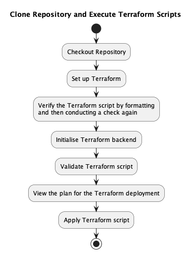

The different stages of the CI/CD pipeline are as such:

1. **Test**: Conduct unit tests and checkstyle on the codebase
    1. Start the pipeline on all major OSes (Windows, MacOS, Linux)
    2. Checkout (clone) the repository
    3. Install Python `3.12` on the GitHub runner
    4. Install the Python dependencies
    5. Execute the unit tests
    6. Upload the code coverage reports to Codecov
2. **Terrascan**: Scan Terraform code for security vulnerabilities
    1. Start the pipeline on Ubuntu
    2. Checkout the repository and set up Terraform
    3. Execute Terrascan on all Terraform files in the `deploy` directory
    4. Upload the Security Report to GitHub
3. **Setup**: Sets up the S3 bucket used for Terraform backend
    1. Start the pipeline on Ubuntu
    2. Execute the "Clone Repository and Execute Terraform Scripts" process as defined above
    3. This step can fail if the backend S3 bucket and DynamoDB tables may already exist, but this is anticipated
       and CI will ignore the error
4. **ECR**: Set up the Elastic Container Registry (ECR) Repository
    1. Start the pipeline on Ubuntu
    2. Execute the "Clone Repository and Execute Terraform Scripts" process as defined above
    3. This step can fail if the ECR repository already exists
5. **Deploy**: Use Terraform to deploy the application to AWS
    1. Start the pipeline on Ubuntu
    2. Execute the "Clone Repository and Execute Terraform Scripts" process as defined above

Depending on the repository where the CI/CD pipeline is run, different scripts corresponding to different environments
will be executed.

If the repository is the upstream repository, the pipeline will deploy to the `prod` environment. If the repository
is a forked repository, the pipeline will deploy to the `dev` environment.

> [!WARNING]
> The deployment process to `prod` is only permitted once a reviewer approves it.

Here is a diagram representing the overall flow of processes implemented in the workflow file:

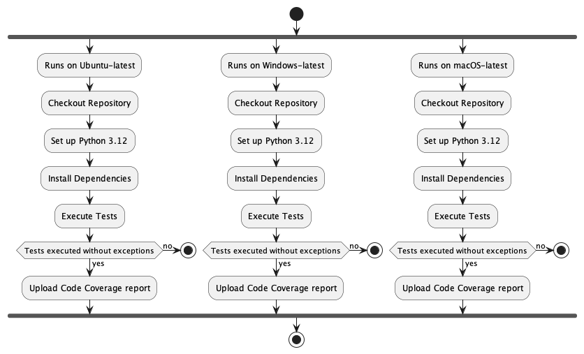

> [!NOTE]
> If the setting up of your GitHub Environment was skipped, the `Approval from reviewers?` process is skipped and
> the CI/CD pipeline will proceed to `Begin process for setting up main infrastructure`.

> [!CAUTION]
> Should GitHub Actions not execute the Actions contained within the repository after a fork, you may have to delete
> the files contained within the `.github/workflows` directory and recommit the files in directory to the repository.

#### Failed Deployment

Should the deployment fail, and you need to destroy the infrastructure, you may need to trigger a manual workflow run
stored in [this file](../../.github/workflows/teardown.yml).

To run a manual workflow, refer
to [this guide](https://docs.github.com/en/actions/using-workflows/manually-running-a-workflow).

Alternatively, if you have the credentials to the AWS account used to provision the infrastructure in `prod` or `dev`,
you may run the command within the subdirectories of the `deploy` directory (e.g. `deploy/dev/create-ecr`):

```shell
terraform destroy
```

More information about the Terraform commands can be found within the [Deployment Guide](Deployment%20Guide.md#terraform).

> [!CAUTION]
> If you are destroying the `prod` environment, make sure to get explicit approval from a reviewer before doing so!

## Logging and Housekeeping

To assist you in logging and removing unused credential files for housekeeping, we have put in place some helpful
features to help you achieve just that!

These tools might come in useful when you are debugging the application, or when you are maintaining the application

### Logging

We have implemented a utility `Logger` class, located under `logger.py` under
the [`app.core.system`](../app/core/system) package.

The `Logger` class uses a global `StreamHandler` and `FileHandler` to print out logs to `stdout` and save the logs to a
file under `app/.log/log.txt`.

> [!NOTE]
> `StreamHandler` is used to print out the log text to `stdout`.
>
> `FileHandler` is used to save the log text to a designated log file.

> [!WARNING]
> `StreamHandler` and printing out log text to `stdout` is necessary if you are using AWS CloudWatch Logs for logging
> your container applications!

The `Logger` class has 4 main methods to allow you to log messages of different severity:

* `Logger::debug()`: logs a **DEBUG** level message - use this for debugging the application
* `Logger::info()`: logs an **INFO** level message - use this for informative messages that you wish to log
* `Logger::warning()`: logs a **WARNING** level message - use this for exceptional but non-critical events that you wish
  to
  note
* `Logger::error()`: logs an **ERROR** level message - use this for exceptional events that are critical

The `Logger` class also has another utility method: `Logger::close()`, which is used to shut down the `Logger` instance.
You may indicate `close_handler = False` to override the default behaviour of closing the global handlers in the loggers
as well.

### Housekeeping

To help you better maintain the state of the temporary file location used to store your uploaded credentials, we have
implemented a "garbage collector" method in `cleaner.py` under the `app.core.system` package.

The "garbage collection" package used is `apscheduler`, a non-blocking task scheduling library in Python. This library
allows you to create cron (interval) tasks that will be performed at a specified time interval without blocking the
execution of the base Sample Application.

We chose those to use this package over other packages due to its ease of use, compatibility with Streamlit and the
lack of the need to write explicit multithreading/concurrent code to execute cron tasks.

> [!NOTE]
> There are plans to move to use an in-memory certificate and private key file system or to change processes such that
> any certificate and key files are not stored in the filesystem permanently.

#### `start_scheduler()`

`start_scheduler()` is the main method used to start the scheduler. The following details the steps taken when the
method is called:

1. Declare a `UNIQUE_JOB_ID` to identify the task to be scheduled
2. Check if the task with a job ID equal to `UNIQUE_JOB_ID` is already present in the task scheduling pool
3. If it is not in the pool, create a new task to add to the pool.
    1. Specify the time interval as 7 days
    2. Specify the job ID as `UNIQUE_JOB_ID`
    3. Specify to replace any existing jobs with the same job ID to prevent conflicts over which task is the latest
       task
    4. Start the scheduler
4. If the job ID is in the pool, return immediately and do nothing

> [!TIP]
> Do note that the interval is arbitrarily set, you may wish to use another interval for stricter housekeeping and
> certificate and private key retention policy.

#### `_clean_temp()`

`_clean_temp()` is the task that the scheduler will execute at a fixed interval.

This (private) method does the following:

1. Iterate through all files in the temporary directory where the certificate and key files are uploaded and saved into
2. If the filename ends with `.pem`, remove it

#### Extending tasks to perform

If you wish to include more cron tasks to perform, feel free to define more methods within this file, and add them into
the scheduler within `start_scheduler()`, defining the interval in which to execute the task.

## Planned Enhancements

There are some planned enhancements that we wish to implement in the future. These enhancements are as follows:

### In-memory Key Files

Currently, the application saves the uploaded key files to the local filesystem. This is not ideal as the key files are
sensitive and anyone with access to the filesystem can potentially access the key files. Saving it in memory will
make it more difficult for attackers to gain access to the key files, as they will need to have access to the memory
space of the application, which is difficult without root access.

### Alternative: Change processes to save key files to temporary files

We could also explore changing processes of writing to a temporary file system, where the key files are saved to a
temporary file when needed and deleted after it is done being used. This will prevent the key files from being saved
permanently on the filesystem, mitigating some of the security issues that may arise from saving the key files to the
filesystem.

### Go Serverless: Fargate

EC2 instances are currently used to host the application via ECS. This may be problematic since we need to regularly
maintain the EC2 instances to ensure that they are up-to-date and secure.

By using Fargate, we can eliminate the need to maintain the OS and the underlying infrastructure, as AWS will handle
it for us. We only need to focus on the application itself.

## Conclusion

Congratulations! You have made it to the end of the Developer Guide for the Sample Application. We hope that this guide
has been helpful in providing you with the necessary information to get started with development of the Sample
Application.

If you wish to learn more on how to set up your AWS account and AWS Organization, refer to the
[AWS Account Setup Guide](AWS%20Account%20Setup%20Guide.md).

If you wish to learn more about how to deploy the application onto AWS, refer to the
[Deployment Guide](Deployment%20Guide.md).

If you wish to learn more about how to use the application from the user's perspective, refer to the
[User Guide](User%20Guide.md).

If you wish to just install the application locally on your machine and use it without any further development, refer
to the [Installation Guide](Installation%20Guide.md).
