# User Guide

Welcome to the SSG Sample Application User Guide!

In this guide, you will learn how to use the SSG Sample Application, and how to use the APIs that are integrated
into the application.

Here is a quick summary of what the SSG Sample Application does:

* Call the Courses API to view, add, update and delete course runs, as well as view course sessions
* Call the Enrolment API to create, update, delete, search and view enrolment records, as well as update the 
  enrolment fee collection status of a customer 
* Call the Attendance API to view course session attendance and upload course session attendance 
* Call the Assessment API to create, update/void, search and view assessment records 
* Call the SkillsFuture Credit Pay API to create, view and cancel claims, as well as uploading any supporting 
  documents for claims

## Table of Contents

- [Introduction](#Introduction)
  - [About this Guide](#About-This-Guide)
  - [Target User](#Target-User)
  - [System Requirements](#System-Requirements)
  - [Usage of the Guide](#Usage-of-the-Guide)
- [Quick Start Guide](#Quick-Start-Guide)
  - [Installation](#Installation)
  - [Interface](#Interface)
  - [Setup](#Setup)
- [Pages](#Pages)
  - [En-Decryption](#En-Decryption)
    - [Encryption Mode](#Encryption-Mode)
    - [Decryption Mode](#Decryption-Mode)
  - [Courses](#Courses)
    - [Course Run by Run Id](#Course-Run-by-Run-Id)
    - [Add Course Runs](#Add-Course-Runs)
    - [Edit or Delete Course Runs](#Edit-or-Delete-Course-Runs)
    - [View Course Sessions](#View-Course-Sessions)
  - [Enrolment](#Enrolment)
    - [Create Enrolment](#Create-Enrolment)
    - [Update Enrolment](#Update-Enrolment)
    - [Cancel Enrolment](#Cancel-Enrolment)
    - [Search Enrolment](#Search-Enrolment)
    - [View Enrolment](#View-Enrolment)
    - [Update Enrolment Fee Collection](#Update-Enrolment-Fee-Collection)
  - [Attendance](#Attendance)
    - [Course Session Attendance](#Course-Session-Attendance)
    - [Upload Course Session Attendance](#Upload-Course-Session-Attendance)
  - [Assessment](#Assessment)
    - [Create Assessment](#Create-Assessment)
    - [Update or Void Assessment](#Update-or-Void-Assessment)
    - [Find Assessment](#Find-Assessment)
    - [View Assessment](#View-Assessment) 
  - [SkillsFuture Credit Pay](#SkillsFuture-Credit-Pay)
    - [SF Credit Claims Payment Request Encryption](#SF-Credit-Claims-Payment-Request-Encryption)
    - [SF Credit Claims Payment Request Decryption](#SF-Credit-Claims-Payment-Request-Decryption)
    - [Upload Supporting Documents](#Upload-Supporting-Documents)
    - [View Claim Details](#View-Claim-Details)
    - [Cancel Claim](#Cancel-Claim)
- [Glossary](#Glossary)

## Introduction

### About this Guide

This document will help provide you with a step-by-step guide on how you can use the revamped Sample Application to 
test out the SSG APIs, the requirements needed to run the application, as well as the usage of the different APIs.

This guide contains functionality for the base 15 mandated SSG APIs outlined in the TMS requirements, along with the
5 new SkillsFuture Credit Pay APIs.

### Target User

This guide is intended for users who are interested in using the Sample Application and testing out the SSG APIs.

### System Requirements

The Sample Application requires either Python `3.12` or Docker installed, and can run on any major platform
(Windows, macOS, Linux) that supports Python `3.12`. An installed browser is optional, as this application can run in
headless mode, but you are highly recommended to have a browser installed on your system (unless your system is used
purely to host the application).

### Usage of the Guide

To aid you in understanding how to use the Sample Application, notes, warnings and hints are added to this user guide
to help you better understand the different aspects of the Sample Application.

Text in **green** callout boxes are some tips and tricks that you should be aware of while using the Sample Application:

> [!TIP]
> This is a tip!

Text in **blue** callout boxes are informational messages that you should take note of:

> [!NOTE]
> This is a note!

Text in **yellow** callout boxes are warnings that you should take note of to ensure that you do not encounter an error:

> [!WARNING]
> This is a warning!

Text in **red** callout boxes are potential errors which you may encounter while performing an action in the 
Sample Application:

> [!CAUTION]
> This is a potential error!

## Quick Start Guide

### Installation

Head over to the [Installation Guide](Installation%20Guide.md) to learn more about installing and running this
application on your system.

### Interface

Let’s describe some terms we will use to describe the user interface.

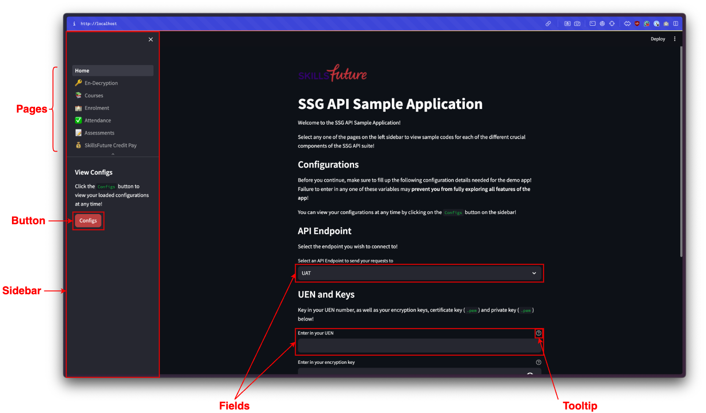
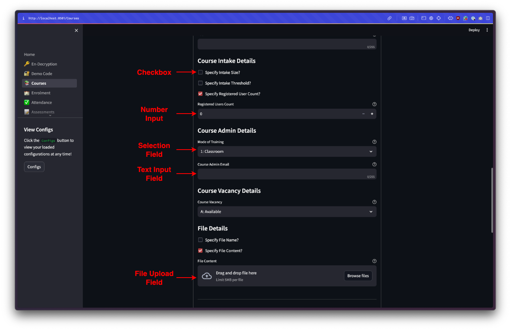
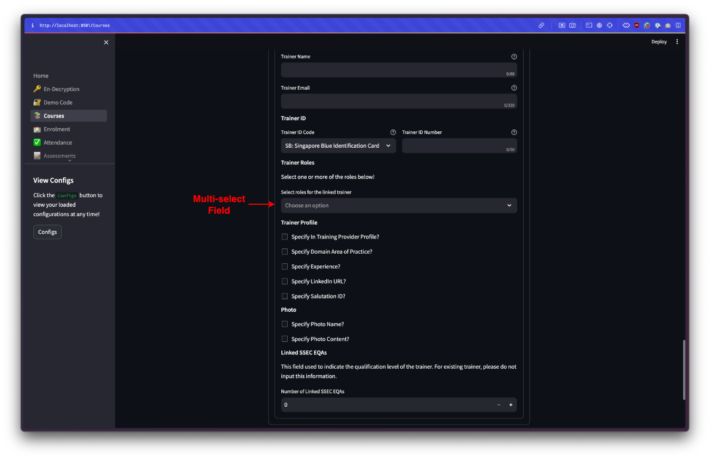

| **Term**           | **Description**                                                                                                                                                                                                                                                                                                                                                                              |
|--------------------|----------------------------------------------------------------------------------------------------------------------------------------------------------------------------------------------------------------------------------------------------------------------------------------------------------------------------------------------------------------------------------------------|
| Page               | A screen within the Sample Application. A page may have multiple UI elements that you can interact with and perform one or more tasks on, depending on the complexity of the screen.                                                                                                                                                                                                         |
| Sidebar            | A tab on the left side of your screen that provides you with quick access to the other Pages of the Sample Application                                                                                                                                                                                                                                                                       |
| Tooltip            | An icon that you can hover over for more details about a particular entry field                                                                                                                                                                                                                                                                                                              |
| Fields             | A Field allows you to input or select data to pass into the Sample Application. There are 3 main types of fields used in the Sample Application: - Selection fields (clicking on some UI elements to select it), - Alphanumeric fields (allow you to key in numerical, textual or both types of data) - File Upload fields (allows you to upload files into the Sample Application) |
| Button             | Clickable UI elements that is usually used to start a process or transition to a different screen.                                                                                                                                                                                                                                                                                           |
| Checkbox           | Clickable UI element that is used to hide an option until this element is selected                                                                                                                                                                                                                                                                                                           |
| Number Input       | Input field that that permits the entry of numerical (integers and floating point numbers) values                                                                                                                                                                                                                                                                                            |
| Selection Field    | Input field that permits the entry of a single value from a list of predetermined values                                                                                                                                                                                                                                                                                                     |
| Text Input Field   | Input field that permits the entry of text (characters) values                                                                                                                                                                                                                                                                                                                               |
| File Upload Field  | Input field that permits the uploading of a file to the application                                                                                                                                                                                                                                                                                                                          |
| Multi-Select Field | Input field that permits the entry of multiple values from a list of predetermined values (in contrast to a Selection Field)                                                                                                                                                                                                                                                                 |

### Setup

Before you can call the different APIs, you may need to specify your UEN and provide your 
**Base64-encoded** AES-256 encryption keys, SSL certificate and SSL private key.

To find out more on how to generate an AES-256 key, check out [this guide](https://developer.ssg-wsg.gov.sg/webapp/guides/1kR6AzKYXtvPEXfXCZJHgu#4-encryption-key).
To learn more about how to generate your own SSL certificate and private key, check out [this guide](https://developer.ssg-wsg.gov.sg/webapp/guides/20TYgEkfmOQWMzngzSQ4Pe).

To upload your credentials and use it for calling the SSG APIs, follow the steps below:

1. Navigate to the Home page of the Sample Application. You should be able to see a screen similar to the figure you see below:
   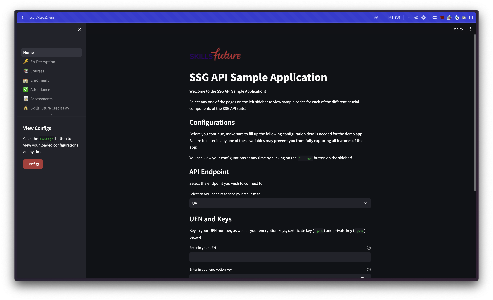
2. Select the API endpoint you wish to connect to. By default, you will be connected to the *User Acceptance Testing (UAT)*
   environment, but you can choose between the UAT, Production and Mock environment.
   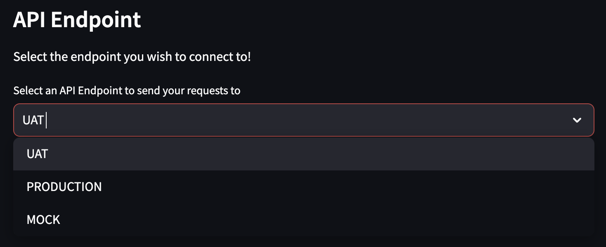
   > [!CAUTION]
   > If the application reruns for any reason (e.g. the application code has been altered, the application is reloaded, e.t.c.),
   > you must return to the Home Screen and re-select the API Endpoint.
   > 
   > **This selection is reset if the application is rerun!** 
3. Scroll down to the UEN and Keys section
   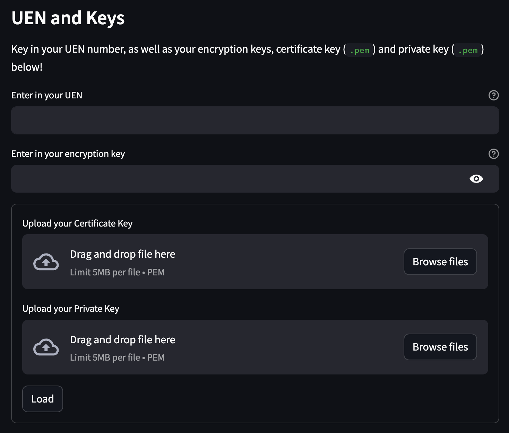
4. Under the “Enter in your UEN” field, key in your 9-10 digit UEN number:
   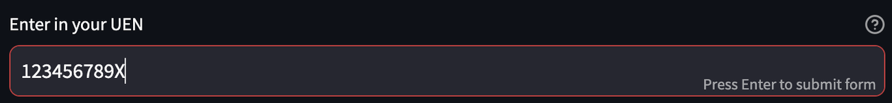
   1. You should be able to see the following message when you upload a valid UEN:
      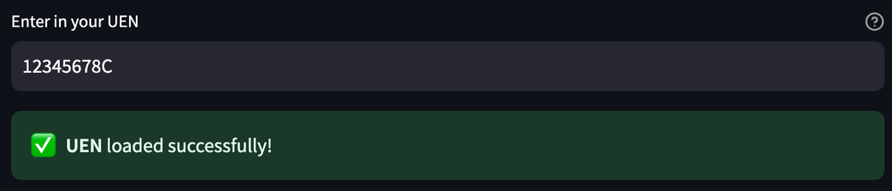
   2. If you enter in an invalid UEN, you will see the following message:
      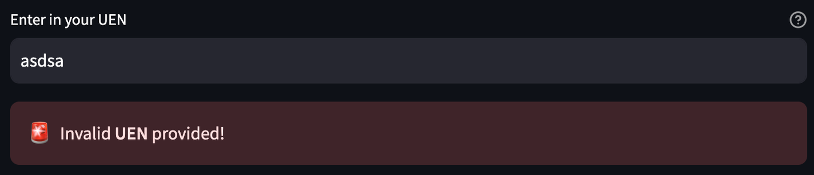
5. Under the “Enter in your encryption key” field, key in your AES-256 encryption key generated using the commands in
   this [guide](https://developer.ssg-wsg.gov.sg/webapp/guides/1kR6AzKYXtvPEXfXCZJHgu#4-encryption-key)
   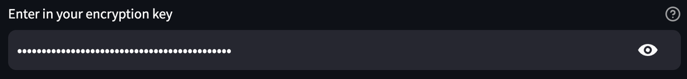
   1. You should be able to see the following messages when you upload a valid AES-256 encryption key:
      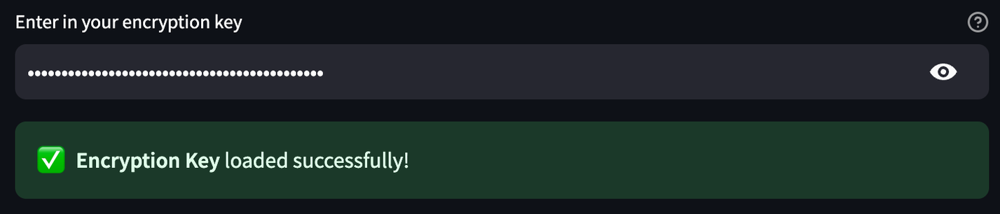
   2. If you enter an invalid AES-256 key, you will see the following message:
      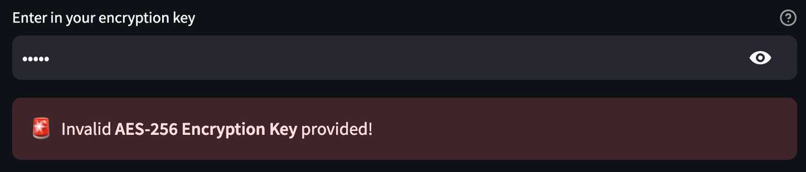
6. Under the “Upload your Certificate Key” file upload field, click “Browse files” and select the certificate you 
   wish to upload. If you are following [this guide](https://developer.ssg-wsg.gov.sg/webapp/guides/20TYgEkfmOQWMzngzSQ4Pe),
   the certificate file should be named `cert.pem`.
   1. Once uploaded, you should see the certificate file you had just uploaded right below the field.
   2. To delete it, click on the “X” icon corresponding to the file that you have uploaded
      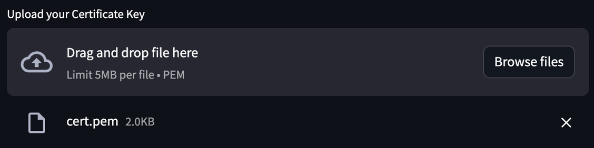
7. Under the “Upload your Private Key” file upload field, click on “Browse files” and select the private you wish to
   upload. If you are following [this guide](https://developer.ssg-wsg.gov.sg/webapp/guides/20TYgEkfmOQWMzngzSQ4Pe),
   the certificate file should be named `key.pem`.
   1. Once uploaded, you should be able to see the certificate file you have just uploaded right below the field.
   2. To delete it, click on the “X” button corresponding to the file that you have uploaded
      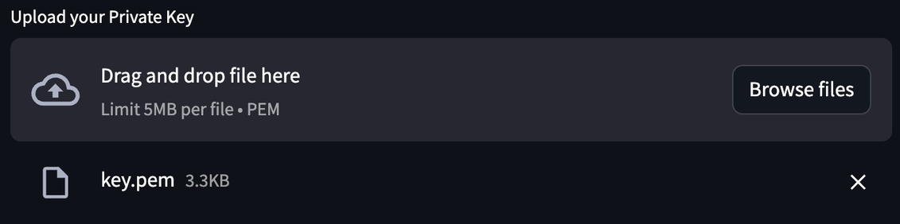

> [!WARNING]
> Make sure to upload your Certificate and Private Key in the correct fields! You will be alerted if you 
> accidentally upload your Certificate in the Private Key field and vice versa when you attempt to upload
> the credentials.
> 
> 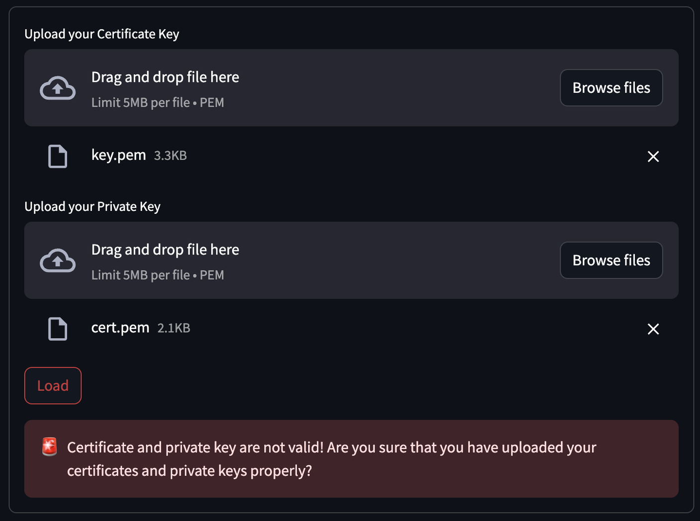

8. Click on the “Load” button to begin loading your certificate and private key files
9. If successful, you should see the following popup appear on your screen
   
10. To view your loaded configurations and credentials, navigate to the sidebar and click on the “Config” button 
    under the “View Configs” header

    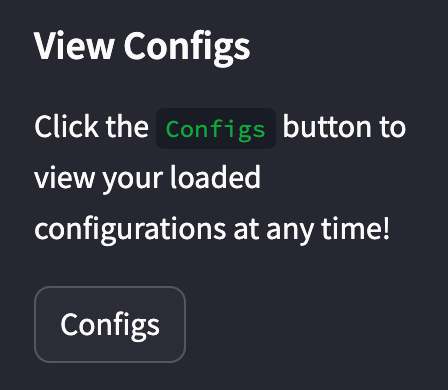
11. Clicking the button should reveal a new screen, summarising the API endpoint you selected, your AES-256 key
    and the path to your certificate and private key.
    1. To close this screen, click on the “X” icon in the upper right corner of the screen.
    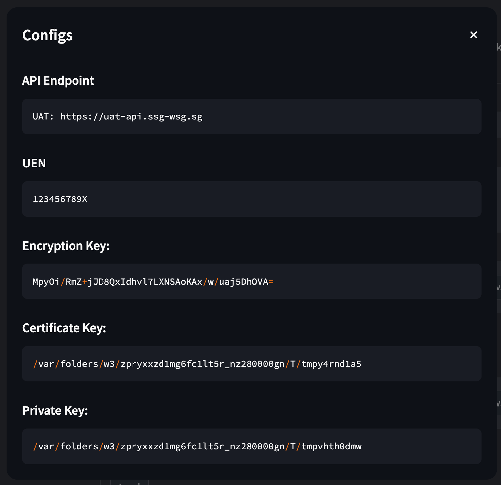

Congratulations! You have loaded up your credentials and are now ready to call SSG’s APIs!

## Pages

Now, let us explore the different pages of the Sample Application. There are 7 main pages of the application:

* [En-Decryption](#En-Decryption)
* [Demo Code](#Demo-Code)
* [Courses](#Courses)
* [Attendance](#Attendance)
* [Assessment](#Assessment)
* [Enrolment](#Enrolment)
* [SkillsFuture Credit Pay](#SkillsFuture-Credit-Pay)

### En-Decryption

To help you encrypt and decrypt messages from the API, we have implemented an interface where you can experiment
with encrypting and decrypting messages.

To access this page, click the “En-Decryption” tab on the left sidebar. You should be able to see this screen:

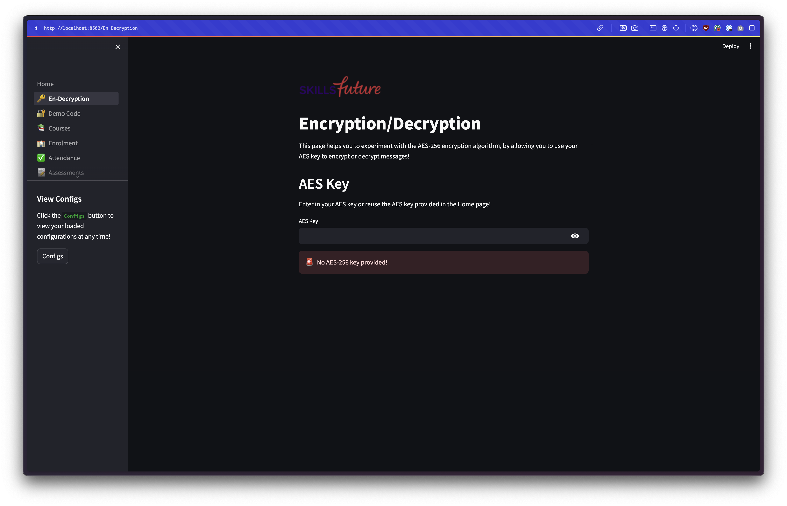

Enter in your AES-256 key (if you have not entered in the key on the Home page). The page should then update to:

#### Encryption Mode

To encrypt your message, select the “Encrypt Mode” toggle. You should then be able to see the fields update to:

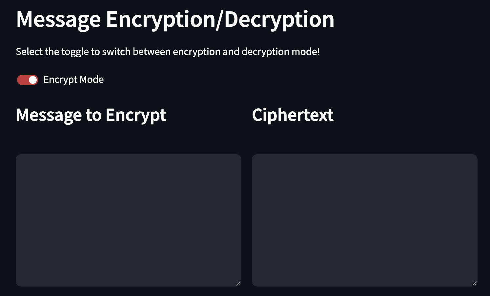

Enter your message to encrypt on the left column. The encrypted ciphertext will then be shown in the right column.

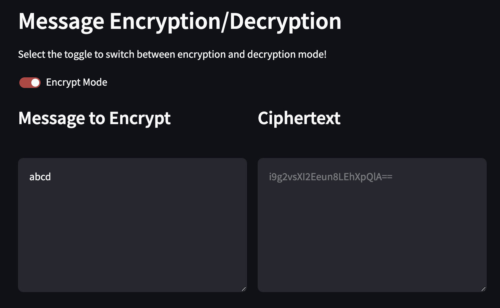

#### Decryption Mode

To decrypt your message, unselect the “Encrypt Mode” toggle. The fields will now update to:

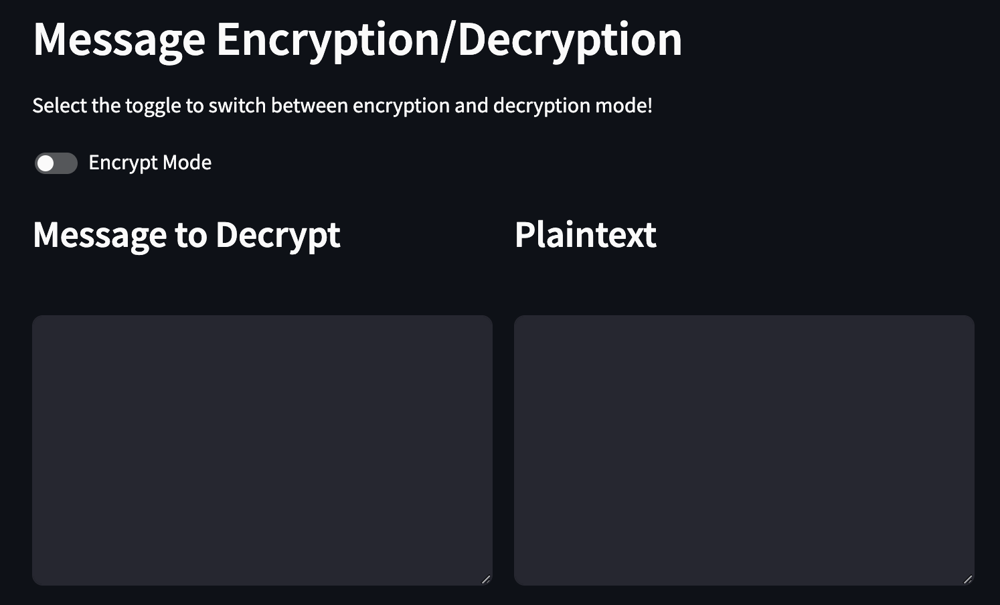

Enter the ciphertext on the left column. The decrypted plaintext will then be shown in the right column.

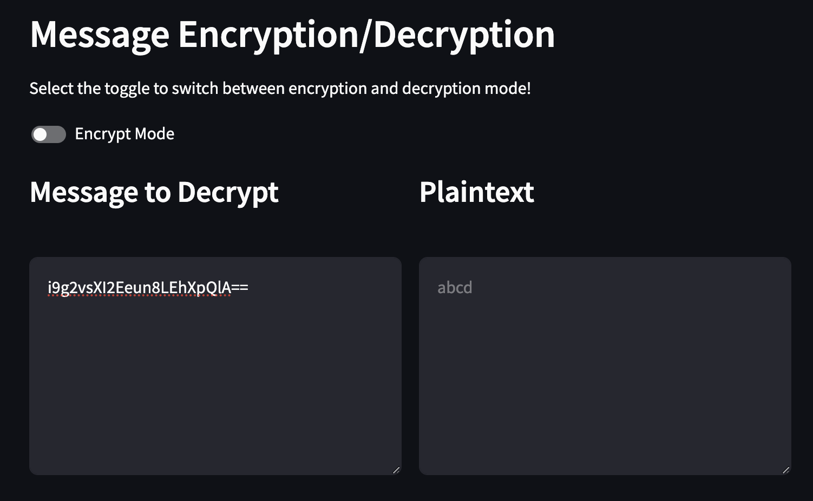

### Courses

This page helps you to call APIs related to managing your course runs and sessions using the SSG APIs.

4 Course-related APIs implemented in the Sample Application are as such:

1. [Course Run by Run Id](#Course-Run-by-Run-Id)
   1. This API is used to retrieve course run details based on a provided course reference number and course run ID
2. [Add Course Runs](#Add-Course-Runs)
   1. This API is used to publish course run(s) with sessions (if any)
3. [Edit or Delete Course Runs](#Edit-or-Delete-Course-Runs)
   1. This API is used to update or delete course run with sessions (if any)
4. [View Course Sessions](#View-Course-Sessions)
   1. This API is used to retrieve course sessions based on a provided course reference number, course run ID and month

To access this page, navigate to the sidebar and click on the “Courses” page.

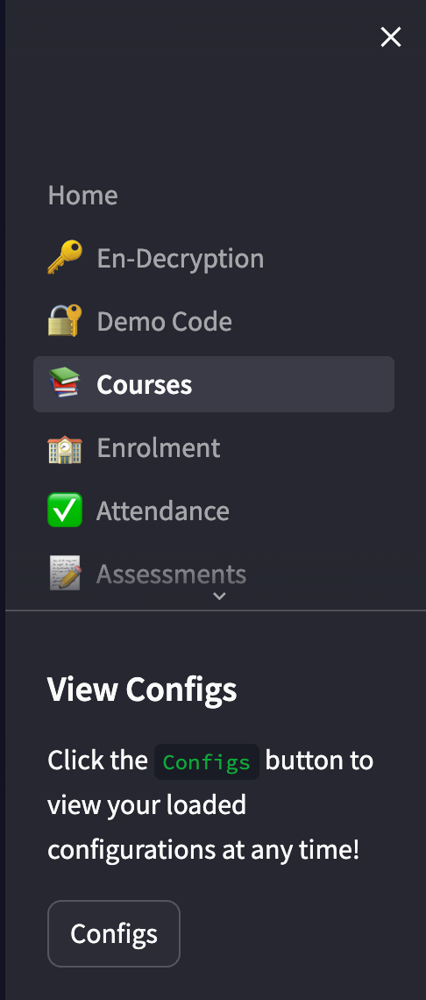

You should then be able to see the front page of the Courses page.

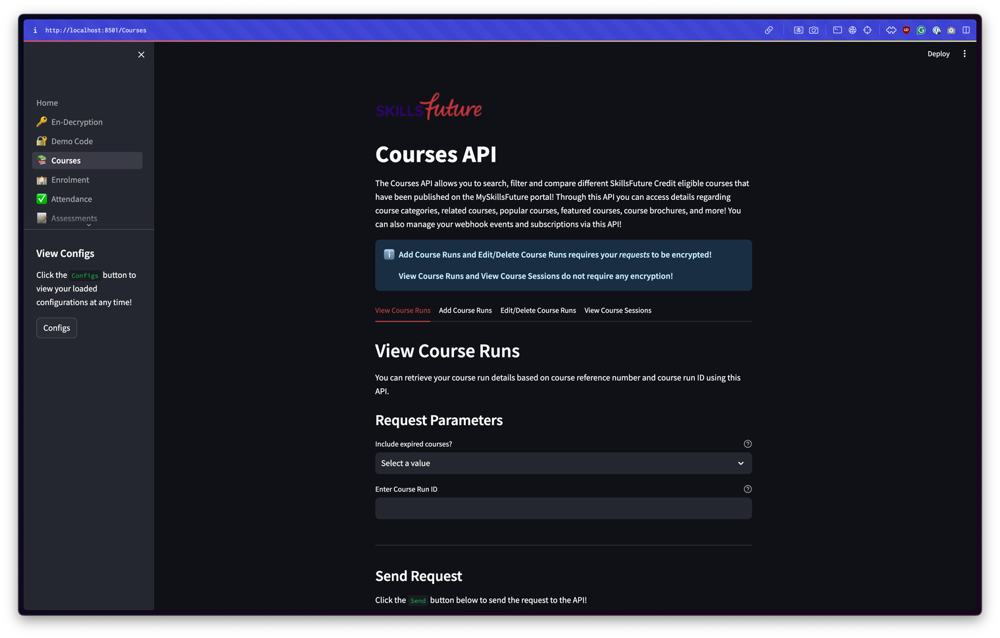

#### Course Run by Run Id

To access this API, follow the steps below:

1. Select the “View Course Runs” tab
   
2. You should be able to see the View Course Runs page show up on your screen
   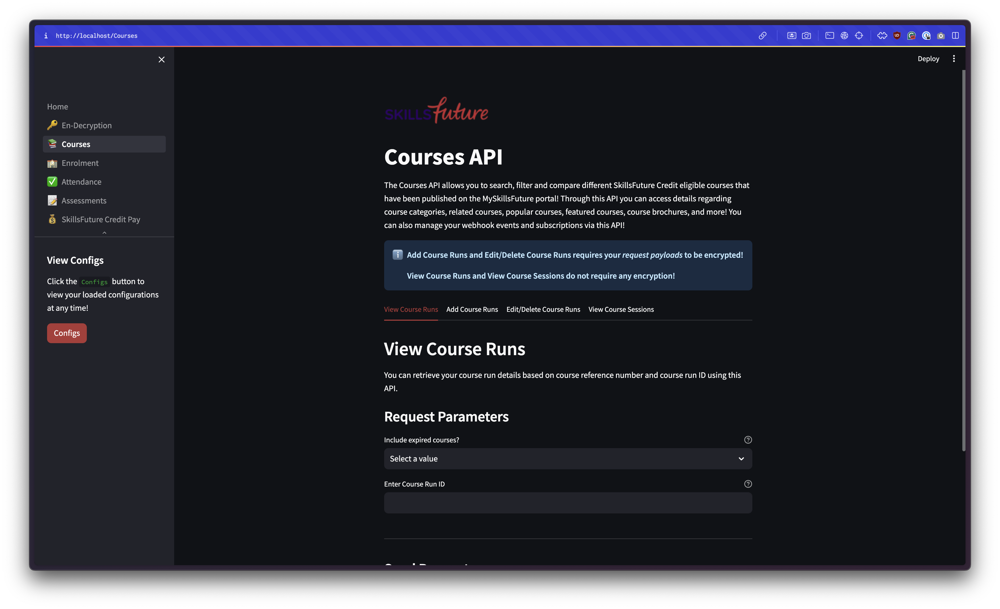
3. Next, fill in the required parameters.
   > [!TIP]
   > Unsure of what the fields mean? Hover over the tooltip icon to display a useful help text explaining what the fields
   > mean and what you should fill it up with!
4. Once you are done, click on the “Send” button. This should send an HTTP GET request to the Course Run by Run Id
   (View Course Runs) API
   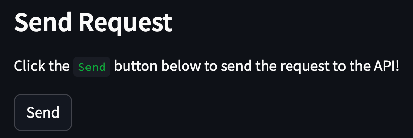
5. If the HTTP request is successful, you should be able to see 2 new tabs show up on your screen
   1. The Request tab shows the API endpoint that you are making the GET request to, the Headers of the request,
      as well as the body of the request
   2. The Response tab shows the response from the API after receiving your request

#### Add Course Runs

To access this API, follow the following steps:

1. Select the “Add Course Runs” tab
   
2. You should be able to see the Add Course Runs page show up on your screen
   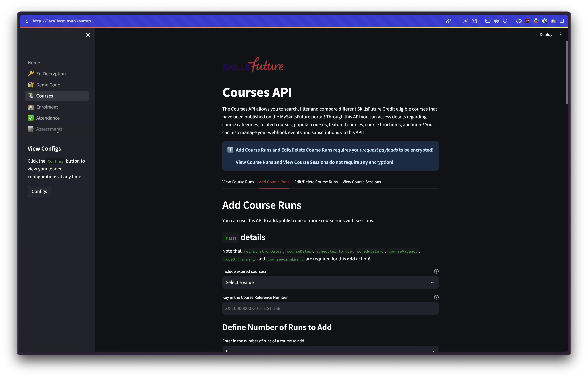
3. Fill in the required parameters. Optional parameters (parameters hidden behind a checkbox) are optional to define 
   and can be left as if not needed
   > [!TIP]
   > Unsure of what the fields mean? Hover over the tooltip icon to display a useful help text explaining what
   > the fields mean and what you should fill it up with!
   > 
   > To view the tooltips for the optional parameters, you can select the parameter first to view it
   > before unselecting it.
4. To view the request body that you will be sending, click on the “Request Body” expander under the “Preview
   Request Body” heading to view a JSON representation of the request body which you will be sending to the API.
5. Once you are done, click on the “Send” button. This should send an HTTP POST request to the Add Course Run (New) API
6. If the HTTP request is successful, you should be able to see 2 new tabs show up on your screen
   1. The Request tab shows the API endpoint that you are making the POST request to, the Headers of the request,
      as well as the body of the request. Since this API requires you to send encrypted payloads, you will also be
      able to view the encrypted payload that you are sending to the API.
   2. The Response tab shows the API response after receiving your request.

#### Edit or Delete Course Runs

To access this API, follow the following steps:

1. Select the “Edit/Delete Course Runs” tab
   
2. You should be able to see the Edit/Delete Course Runs page show up on your screen
   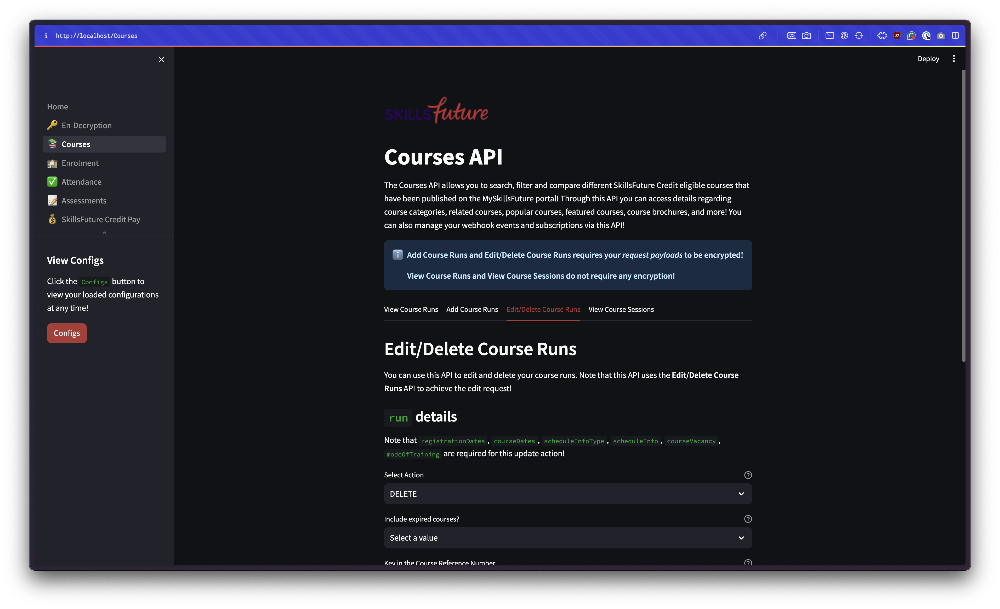
3. Fill in the required parameters. Optional parameters (parameters hidden behind a checkbox) are optional to define
   and can be left as if not needed
   > [!TIP]
   > Unsure of what the fields mean? Hover over the tooltip icon to display a useful help text explaining what
   > the fields mean and what you should fill it up with!
   > 
   > To view the tooltips for the optional parameters, you can select the parameter first to view it
   > before unselecting it.
4. To view the request body that you will be sending, click on the “Request Body” expander under the “Preview Request
   Body” heading to view a JSON representation of the request body which you will be sending to the API. Depending
   on the action that you have specified above, the JSON representation you see may be different
5. Once you are done, click on the “Send” button. This should send an HTTP POST request to the Edit Course Run
   (New) API
6. If the HTTP request is successful, you should be able to see 2 new tabs show up on your screen
   1. The Request tab shows the API endpoint that you are making the POST request to, the Headers of the request,
      as well as the body of the request. Since this API requires you to send encrypted payloads, you will also be
      able to view the encrypted payload that you are sending to the API.
   2. The Response tab shows the API response after receiving your request.

#### View Course Sessions

To access the Course Sessions API (via the View Course Sessions page), follow the steps below:

1. Select the “View Course Sessions” tab
   
2. You should be able to see the View Course Sessions page show up on your screen
   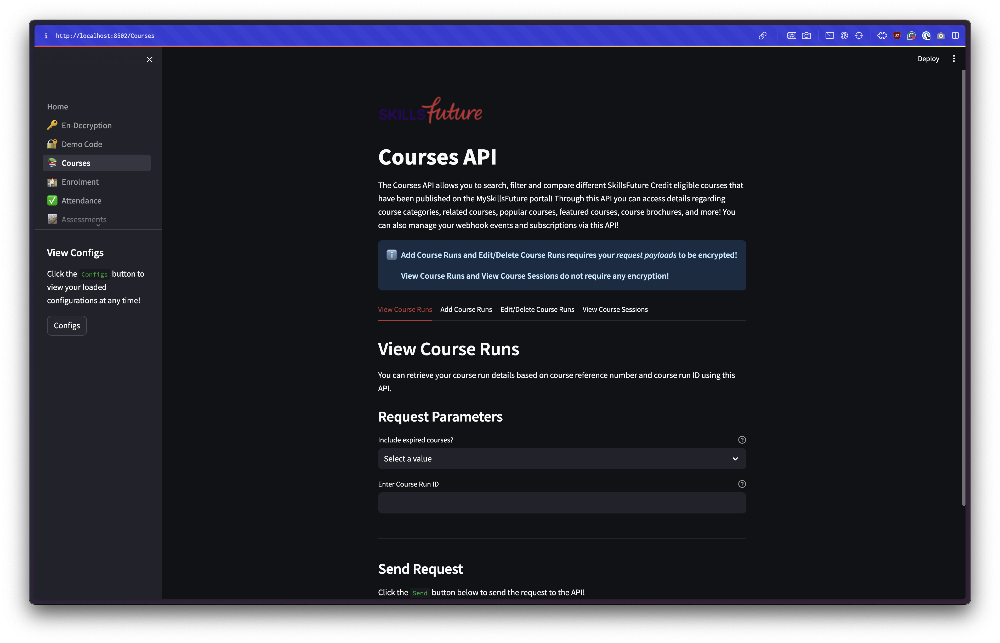
3. Fill in the required parameters. Optional parameters (parameters hidden behind a checkbox) are optional to define
   and can be left as if not needed
   > [!TIP]
   > Unsure of what the fields mean? Hover over the tooltip icon to display a useful help text explaining what
   > the fields mean and what you should fill it up with!
   > 
   > To view the tooltips for the optional parameters, you can select the parameter first to view it
   > before unselecting it.
4. Once you are done, click on the “Send” button. This should send an HTTP GET request to the Edit Course Run
   (New) API
5. If the HTTP request is successful, you should be able to see 2 new tabs show up on your screen
   1. The Request tab shows the API endpoint that you are making the GET request to, the Headers of the request,
      as well as the body of the request.
   2. The Response tab shows the API response after receiving your request.

### Enrolment

This page helps you to call APIs related to managing the enrolment records for your courses using the SSG APIs.

6 Enrolment-related APIs implemented in the Sample Application are as such:

1. [Create Enrolment](#Create-Enrolment)
   1. This API is used to create enrolment records
2. [Update Enrolment](#Update-Enrolment)
   1. This API is used to update enrolment records by referencing an enrolment reference number and providing the fields to update
3. [Cancel Enrolment](#Cancel-Enrolment)
   1. This API is used to cancel enrolment records by referencing an enrolment reference number
4. [Search Enrolment](#Search-Enrolment)
   1. This API is used to search for enrolment records based on the input query parameters
5. [View Enrolment](#View-Enrolment)
   1. This API is used to view an enrolment record by referencing an enrolment reference number
6. [Update Enrolment Fee Collection](#Update-Enrolment-Fee-Collection)
   1. This API is used to update the fee collection status of an enrolment record

To access this page, navigate to the sidebar and click on the “Enrolment” page.

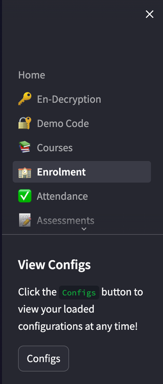

You should be able to see the Enrolment page.

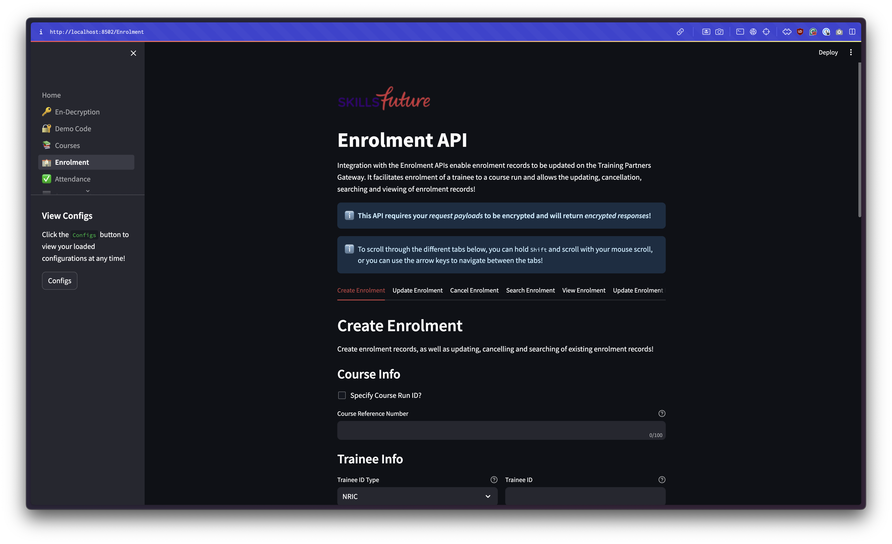

#### Create Enrolment

To access the Create Enrolment API, follow the steps below:

1. Select the “Create Enrolment” tab
   
2. You should be able to see the Create Enrolment page show up on your screen
   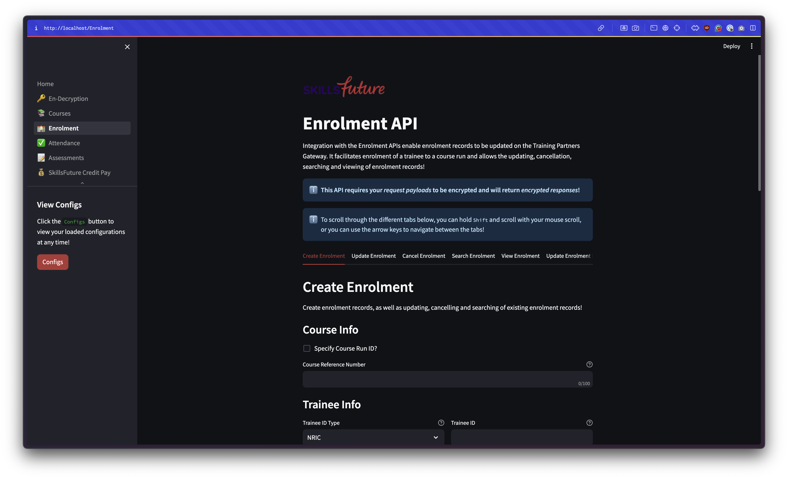
3. Fill in the required parameters. Optional parameters (parameters hidden behind a checkbox) are optional to define
   and can be left as if not needed
   > [!TIP]
   > Unsure of what the fields mean? Hover over the tooltip icon to display a useful help text explaining what
   > the fields mean and what you should fill it up with!
   > 
   > To view the tooltips for the optional parameters, you can select the parameter first to view it
   > before unselecting it.
4. To view the request body that you will be sending, click on the “Request Body” expander under the “Preview Request
    Body” heading to view a JSON representation of the request body which you will be sending to the API.
5. Once you are done, click on the “Send” button. This should send an HTTP POST request to the Create Enrolment API
6. If the HTTP request is successful, you should be able to see 2 new tabs show up on your screen
    1. The Request tab shows the API endpoint that you are making the POST request to, the Headers of the request,
        as well as the body of the request. Since this API requires you to send encrypted payloads, you will also be
        able to view the encrypted payload that you are sending to the API.
    2. The Response tab shows the API response after receiving your request. Since this API returns encrypted payloads,
        you will be view the encrypted payload that you are receiving from the API.

#### Update Enrolment

To access the Update Enrolment API, follow the steps below:

1. Select the “Update Enrolment” tab
   
2. You should be able to see the Update Enrolment page show up on your screen
   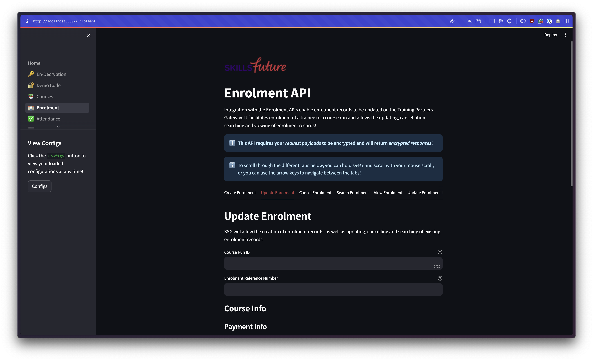
3. Fill in the required parameters. Optional parameters (parameters hidden behind a checkbox) are optional to define
   and can be left as if not needed
   > [!TIP]
   > Unsure of what the fields mean? Hover over the tooltip icon to display a useful help text explaining what
   > the fields mean and what you should fill it up with!
   > 
   > To view the tooltips for the optional parameters, you can select the parameter first to view it
   > before unselecting it.
4. To view the request body that you will be sending, click on the “Request Body” expander under the “Preview Request
5. Once you are done, click on the “Send” button. This should send an HTTP POST request to the Update Enrolment API
6. If the HTTP request is successful, you should be able to see 2 new tabs show up on your screen
    1. The Request tab shows the API endpoint that you are making the POST request to, the Headers of the request,
        as well as the body of the request. Since this API requires you to send encrypted payloads, you will also be
        able to view the encrypted payload that you are sending to the API.
    2. The Response tab shows the API response after receiving your request. Since this API returns encrypted payloads,
        you will be view the encrypted payload that you are receiving from the API.

#### Cancel Enrolment

To access the Cancel Enrolment API, follow the steps below:

1. Select the “Cancel Enrolment” tab
   
2. You should be able to see the Cancel Enrolment page show up on your screen
   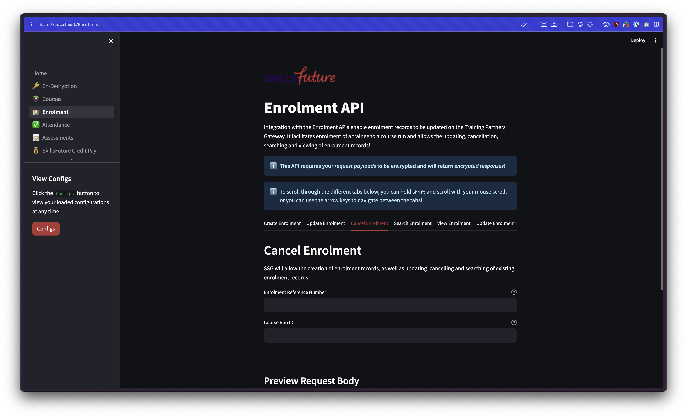
3. Fill in the required parameters. Optional parameters (parameters hidden behind a checkbox) are optional to define
   and can be left as if not needed
   > [!TIP]
   > Unsure of what the fields mean? Hover over the tooltip icon to display a useful help text explaining what
   > the fields mean and what you should fill it up with!
   > 
   > To view the tooltips for the optional parameters, you can select the parameter first to view it
   > before unselecting it.
4. To view the request body that you will be sending, click on the “Request Body” expander under the “Preview Request
    Body” heading to view a JSON representation of the request body which you will be sending to the API.
5. Once you are done, click on the “Send” button. This should send an HTTP POST request to the Cancel Enrolment API 
6. If the HTTP request is successful, you should be able to see 2 new tabs show up on your screen
    1. The Request tab shows the API endpoint that you are making the POST request to, the Headers of the request,
        as well as the body of the request. Since this API requires you to send encrypted payloads, you will also be
        able to view the encrypted payload that you are sending to the API.
    2. The Response tab shows the API response after receiving your request. Since this API returns encrypted payloads,

#### Search Enrolment

To access the Search Enrolment API, follow the steps below:

1. Select the “Search Enrolment” tab
   
2. You should be able to see the Search Enrolment page show up on your screen
   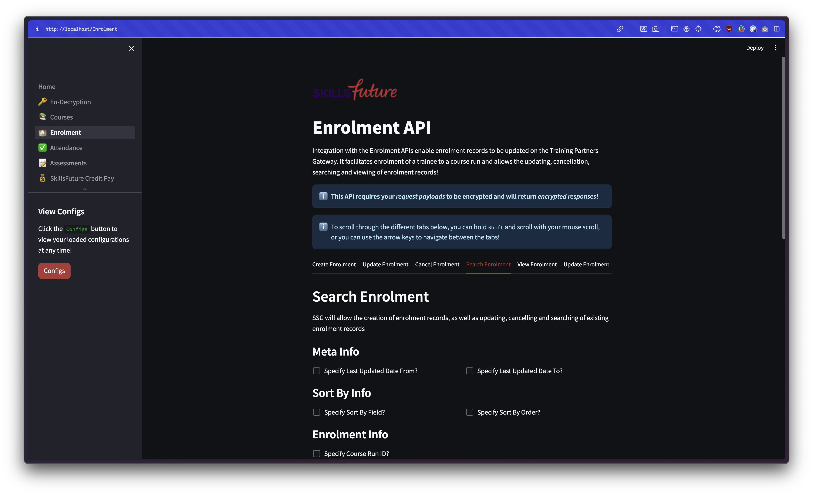
3. Fill in the required parameters. Optional parameters (parameters hidden behind a checkbox) are optional to define
   and can be left as if not needed
   > [!TIP]
   > Unsure of what the fields mean? Hover over the tooltip icon to display a useful help text explaining what
   > the fields mean and what you should fill it up with!
   > 
   > To view the tooltips for the optional parameters, you can select the parameter first to view it
   > before unselecting it.
4. To view the request body that you will be sending, click on the “Request Body” expander under the “Preview Request
    Body” heading to view a JSON representation of the request body which you will be sending to the API.
5. Once you are done, click on the “Send” button. This should send an HTTP POST request to the Search Enrolment API
6. If the HTTP request is successful, you should be able to see 2 new tabs show up on your screen
    1. The Request tab shows the API endpoint that you are making the POST request to, the Headers of the request,
        as well as the body of the request. Since this API requires you to send encrypted payloads, you will also be
        able to view the encrypted payload that you are sending to the API.
    2. The Response tab shows the API response after receiving your request. Since this API returns encrypted payloads,
        you will be view the encrypted payload that you are receiving from the API.

#### View Enrolment

To access the View Enrolment API, follow the steps below:

1. Select the “View Enrolment” tab
   
2. You should be able to see the View Enrolment page show up on your screen
   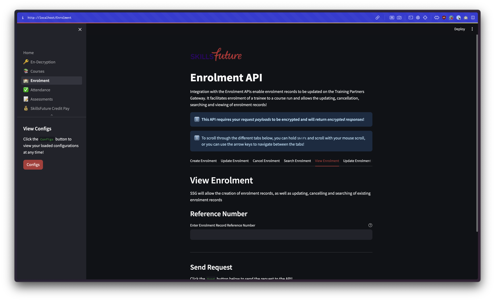
3. Fill in the required parameters. Optional parameters (parameters hidden behind a checkbox) are optional to define
   and can be left as if not needed
   > [!TIP]
   > Unsure of what the fields mean? Hover over the tooltip icon to display a useful help text explaining what
   > the fields mean and what you should fill it up with!
   > 
   > To view the tooltips for the optional parameters, you can select the parameter first to view it
   > before unselecting it.
5. Once you are done, click on the “Send” button. This should send an HTTP GET request to the View Enrolment API
6. If the HTTP request is successful, you should be able to see 2 new tabs show up on your screen
    1. The Request tab shows the API endpoint that you are making the GET request to, the Headers of the request,
        as well as the body of the request.
    2. The Response tab shows the API response after receiving your request. Since this API returns encrypted payloads,
        you will be view the encrypted payload that you are receiving from the API.

#### Update Enrolment Fee Collection

To access the Update Enrolment Fee Collection API, follow the steps below:

1. Select the “Update Enrolment Fee Collection” tab
   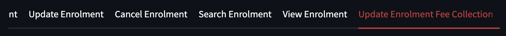
2. You should be able to see the Update Enrolment Fee Collection page show up on your screen
   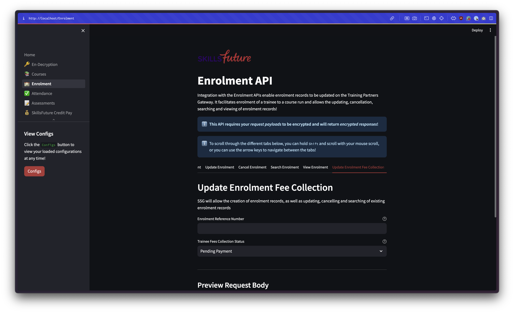
3. Fill in the required parameters. Optional parameters (parameters hidden behind a checkbox) are optional to define
   and can be left as if not needed
   > [!TIP]
   > Unsure of what the fields mean? Hover over the tooltip icon to display a useful help text explaining what
   > the fields mean and what you should fill it up with!
   > 
   > To view the tooltips for the optional parameters, you can select the parameter first to view it
   > before unselecting it.
4. To view the request body that you will be sending, click on the “Request Body” expander under the “Preview Request
    Body” heading to view a JSON representation of the request body which you will be sending to the API.
5. Once you are done, click on the “Send” button. This should send an HTTP POST request to the Update Enrolment Fee
    Collection API
6. If the HTTP request is successful, you should be able to see 2 new tabs show up on your screen
    1. The Request tab shows the API endpoint that you are making the POST request to, the Headers of the request,
        as well as the body of the request. Since this API requires you to send encrypted payloads, you will also be
        able to view the encrypted payload that you are sending to the API.
    2. The Response tab shows the API response after receiving your request. Since this API returns encrypted payloads,
        you will be view the encrypted payload that you are receiving from the API.

### Attendance

This page helps you to call APIs related to managing the attendance of your trainees enrolled in your courses using the SSG APIs.

2 Attendance-related APIs implemented in the Sample Application are as such:

1. [Course Session Attendance](#Course-Session-Attendance)
   1. This API is used to retrieve the course session attendance information based on a given course run ID,
      course reference number and course session ID
2. [Upload Course Session Attendance](#Upload-Course-Session-Attendance)
   1. This API is used to upload course session attendance information

To access this page, navigate to the sidebar and click on the “Attendance” page.

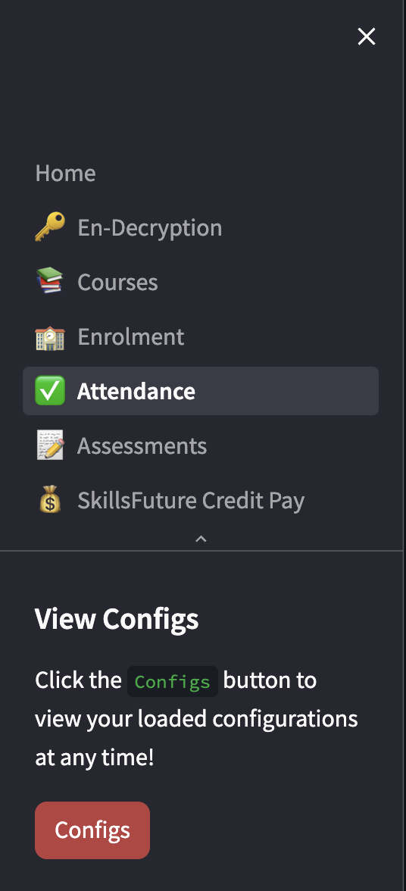

You should then be able to see the front page of the Attendance page.

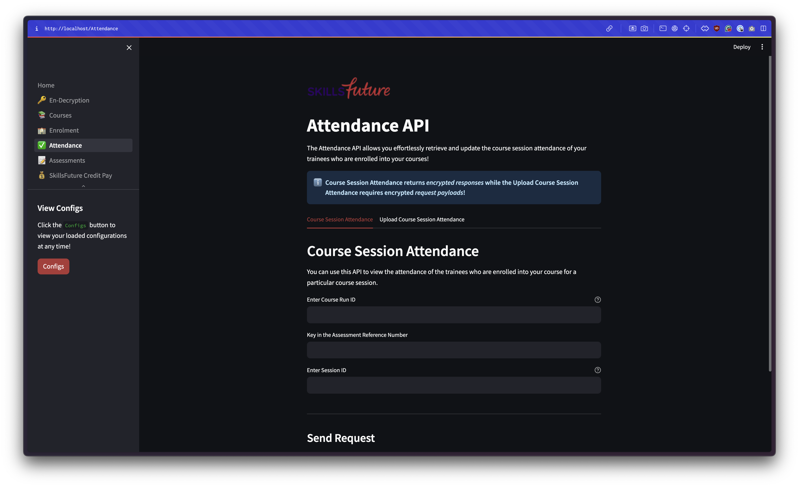

#### Course Session Attendance

To access the Course Session Attendance API, follow the steps below:

1. Select the “Course Session Attendance” tab
   
2. You should be able to see the Course Session Attendance page show up on your screen
   
3. Fill in the required parameters. Optional parameters (parameters hidden behind a checkbox) are optional to define
   and can be left as if not needed
   > [!TIP]
   > Unsure of what the fields mean? Hover over the tooltip icon to display a useful help text explaining what
   > the fields mean and what you should fill it up with!
   > 
   > To view the tooltips for the optional parameters, you can select the parameter first to view it
   > before unselecting it.
4. Once you are done, click on the “Send” button. This should send an HTTP GET request to the Course Session Attendance
   API
5. If the HTTP request is successful, you should be able to see 2 new tabs show up on your screen
   1. The Request tab shows the API endpoint that you are making the GET request to, the Headers of the request,
      as well as the body of the request.
   2. The Response tab shows the API response after receiving your request. Since this API returns encrypted payloads,
      you will be view the encrypted payload that you are receiving from the API.

#### Upload Course Session Attendance

To access the Upload Course Session Attendance API, follow the steps below:

1. Select the “Upload Course Session Attendance” tab
   
2. You should be able to see the Upload Course Session Attendance page show up on your screen
   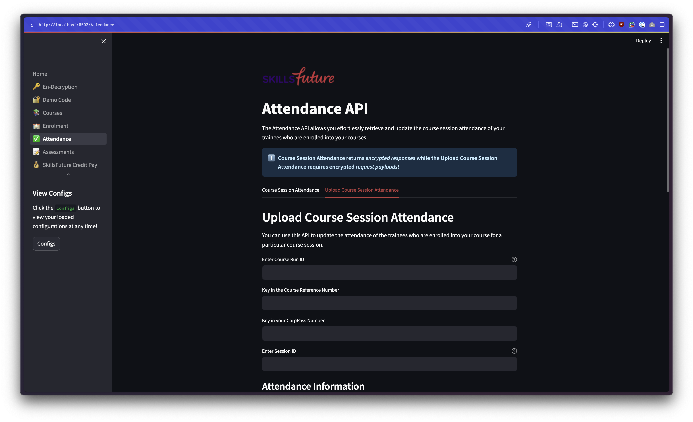
3. Fill in the required parameters. Optional parameters (parameters hidden behind a checkbox) are optional to define
   and can be left as if not needed
   > [!TIP]
   > Unsure of what the fields mean? Hover over the tooltip icon to display a useful help text explaining what
   > the fields mean and what you should fill it up with!
   > 
   > To view the tooltips for the optional parameters, you can select the parameter first to view it
   > before unselecting it.
4. To view the request body that you will be sending, click on the “Request Body” expander under the “Preview Request
   Body” heading to view a JSON representation of the request body which you will be sending to the API.
5. Once you are done, click on the “Send” button. This should send an HTTP POST request to the Upload Course Session
   Attendance API
6. If the HTTP request is successful, you should be able to see 2 new tabs show up on your screen
   1. The Request tab shows the API endpoint that you are making the POST request to, the Headers of the request,
      as well as the body of the request. Since this API requires you to send encrypted payloads, you will also be
      able to view the encrypted payload that you are sending to the API.
   2. The Response tab shows the API response after receiving your request.

### Assessment

This page helps you to call APIs related to managing the assessment records of the trainees enrolled in your courses using the SSG APIs.

4 Assessment-related APIs implemented in the Sample Application are as such:

1. [Create Assessment](#Create-Assessment)
   1. This API is used to create an assessment record 
2. [Update or Void Assessment](#Update-or-Void-Assessment)
   1. This API is used to update or void an assessment record
3. [Find Assessment](#Find-Assessment)
   1. This API is used to find an assessment record based on the query parameters provided
4. [View Assessment](#View-Assessment) 
   1. This API is used to view an assessment record based on a given assessment reference number

To access the APIs, navigate to the sidebar and click on the “Assessments” page.

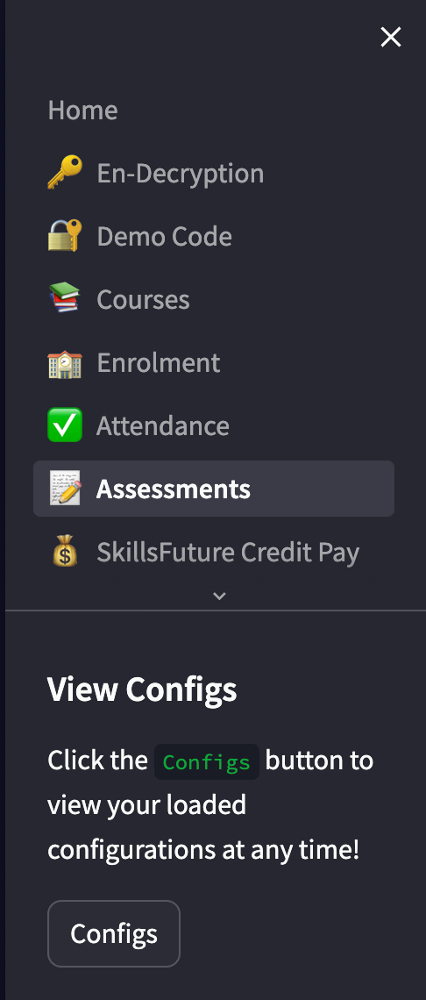

You should then be able to see the front page of the Assessment page.

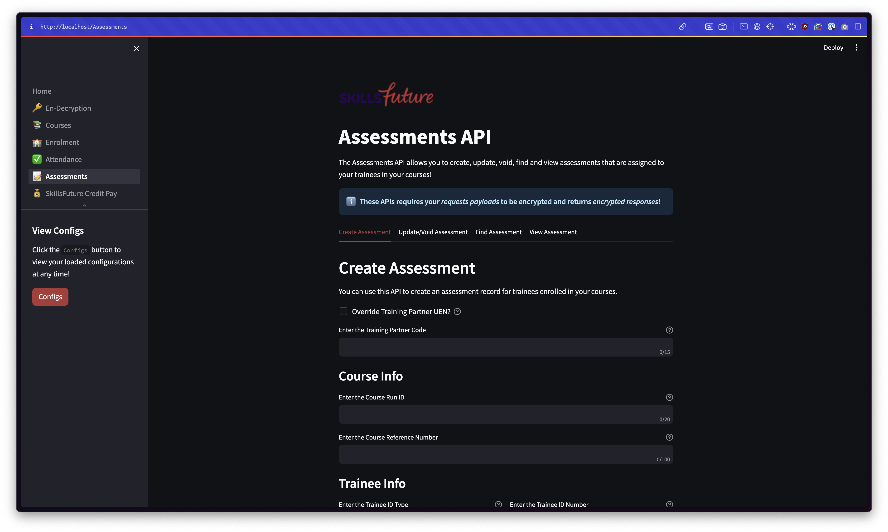

#### Create Assessment

To access the Create Assessment API, follow the steps below:

1. Select the “Create Assessment” tab
   
2. You should be able to see the Create Assessment page show up on your screen
   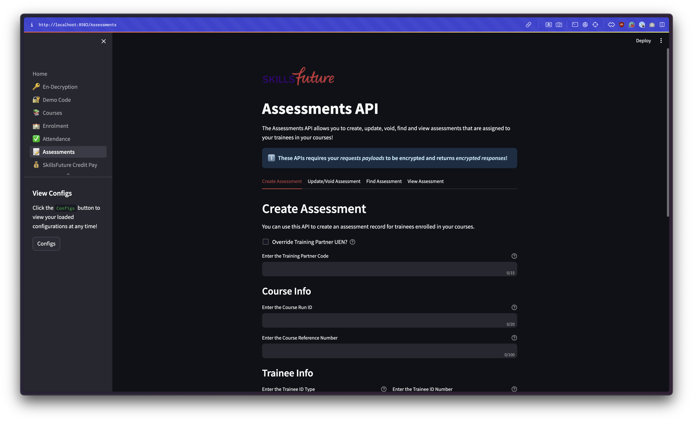
3. Fill in the required parameters. Optional parameters (parameters hidden behind a checkbox) are optional to define
   and can be left as if not needed
   > [!TIP]
   > Unsure of what the fields mean? Hover over the tooltip icon to display a useful help text explaining what
   > the fields mean and what you should fill it up with!
   > 
   > To view the tooltips for the optional parameters, you can select the parameter first to view it
   > before unselecting it.
4. To view the request body that you will be sending, click on the “Request Body” expander under the “Preview Request
   Body” heading to view a JSON representation of the request body which you will be sending to the API.
5. Once you are done, click on the “Send” button. This should send an HTTP POST request to the Create Assessment API
6. If the HTTP request is successful, you should be able to see 2 new tabs show up on your screen
   1. The Request tab shows the API endpoint that you are making the POST request to, the Headers of the request,
      as well as the body of the request. Since this API requires you to send encrypted payloads, you will also be
      able to view the encrypted payload that you are sending to the API.
   2. The Response tab shows the API response after receiving your request. Since this API returns encrypted payloads,
      you will be view the encrypted payload that you are receiving from the API.

#### Update or Void Assessment

To access the Update or Void Assessment API, follow the steps below:

1. Select the “Update or Void Assessment” tab
   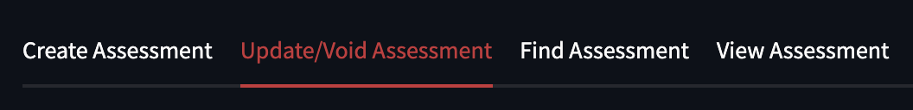
2. You should be able to see the Update or Void Assessment page show up on your screen
   
3. Fill in the required parameters. Optional parameters (parameters hidden behind a checkbox) are optional to define
   and can be left as if not needed
   > [!TIP]
   > Unsure of what the fields mean? Hover over the tooltip icon to display a useful help text explaining what
   > the fields mean and what you should fill it up with!
   > 
   > To view the tooltips for the optional parameters, you can select the parameter first to view it
   > before unselecting it.
4. To view the request body that you will be sending, click on the “Request Body” expander under the “Preview Request
   Body” heading to view a JSON representation of the request body which you will be sending to the API.
5. Once you are done, click on the “Send” button. This should send an HTTP POST request to the Update or Void Assessment
   API
6. If the HTTP request is successful, you should be able to see 2 new tabs show up on your screen
   1. The Request tab shows the API endpoint that you are making the POST request to, the Headers of the request,
      as well as the body of the request. Since this API requires you to send encrypted payloads, you will also be
      able to view the encrypted payload that you are sending to the API.
   2. The Response tab shows the API response after receiving your request. Since this API returns encrypted payloads,
      you will be view the encrypted payload that you are receiving from the API.

#### Find Assessment

To access the Find Assessment API, follow the steps below:

1. Select the “Find Assessment” tab
   
2. You should be able to see the Find Assessments page show up on your screen
   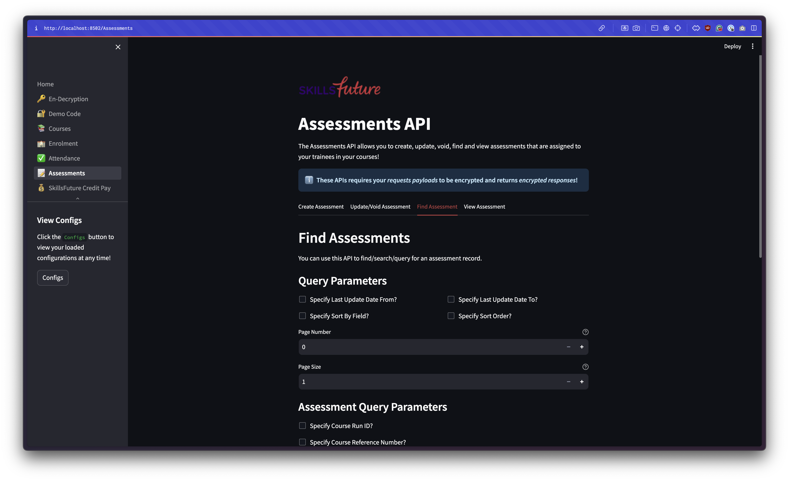
3. Fill in the required parameters. Optional parameters (parameters hidden behind a checkbox) are optional to define
   and can be left as if not needed
   > [!TIP]
   > Unsure of what the fields mean? Hover over the tooltip icon to display a useful help text explaining what
   > the fields mean and what you should fill it up with!
   > 
   > To view the tooltips for the optional parameters, you can select the parameter first to view it
   > before unselecting it.
4. To view the request body that you will be sending, click on the “Request Body” expander under the “Preview Request
   Body” heading to view a JSON representation of the request body which you will be sending to the API.
5. Once you are done, click on the “Send” button. This should send an HTTP POST request to the Find Assessment API
6. If the HTTP request is successful, you should be able to see 2 new tabs show up on your screen
   1. The Request tab shows the API endpoint that you are making the POST request to, the Headers of the request,
      as well as the body of the request. Since this API requires you to send encrypted payloads, you will also be
      able to view the encrypted payload that you are sending to the API.
   2. The Response tab shows the API response after receiving your request. Since this API returns encrypted payloads,
      you will be view the encrypted payload that you are receiving from the API.

#### View Assessment

To access the View Assessment API, follow the steps below:

1. Select the “View Assessment” tab
   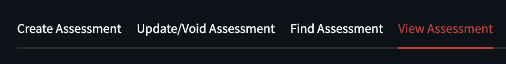
2. You should be able to see the View Assessment page show up on your screen
   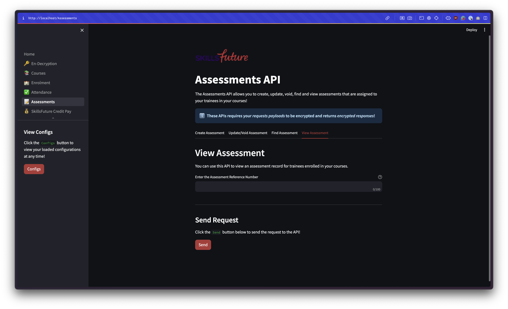
3. Fill in the required parameters. Optional parameters (parameters hidden behind a checkbox) are optional to define
   and can be left as if not needed
   > [!TIP]
   > Unsure of what the fields mean? Hover over the tooltip icon to display a useful help text explaining what
   > the fields mean and what you should fill it up with!
   > 
   > To view the tooltips for the optional parameters, you can select the parameter first to view it
   > before unselecting it.
4. Once you are done, click on the “Send” button. This should send an HTTP GET request to the View Assessment API
5. If the HTTP request is successful, you should be able to see 2 new tabs show up on your screen
   1. The Request tab shows the API endpoint that you are making the GET request to, the Headers of the request,
      as well as the body of the request.
   2. The Response tab shows the API response after receiving your request. Since this API returns encrypted payloads,
      you will be view the encrypted payload that you are receiving from the API.

### SkillsFuture Credit Pay

This page helps you to call APIs related to managing the SkillsFuture Credit Claims for trainees enrolled in your courses using the SSG APIs.

5 SkillsFuture Credit Pay-related APIs implemented in the Sample Application are as such:

1. [SF Credit Claims Payment Request Encryption](#SF-Credit-Claims-Payment-Request-Encryption)
   1. This API is used to perform encryption on a request payload that will be send out in a Form POST to begin the claims
      process
2. [SF Credit Claims Payment Request Decryption](#SF-Credit-Claims-Payment-Request-Decryption)
   1. This API is used to perform decryption on a response payload that is returned after the Form POST is complete
3. [Upload Supporting Documents](#Upload-Supporting-Documents)
   1. This API is used to upload supporting documents for a claim
4. [View Claim Details](#View-Claim-Details)
   1. This API is used to view the details of a claim
5. [Cancel Claim](#Cancel-Claim)
   1. This API is used to cancel a claim

#### SF Credit Claims Payment Request Encryption

To access the SF Credit Claims Payment Request Encryption API, follow the steps below:

1. Select the “SF Credit Claims Payment Request Encryption” tab
   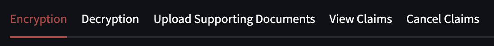
2. You should be able to see the SF Credit Claims Payment Request Encryption page show up on your screen
   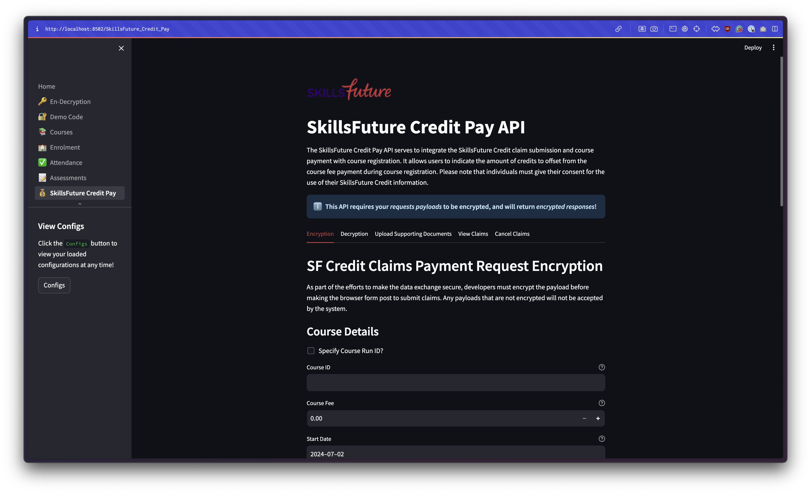
3. Fill in the required parameters. Optional parameters (parameters hidden behind a checkbox) are optional to define
   and can be left as if not needed
   > [!TIP]
   > Unsure of what the fields mean? Hover over the tooltip icon to display a useful help text explaining what
   > the fields mean and what you should fill it up with!
   > 
   > To view the tooltips for the optional parameters, you can select the parameter first to view it
   > before unselecting it.
4. To view the request body that you will be sending, click on the “Request Body” expander under the “Preview Request
   Body” heading to view a JSON representation of the request body which you will be sending to the API.
5. Once you are done, click on the “Send” button. This should send an HTTP POST request to the SF Credit Claims Payment
   Request Encryption API
6. If the HTTP request is successful, you should be able to see 2 new tabs show up on your screen
    1. The Request tab shows the API endpoint that you are making the POST request to, the Headers of the request,
       as well as the body of the request. Since this API requires you to send encrypted payloads, you will also be
       able to view the encrypted payload that you are sending to the API.
    2. The Response tab shows the API response after receiving your request. Since this API returns encrypted payloads,
       you will be view the encrypted payload that you are receiving from the API.
7. Using the encrypted payload returned from the API, you can then proceed to send a Form POST request to the SSG
   SkillsFuture Credit Claims API to begin the claims process. The Form POST template is provided below the results of
   the API response.
   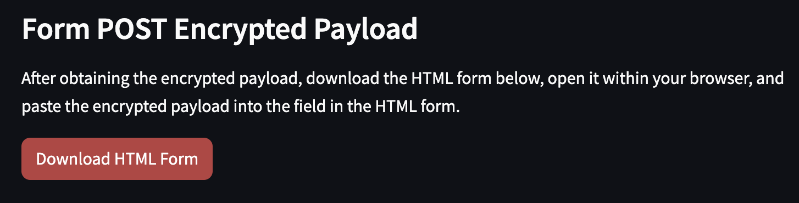

   1. Enter in the encrypted payload into the text field in the Form POST template
   2. Click on the “Submit” button to send the Form POST request to the SSG SkillsFuture Credit Claims API
   3. You will be directed to log in with your Singpass
   4. After logging in, specify the claim amount and make the claim
   5. The callback action will trigger after you submit the claim
   6. Use the Developer Mode console of your browser to view the encrypted response. This will be used in the next API.

#### SF Credit Claims Payment Request Decryption

To access the SF Credit Claims Payment Request Decryption API, follow the steps below:

1. Select the “SF Credit Claims Payment Request Decryption” tab
   
2. You should be able to see the SF Credit Claims Payment Request Decryption page show up on your screen
   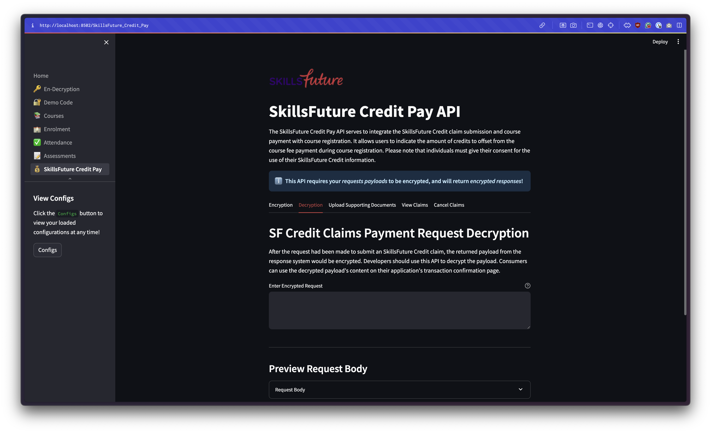
3. Fill in the required parameters. Optional parameters (parameters hidden behind a checkbox) are optional to define
   and can be left as if not needed
   > [!TIP]
   > Unsure of what the fields mean? Hover over the tooltip icon to display a useful help text explaining what
   > the fields mean and what you should fill it up with!
   > 
   > To view the tooltips for the optional parameters, you can select the parameter first to view it
   > before unselecting it.
4. To view the request body that you will be sending, click on the “Request Body” expander under the “Preview Request
   Body” heading to view a JSON representation of the request body which you will be sending to the API.
5. Once you are done, click on the “Send” button. This should send an HTTP POST request to the SF Credit Claims Payment
   Request Decryption API
6. If the HTTP request is successful, you should be able to see 2 new tabs show up on your screen
    1. The Request tab shows the API endpoint that you are making the POST request to, the Headers of the request,
       as well as the body of the request. Since this API requires you to send encrypted payloads, you will also be
       able to view the encrypted payload that you are sending to the API.
    2. The Response tab shows the API response after receiving your request. Since this API returns encrypted payloads,
       you will be view the encrypted payload that you are receiving from the API.

#### Upload Supporting Documents

To access the Upload Supporting Documents API, follow the steps below:

1. Select the “Upload Supporting Documents” tab
   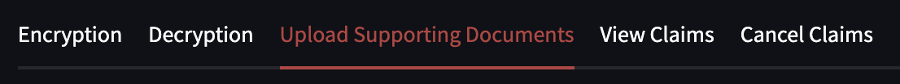
2. You should be able to see the Upload Supporting Documents page show up on your screen
   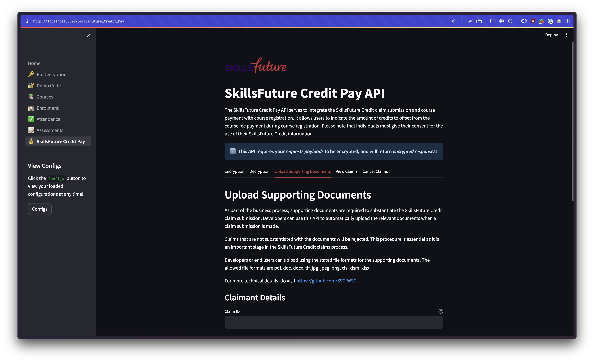
3. Fill in the required parameters. Optional parameters (parameters hidden behind a checkbox) are optional to define
   and can be left as if not needed
   > [!TIP]
   > Unsure of what the fields mean? Hover over the tooltip icon to display a useful help text explaining what
   > the fields mean and what you should fill it up with!
   > 
   > To view the tooltips for the optional parameters, you can select the parameter first to view it
   > before unselecting it.
4. To view the request body that you will be sending, click on the “Request Body” expander under the “Preview Request
   Body” heading to view a JSON representation of the request body which you will be sending to the API
5. Once you are done, click on the “Send” button. This should send an HTTP POST request to the Upload Supporting Documents
   API
6. If the HTTP request is successful, you should be able to see 2 new tabs show up on your screen
    1. The Request tab shows the API endpoint that you are making the POST request to, the Headers of the request,
       as well as the body of the request. Since this API requires you to send encrypted payloads, you will also be
       able to view the encrypted payload that you are sending to the API.
    2. The Response tab shows the API response after receiving your request. Since this API returns encrypted payloads,
       you will be view the encrypted payload that you are receiving from the API.

#### View Claim Details

To access the View Claim Details API, follow the steps below:

1. Select the “View Claim Details” tab
   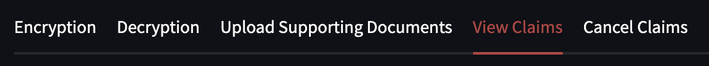
2. You should be able to see the View Claim Details page show up on your screen
   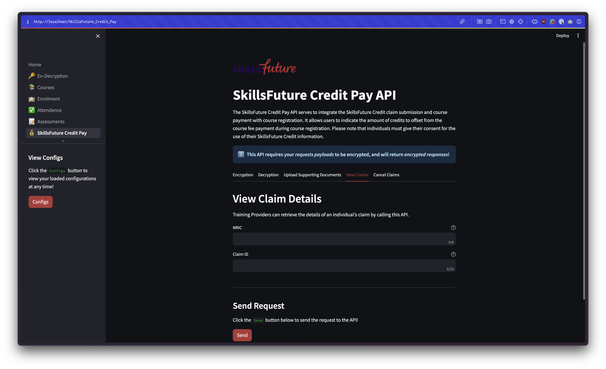
3. Fill in the required parameters. Optional parameters (parameters hidden behind a checkbox) are optional to define
   and can be left as if not needed
   > [!TIP]
   > Unsure of what the fields mean? Hover over the tooltip icon to display a useful help text explaining what
   > the fields mean and what you should fill it up with!
   > 
   > To view the tooltips for the optional parameters, you can select the parameter first to view it
   > before unselecting it.
4. Once you are done, click on the “Send” button. This should send an HTTP GET request to the View Claim Details API
5. If the HTTP request is successful, you should be able to see 2 new tabs show up on your screen
    1. The Request tab shows the API endpoint that you are making the POST request to, the Headers of the request,
       as well as the body of the request. Since this API requires you to send encrypted payloads, you will also be
       able to view the encrypted payload that you are sending to the API.
    2. The Response tab shows the API response after receiving your request. Since this API returns encrypted payloads,
       you will be view the encrypted payload that you are receiving from the API.

#### Cancel Claim

To access the Cancel Claim API, follow the steps below:

1. Select the “Cancel Claim” tab
   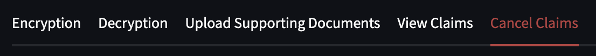
2. You should be able to see the Cancel Claim page show up on your screen
   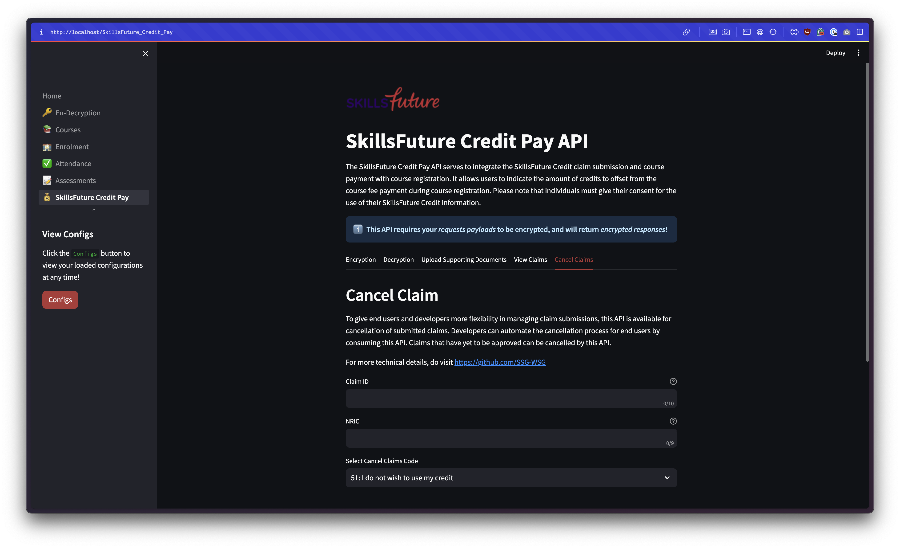
3. Fill in the required parameters. Optional parameters (parameters hidden behind a checkbox) are optional to define
   and can be left as if not needed
   > [!TIP]
   > Unsure of what the fields mean? Hover over the tooltip icon to display a useful help text explaining what
   > the fields mean and what you should fill it up with!
   > 
   > To view the tooltips for the optional parameters, you can select the parameter first to view it
   > before unselecting it.
4. To view the request body that you will be sending, click on the “Request Body” expander under the “Preview Request
    Body” heading to view a JSON representation of the request body which you will be sending to the API
5. Once you are done, click on the “Send” button. This should send an HTTP POST request to the Cancel Claim API
6. If the HTTP request is successful, you should be able to see 2 new tabs show up on your screen
    1. The Request tab shows the API endpoint that you are making the POST request to, the Headers of the request,
        as well as the body of the request. Since this API requires you to send encrypted payloads, you will also be
        able to view the encrypted payload that you are sending to the API.
    2. The Response tab shows the API response after receiving your request. Since this API returns encrypted payloads,
        you will be view the encrypted payload that you are receiving from the API.

## Glossary

| **Term**  | **Definition**                                                                                                                                                                  |
|-----------|---------------------------------------------------------------------------------------------------------------------------------------------------------------------------------|
| API       | Application Programming Interface; A term used to describe a set of functions that one can call to perform an action, without knowing the action is performed behind the scenes |
| Field     | An element on the web user interface that enables you to input text, numbers or upload files                                                                                    |
| Parameter | A piece of text, a number or a file that you must specify for a Field for the called API to function                                                                            |
| SSG       | SkillsFuture Singapore                                                                                                                                                          |
| TP        | Training Provider                                                                                                                                                               |
| UAT       | User Acceptance Testing; a test done to check if an application is acceptable for use by an intended user of the application                                                    |
| UEN       | Unique Entity Number; A 9-10 digit identification number used to identify an entity (business/company) in Singapore                                                             |
